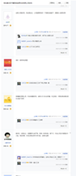
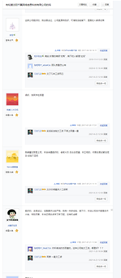

本文为镜像
原地址为 https://docs.qq.com/sheet/DV3piSGFDYXhkcERL?tab=BB08J2&_t=1626881355586

[点击访问](https://docs.qq.com/sheet/DV3piSGFDYXhkcERL?tab=BB08J2&_t=1626881355586)

最后更新时间：2021年9月22日 23:20

* 转载声明

下文内容不代表作者观点，表格制作跟作者毫无关系，表格内容仅供参考，其真实性还需个人进行查证。

* 文献声明

为了大家人身安全着想，本表格没有任何QQ群组以及微信群组，请勿相信任何人在表格内编辑的交流群，否则发生的所有后果自行承担
表格全部数据来自于广大网友们贡献，与表格作者毫无关系，表格内容仅供参考，其真实性还需个人进行查证。

| 公司名称                                                   | 办公地址                                                   | 性质                                      | 特点                                                         | 学历要求                                                     | 面试技术                                                     | 环境                                       | 人际关系                                  | 薪资待遇 | 社会保障 | 加班情况                                              | 评论(右键单元格>插入>批注来进行评论)       |      |
| ---------------------------------------------------------- | ---------------------------------------------------------- | ----------------------------------------- | ------------------------------------------------------------ | ------------------------------------------------------------ | ------------------------------------------------------------ | ------------------------------------------ | ----------------------------------------- | -------- | -------- | ----------------------------------------------------- | ------------------------------------------ | ---- |
| 示例                                                       | 某某写字间                                                 | 【1】私企,【2】本部,【3】沈阳公司         | 就是不加班                                                   | 初中,高中,大专,本科,研究生,博士,不限,能力好/工作经验丰富可放宽 | Spring,Spring Boot,Spring  Cloud,Redis,Jvm,多线程,Mongo,Mysql,Oracle,Mybatis(plus...),Hibernate,Logger,连接池,JQuery,Vue.js,Vue  CLI,Element  UI、Vant、Antd、iView...,AngularJS,Boostrap、EasyUi、Layui...,Echarts,Ajax,React,Type  Script,Css,Java Script,LESS、SCSS、SASS,支付,WebPack,NodeJS,NW.JS,Taro,微信小程序,IOS,MUI,Android,API  Cloud,Linux,Tomcat,Undertow,Docker,JBoss,Nginx,Shell,Jenkins,Maven,Git,画图、逻辑思维题...,职业规划 | 高端写字间,居民楼,写字间,自有办公楼,商场内 | 简单,一般,复杂,裙带关系,难以形容/分类困难 | 实习生   | 1k~3k    | 【1】六险二金,【2】全额,【3】入职即交                 | 不加班,不 加  班,007,996,经常加班,偶尔加班 |      |
| 1~3年                                                      | 3k~5k                                                      |                                           |                                                              |                                                              |                                                              |                                            |                                           |          |          |                                                       |                                            |      |
| 3~5年                                                      | 5k~7k                                                      |                                           |                                                              |                                                              |                                                              |                                            |                                           |          |          |                                                       |                                            |      |
| 5年+                                                       | 7k~9k                                                      |                                           |                                                              |                                                              |                                                              |                                            |                                           |          |          |                                                       |                                            |      |
| 经理                                                       | >=10k                                                      |                                           |                                                              |                                                              |                                                              |                                            |                                           |          |          |                                                       |                                            |      |
| 卡丁生活                                                   |                                                            |                                           | 有大佬知道吗，我记得之前表格里有，好像被谁删了               |                                                              |                                                              |                                            |                                           | 实习生   |          | 【1】五险一金                                         | 9127,996                                   |      |
| 1~3年                                                      | 3k~5k,5k~7k                                                |                                           |                                                              |                                                              |                                                              |                                            |                                           |          |          |                                                       |                                            |      |
| 3~5年                                                      |                                                            |                                           |                                                              |                                                              |                                                              |                                            |                                           |          |          |                                                       |                                            |      |
| 5年+                                                       |                                                            |                                           |                                                              |                                                              |                                                              |                                            |                                           |          |          |                                                       |                                            |      |
| 经理                                                       |                                                            |                                           |                                                              |                                                              |                                                              |                                            |                                           |          |          |                                                       |                                            |      |
| 东软集团政府部门（政府一，现在应该改名了，叫政府事业本部） | 沈阳浑南区东软软件园A2                                     | 【3】沈阳公司,【4】外包项目,【4】政府项目 | 1. 出差情况：项目开发阶段在沈阳896，出差8 12  7甚至更晚，加班没有加班费，出差很久，以前我呆的开发一部门，80多人基本全去出差了，出差有补贴，根据地区补贴价格不一样，基本上一天70左右，周末还要强制加班。不出差基本上被辞退。          2.领导推崇狼性文化，天天想法设法让人多干活，对应届生特别坑，有个姓吕的女领导，天天拿着小本催你，模块开发到哪了。  3.  各部门的人来回借，不会让人闲着的，开发一部门开发完了，会被调借到开发二，至少996，可能领导会一周在拼多多上拼几袋方便面，咖啡作为加班费吧。 4.  说点内部情况，以前我的组长和我说，部门会坑应届生，xx会给东软政府部门指标，招多少人，然后XX会给东软按照每个应届生补贴一些钱，最后政府部门会把人都逼走的，强制出差，然后再招下一批应届生。我那批来的16个人，现在一年剩下不到5人了。                                5.据我观察，政府一最好的部门就是产品规划发展部了，部门之间不会来回借，也挺人性化的，领导也不错，但也会出差。           6.对了，学不到啥东西，技术用的非常旧，一切已业务为准，用的unieap，啥用没有。   欢迎补充      记得2021年7月份时，沈阳是 早8：30-晚5：30。2，4，6加班到9点。然后出差 可能 去的地方不一样工作时间也不一样吧（在重庆是 早9  晚11点多，一周7天）。但是你们面试时面试官是不会和你们说这样的工作时间的，你们懂的！嘿嘿 | 本科,能力好/工作经验丰富可放宽                               |                                                              | 自有办公楼                                 | 复杂                                      | 实习生   |          |                                                       |                                            |      |
| 1~3年                                                      |                                                            |                                           |                                                              |                                                              |                                                              |                                            |                                           |          |          |                                                       |                                            |      |
| 3~5年                                                      |                                                            |                                           |                                                              |                                                              |                                                              |                                            |                                           |          |          |                                                       |                                            |      |
| 5年+                                                       |                                                            |                                           |                                                              |                                                              |                                                              |                                            |                                           |          |          |                                                       |                                            |      |
| 经理                                                       |                                                            |                                           |                                                              |                                                              |                                                              |                                            |                                           |          |          |                                                       |                                            |      |
| 众信同行                                                   | 铁西金谷                                                   | 【4】政府项目                             |                                                              |                                                              |                                                              | 写字间                                     | 难以形容/分类困难                         | 实习生   |          |                                                       | 经常加班                                   |      |
| 1~3年                                                      |                                                            |                                           |                                                              |                                                              |                                                              |                                            |                                           |          |          |                                                       |                                            |      |
| 3~5年                                                      |                                                            |                                           |                                                              |                                                              |                                                              |                                            |                                           |          |          |                                                       |                                            |      |
| 5年+                                                       |                                                            |                                           |                                                              |                                                              |                                                              |                                            |                                           |          |          |                                                       |                                            |      |
| 经理                                                       |                                                            |                                           |                                                              |                                                              |                                                              |                                            |                                           |          |          |                                                       |                                            |      |
| 东软思芮                                                   |                                                            |                                           | 恶心至极 人事口头offer 实际拖很久也不给发正式offer 傻逼公司一定慎重  就算口头答应你offer也不要信 祝傻逼公司早点倒闭 |                                                              |                                                              |                                            |                                           | 实习生   |          |                                                       |                                            |      |
| 1~3年                                                      |                                                            |                                           |                                                              |                                                              |                                                              |                                            |                                           |          |          |                                                       |                                            |      |
| 3~5年                                                      |                                                            |                                           |                                                              |                                                              |                                                              |                                            |                                           |          |          |                                                       |                                            |      |
| 5年+                                                       |                                                            |                                           |                                                              |                                                              |                                                              |                                            |                                           |          |          |                                                       |                                            |      |
| 经理                                                       |                                                            |                                           |                                                              |                                                              |                                                              |                                            |                                           |          |          |                                                       |                                            |      |
| 吉塔思                                                     |                                                            |                                           | 「补充说明」老板特别喜欢PUA女员工，说你不行不配多少的工资这那。公司女员工经常被骂哭。不仅在心里上摧残员工，动不动还拽胳膊，及其不尊重员工。还喜欢多管闲事，对于你的私事进行评判。总之待在这里就是浪费生命浪费人生。入职这家公司可以比拟为你卖身青楼了。让你干啥你就干啥。总之在这浪费时间浪费生命。一个公司官网做四五年没做完，就可以看出这是什么妖魔鬼怪。 |                                                              |                                                              |                                            |                                           | 实习生   |          |                                                       |                                            |      |
| 1~3年                                                      |                                                            |                                           |                                                              |                                                              |                                                              |                                            |                                           |          |          |                                                       |                                            |      |
| 3~5年                                                      |                                                            |                                           |                                                              |                                                              |                                                              |                                            |                                           |          |          |                                                       |                                            |      |
| 5年+                                                       |                                                            |                                           |                                                              |                                                              |                                                              |                                            |                                           |          |          |                                                       |                                            |      |
| 经理                                                       |                                                            |                                           |                                                              |                                                              |                                                              |                                            |                                           |          |          |                                                       |                                            |      |
| 沈阳领维电子有限公司                                       | 和平区和平南大街43号3号楼3楼     (目前工作地点是在202医院) |                                           | 要求七天试岗，强烈建议不要去那些要求试岗的公司，都不是正经公司 |                                                              |                                                              |                                            |                                           | 实习生   |          |                                                       |                                            |      |
| 1~3年                                                      |                                                            |                                           |                                                              |                                                              |                                                              |                                            |                                           |          |          |                                                       |                                            |      |
| 3~5年                                                      |                                                            |                                           |                                                              |                                                              |                                                              |                                            |                                           |          |          |                                                       |                                            |      |
| 5年+                                                       |                                                            |                                           |                                                              |                                                              |                                                              |                                            |                                           |          |          |                                                       |                                            |      |
| 经理                                                       |                                                            |                                           |                                                              |                                                              |                                                              |                                            |                                           |          |          |                                                       |                                            |      |
| 东北云创                                                   | 红星美凯龙西区1门直梯5楼(铁铁9号线彩霞街A出站口对面)       |                                           | 要求七天试岗，强烈建议不要去那些要求试岗的公司，都不是正经公司 |                                                              |                                                              |                                            |                                           | 实习生   |          |                                                       |                                            |      |
| 1~3年                                                      |                                                            |                                           |                                                              |                                                              |                                                              |                                            |                                           |          |          |                                                       |                                            |      |
| 3~5年                                                      |                                                            |                                           |                                                              |                                                              |                                                              |                                            |                                           |          |          |                                                       |                                            |      |
| 5年+                                                       |                                                            |                                           |                                                              |                                                              |                                                              |                                            |                                           |          |          |                                                       |                                            |      |
|                                                            | 经理                                                       |                                           |                                                              |                                                              |                                                              |                                            |                                           |          |          |                                                       |                                            |      |
| 辽宁山河融创                                               | 营口也有办公，在大石桥博爱大厦，沈阳在和谐大厦A座          | 【4】政府项目,【4】自有项目               | 有七天试用，正常节假日没有或少好几天，唯一正常的是春节，有五险没一金，单休，天天画饼，用的分布式和boot，工作轻松，但架不住公司傻逼，基本工资有满勤，剩下去不去你们自己研究 | 大专                                                         | Spring Boot,Spring Cloud                                     | 写字间                                     | 一般                                      | 实习生   |          | 【1】五险没一金                                       | 不加班                                     |      |
| 营口博爱                                                   | 1~3年                                                      |                                           |                                                              |                                                              |                                                              |                                            |                                           |          |          |                                                       |                                            |      |
| 九州医药                                                   | 3~5年                                                      |                                           |                                                              |                                                              |                                                              |                                            |                                           |          |          |                                                       |                                            |      |
| 是一家                                                     | 5年+                                                       |                                           |                                                              |                                                              |                                                              |                                            |                                           |          |          |                                                       |                                            |      |
|                                                            | 经理                                                       |                                           |                                                              |                                                              |                                                              |                                            |                                           |          |          |                                                       |                                            |      |
| 医信科技                                                   | 国际软件园                                                 |                                           |      面试题如图，大约6页纸正反面 |                                                              |                                                              |                                            |                                           | 实习生   |          |                                                       |                                            |      |
| 1~3年                                                      |                                                            |                                           |                                                              |                                                              |                                                              |                                            |                                           |          |          |                                                       |                                            |      |
| 3~5年                                                      |                                                            |                                           |                                                              |                                                              |                                                              |                                            |                                           |          |          |                                                       |                                            |      |
| 5年+                                                       |                                                            |                                           |                                                              |                                                              |                                                              |                                            |                                           |          |          |                                                       |                                            |      |
| 经理                                                       |                                                            |                                           |                                                              |                                                              |                                                              |                                            |                                           |          |          |                                                       |                                            |      |
| 易联众诚科技有限公司（原名易联众数字科技有限公司）         | 龙之梦大厦                                                 | 【1】私企,【2】分公司,【3】非沈阳公司     | 五险一金全额缴纳，正常节假日休息，没有年假，加班情况不多，拖工资发放，不知道总公司出啥问题。 |                                                              | Spring Boot,Redis,Mysql                                      | 写字间                                     | 一般                                      | 实习生   |          | 【2】全额,【1】五险一金,【3】入职即交,【4】六个月转正 | 偶尔加班                                   |      |
| 1~3年                                                      |                                                            |                                           |                                                              |                                                              |                                                              |                                            |                                           |          |          |                                                       |                                            |      |
| 3~5年                                                      |                                                            |                                           |                                                              |                                                              |                                                              |                                            |                                           |          |          |                                                       |                                            |      |
| 5年+                                                       |                                                            |                                           |                                                              |                                                              |                                                              |                                            |                                           |          |          |                                                       |                                            |      |
| 经理                                                       |                                                            |                                           |                                                              |                                                              |                                                              |                                            |                                           |          |          |                                                       |                                            |      |
| 创胜科技                                                   |                                                            |                                           | 建议想去的等地中海走了再去.事儿(懂的都懂)                    |                                                              |                                                              |                                            |                                           |          |          |                                                       |                                            |      |

| 重要的事情说三遍，此表格内容仅供参考！     重要的事情说三遍，此表格内容仅供参考！     重要的事情说三遍，此表格内容仅供参考！ |  |                                                              |                                                              |                                                              |                                                              |                                                              |                                                              |                                                              |                                                              |                                                              |
| ------------------------------------------------------------ | ------------------------------------------------------------ | ------------------------------------------------------------ | ------------------------------------------------------------ | ------------------------------------------------------------ | ------------------------------------------------------------ | ------------------------------------------------------------ | ------------------------------------------------------------ | ------------------------------------------------------------ | ------------------------------------------------------------ | ------------------------------------------------------------ |
| 千翼科技     你删除一次我们义务补充一次。               管理者麻烦处理一下记录里那三个人。     【冰糖炖雪李】：疑似女主角两次删除     【1】：多次删除     【这个人忘了叫啥名】 | 大东老龙口 天阔华城                                          | 外包                                                         | 哎呀妈耶居然有人删，不要个碧莲了，          拖欠工资     不建议去，目前已经发不出来工资了，人均欠一两万甚至更多，巨坑深     欠薪，全是小孩，欠薪一年了     有软件研发事业部和医疗事业部，两个老板，商务和产品经理需要经常出差，没有公积金保险按最低基数缴纳，工资偏低，工作量不闲，其他     方面还可以          2021年开不出工资，拖欠工资，员工离职很多     老板成天画大饼          不是2021开不出，是以前就有拖欠现象。基本都是刚毕业小孩，在职就是一个月拖一个月或者拖几个月，如果已经离职要的话也会找各种理由给扣掉，半年一年说要举报了才给。               补充一下：这公司2017年就开始拖欠工资，千翼上班没有一千个亿别来！是     谁把公司转给美女那个瓜删了？我还等着吃后续瓜呢     来，加我微信，我告诉你     不敢管你要啊怕你被这男女主角惦记     楼上的楼上，发个微信号 | 老办公楼.                                                    |          怀疑千翼的人经常删除词条，已锁定。附上千翼老板或HR在表格中进行人身攻击与威胁的截图(双击图片查看原图) | 跟领导好就能升职加薪               确定是领导不是李毅?       | 薪资较低     五险无一金     试用期三个月，试用期过后交五险（但是会一直拖，至少半年） | 双休,加班没有加班费（至少21年没有，之前未知）,虽然没钱开工资 | 傻逼玩意                                                     |                                                              |
| 不凡网络科技有限公司                                         | 国际软件园     现在在启工街天宝国际5楼                       |                                                              | 是个大坑（骗子公司，骗员工、骗客户、骗政府、骗投资），别去，拖欠工资，发工资看老板心情目前已经拖欠好多员工工资，有的每人拖欠几万。领导一天就是吹牛逼养小蜜。千万别去。制度？制度是什么？不烦网络科技的制度就是想扣你工资就扣你工资，想加班就加班，想不发工资就不发工资，想骂你一顿就骂你一顿，离职想要工资，不好意思，快醒醒别做梦了，大清都亡了，21世纪了谁还发工资啊，app天天改，app每个样子都代表老板今天的心情     补充:     岗位篇---公司同事各司其职,前台,人事,换灯泡的,打更大爷,司机, 保洁大爷,都有专人负责.     罚款篇---迟到扣10,20,30累加.忘打卡扣25%,50%累加日工资.没 有补签.说是乐捐实际收款码是老板秘书微信.     录音笔---吸烟室放录音笔,出门挪个车还得前台登记.领个没油的 破笔、破本儿也得登记.     办公环境篇---公司转椅就没好的,全是缺轱辘的.还有气杆已经顶破椅 面的,下班只关显示器不关 电脑前台,人事,老板秘书轮番 找你谈话.自己带电脑也没  有补助.     福利篇---每个月底给当月员工过生日,主持人尬的一匹,本来这倒 勉强可以说的福利,但每次都是午休时候开生日会.感觉 公司策划多少沾点nt     试用期篇---试用期80%工资,转正开始交最低档五险一金.周六固定  上班(拖欠工资都离职了以后改大小周了)公司额外搞了个试岗期，招了很多人然后只用一个星期就开除。（比如有的岗位只需要一个人，公司会招2-3个，然后一周后全部开除或者留一个，没过试岗期的人没有工资）     工资篇---工资18,25号分两次发上个月的,没有工资条.试用期离职 扣半个月,离职扣一个月工资.     ·入职一周才签劳动合同,说是通过了体验期,上面这些薪 资情况也是签合同时候才知道这么坑(劳动合同上写的都  是最低工资,而且你签的时候空着不让你填.劳动合同签 完也不给个人,去要就说没有,在等盖章各种理由)     ·拖欠工资,看人下菜谱,欺软怕硬.谁去要就先给谁发.到最 后坚持没离职的同事就彻底要不到了.     ·项目技术用的其实挺多的,但是需求都跟大学生毕业设计 一样的重复换壳儿,加班做完老板一句话就不用了.     ·还强制过转正员工看网课,公司能领政府补贴那一类的.     HR篇---薪资都是HR大姐凭感觉定的,试用期80%用完转正时候 说你能力不行给你降工资或者拖着不给转正     ·HR觉得某个人能力不行的依据基本就是听大家平时聊 天开玩笑说的和看改的bug多不多.也就是你填的坑越多 越显得你菜.      股份篇---在公司快没钱的时候让员工出钱买股份，说公司估值八十多个亿，所谓给老员工福利，每人一百股/两百股,一百块钱一股，说是相当于白送，但是得象征性出钱买，以公司的估值，转手就是几十个w,说是自愿出钱买，买到就是赚到，实际上，股权部找你们几个员工谈话，就是跟逼你出钱差不多，好多人出钱买了，公司凑了二十来万又成立了个新公司。预知后续如何的，期待其他人的补充。 | 有一段时间是我面试的,基本就问些基础问题.薪资都是HR凭感觉定的,忽高忽低就看眼缘了.后来拖欠薪资.也就不招人了.面试时候不会说福利待遇这些,后来电话约面试先是待遇三连:我们试用期80%,转正以后按最低基础缴纳社保,周六上班这个你能接受么?  一般靠谱的人听完基本都挂电话了,剩下能继续开始面试的不用说也知道八成是技术不过关的了... | 制度很差     可以说根本没有制度或者制度都是领导心情决定，还有HR的从中挑拨 | 很差，一些奇奇怪怪的人勾心斗角     技术部和产品同事关系挺好的，在需求方面产品在这个公司也非常无奈，产品很多次和技术吐槽，实在是对公司的需求还有一些制度有心无力.     HR仿佛有大病,一些精彩发言:     ·曾经有一个4年经验的销售投递了公司HR岗位,我们HR 的精彩发言: 现在HR的门槛这么低么?什么人都能当HR了?     两个HR一个比一个有大病，自以为高人一等，从不正眼对待员工。离职Z姓HR不给你离职证明，你得想尽办法去要。不然就不给你，说什么拿去办社保，其实根本不是，就是想晚些给，拖着你让你新公司入职不顺利。求求你给刚出生的孩子积点德把，不怕孩子屁眼合上吗？都是打工人，你为啥为难其他打工人。     ·入职第二个月一问才知道转正才交社保,问HR说:我们公司是转正才交的.社保断了没事的,我也断了.     ·问年假:我们公司入职满一年是有年假的,但是一般人都不休^_^               以前有个架构     狗逼一个，拉帮结派，把技术部搞的鸡犬不宁，胡乱摔锅，技术问题竟然能甩到市场部上，也是没谁了，心眼小的可怜，你一句话没顺着他说，你就废了，各种给你穿小鞋，逼迫你退出技术部，或者让你滚蛋。 | 看老板心情                    除了周六上班,平时加班不多.但是每周都会发1~2次版本.还专挑下班点发版.各种节日前会加一阵班          各种克扣员工休息时间，还总拿那种公司是我家的想法向员工灌输 | 看老板心情          除了周六上班,平时加班不多.但是每周都会发1~2次版本.还专挑下班点发版.各种节日前会加一阵班     各种克扣员工休息时间，还总拿那种公司是我家的想法向员工灌输 | 曾经一个群里的哥们说他在这公司最后套现30W，所谓的套现是他离职股份给别人，我听完也是醉了。。。 |                                                              |
|                                                              | 聚进                                                         | 沈阳极速网络 老板张颖   邮箱951076752@qq.com     沈阳千翼网络 老板张兴达 邮箱912101035941182675@lnpost.cn     创胜网络 老板王宇  邮箱1132779389@qq.com     聚进 老板刘玉华 邮箱jjkj@jjokok.com     国泰新点 老板朱敏 邮箱epoint_ln@163.com     汉华软件 老板陈成方 邮箱qinziyang@hanhuasoft.com | 某部长，不用想着删。天天来看。你删除我就恢复！敢做怕人说？     拖欠员工工资，保险，公积金，不许带手机。     ——————————————————————————     2021年5月27日补充     ——————————————————————————     1.  拖欠工资，拖欠工资，拖欠工资。人均2w，老员工拖欠五六万，七八万的都有，领导级别的从18年至今就没怎么发过工资，保守估计拖欠三十万起步。     2. 升职之路倒是简单有效。压房子。把自己房子和车抵押出去，拿钱给公司发工资，那你就能当部门经理，公司里叫部长。已经有几个部长把家里房子抵押了，还有的部长因为公司逼自己压房子，离职的。     3.  领导一言堂，天天不管是原型还是开发甚至是算法，天天开会评审。老板就是不懂装懂。一个董事长每天从9点跟你评审到六点，事无巨细。去趟客户那里沟通回来都得评审，汇报你跟客户说啥了     4. 无薪加班。每天评审排号，下班了排不到你就下班之后开会。周末也找你评审，直接弄个会议室就拉你进去。只要你天天评审，就认为你是个好员工     5. 超级无敌能画饼。老板看不起阿里巴巴，说就是个超级市场。认为自己做的是有情怀，有理想的大事业。天天道德绑架你，给你洗脑，告诉你无私奉献。然后自己女儿在贵族学校上学，反而给你哭穷说公司没钱发工资     6. 用自己开发的考勤软件和会议申请系统，超级无敌垃圾难用。     7.  自认有自己的一套设计理念，美其名曰43211设计思想。过来人告诉你什么是43211，一年4个季度，发3个月工资，干2个人的活，惹一肚子的气，后悔1辈子。     8. 董事长刚愎自用。自己是从从国企舔狗风混起来的，把当年刚上班每天打扫办公室卫生，给领导端茶倒水的事情拿出来说。想让自己的公司也奉行“领导就是我亲爹”的风气。公司内董事长不叫董事长，叫领导。公司中层一帮舔狗，开会第一句话必须是“领导好”，最后一句话必须是“谢谢领导，您辛苦”     9.  离职的人骗你签订一个无财务方面纠纷的文件，不然不给发离职证明。这样走了拖欠的工资就不可能给了。后来好多人打官司，听说在之后离职的就不用签了     10. 假装上班环境自由，要求穿拖鞋上班。实则没有人权，手机不能公然拿出来。只能在休息时间在隔壁小屋玩     11.  每做一件事情都要有计划，哪怕是三五天的小任务，也要细化到小时进行计划评审。说好的绩效考核，做得多发的多。但做得多总有理由扣掉，发的从来没见多。还会因为董事长事情多没空评审之类的耽误进度而找理由扣绩效。     12. 内部斗争明显。需求跟开发矛盾不断。需求因为董事长缺心眼想法不得不设计实现不了的功能，开发因为需求来回改而很难进行。     13. 销售无原则，用高保真原型冒充成品系统     14. 总说不计成本开发，我们就是打通市场。结果客户要苹果非给人上水果拼盘，不是人家想要的不说，人家还嫌你功能做的不到位。     15. 主要服务对象是鞍钢和辽阳的政府。那上线的系统做的，这么说吧，你代表公司去鞍钢，人家都得打你     16.  入职说好的五险一金，实则保险拖欠，公积金就没发过。保险什么时候有钱什么时候交，半年一交算运气好了。公积金说是离职的时候统一补现金，但是工资都不发呢，公积金运气爆棚能拿到手          ----------6.2更新     好像之前欠薪确实有，夸张不夸张我也不知道，现在应该没有，制度里手机确实不让用，但是没人管，领导确实不好干，员工是真潇洒，干的想降级 |                                                              |                                                              | 挺好                                                         | 最低                                                         | 双休，偶尔加班                                               |                                                              | 谁再乱删，这辈子断子绝孙                                     |
| 沈阳科宝乐学                                                 | 佳兆业中心B座                                                | 私企                                                         | 1.每个月25号发上个月工资      2.目前发不出工资了      3.绩效占总工资的一半，方便扣，绩效评价标准根据老板心情     4.开除了一批员工，说好了给一个月赔偿 但是！！！ 开除的员工要扣上上个月的工资！  当天发不了的时候跟我们说是银行结汇的问题，下周一定发，第二周周五问财务啥时候能发工资，今天能不能发。财务不回消息，追问下，财务给你了一句“你懂的”  ？？？我懂啥？我不懂！     5.开除的员工不发工资，问就老板、财务、人事互相踢皮球，啥时候能发不知道      6.对于离职的员工，非常友善的“建议”  绩效不要的话，基本工资马上就可以发。对，就是如果你能接受之前的工资只要一半，那就发给你一半，另一半你就别要了；如果不能接受，那对不起，不知道啥时候能发。      7.对于离职赔偿，离职赔偿是一个月的基本工资，说四个月能发全。对！就是你建议你最后几个月没发的工资只要一半的情况下，赔偿也是总工资的一半，而且这一半还要分四个月发。还有比这更离谱吗？       8. 6月份通知离职，六月末开5月份工资的时候，特意扣绩效，原因是老板不想被辞退的员工拿满绩效。          说完了离职时候的操作，再说说以前      1.没事也要加班      2.老板闲着没事就喷人      3.6月份开始让IT部门拉客户，拉不来人扣20%绩效，就是要扣总工资的10% | 我年初去面试过，面试人员不挑重点问，有些我不会的就人品攻击，迷之自信、磨磨唧唧的一顿说，没重点，感觉自己很牛。水平真心一般，说话都说不利索           我是去年8月份面试的，面试官可能是他们的领导，面试的时候不尊重人，姿态很高，毫无素质，沟通过程及其痛苦，可见即使入职了在他手下干是什么感觉，脑补一下。当时有两个人面试我，另一个可能是他的手下吧，我觉得他还不错，可惜跟了这样的领导。面试本来就是一个双向选择的过程，不要以为其他人非去你这不可，一个小公司而已 | 新装修的,还凑合                                              | 因工资发一部分，在职员工管老板要其余工资，被老板踢出企业微信😂          老板说员工吃辣条是吃死老鼠 | 比沈阳普遍工资高一些，但是不开工资                           | 老板有钱但是不想开工资，经常有人来公司和老板聊天。然后老板去请他们吃饭。之前发工资的及时的时候闲着没事就在公司里喊  骂人  取一段原话啊，不能放截图真的是太可惜了。“今天我来公司，我们办公室一个人也没有（新组建的运营组和内容组的人，前天和昨天我已经布置了新的任务，大家工作是都完成了？是都可以靠自己一个人的脑子就能想出方案？不需要团队讨论的？6月的新任务是否要讨论和准备？）。你们看看人家1804和1810室的两家公司，每天周末全是人，他们的销售和业务部门都在忙着给自己赚钱、为公司发展做出贡献。我们公司真的太闲了。IT部每天加班确保各项功能的如期上线，而业务部门吵着嚷着要这个功能那个功能、为没有完成任务而找各种理由，结果IT部的功能上线了，没人用！没人知道特色功能！没人会根据上线的特色功能区设计各种活动和完成数据的任务！全在等着我和夏总的指挥！既然这样的话：          1）下周除IT部外，所有员工完成 “军令状”  的签署，6月和7月投资人对于我们公司的数据要求（即每个部门的KPI绩效）连续两个月没有完成的话，自动申请离职！ @詹天育(Alice Zhan)  我2个月前让你找业务部门签署的，至今迟迟没有签署，间接导致大家一点紧迫感都没有，到现在都没签署！5月份你的绩效扣除5%！          2）从6月1日开始至7月31日，每周6天工作制，周六进公司开复盘会和下周的调度会。          3）各部门（IT部除外）6月的KPI指标，由各部门负责人于5月31日中午12点前提交给我，预期不给的，各部门负责人的5月绩效奖金全部清零！” |                                                              |                                                              |
| 国泰新点                                                     | 和平展览馆                                                   | 私企，政府项目                                               | 硬性要求统招本科     公司管理制度较规范 有成熟产品 入职先培训再考核 使用公司内部框架开发  会查api就行 日常工作就是增删改查 对个人技术发展不太友好   养老可以。      每年都有淘汰，涨薪幅度还行公司比较大，但是承接的政府项目比较多，并且很恶心，一个地市派一个开发基本上都是总部开发好的标准版系统分公司进行调试保证系统能够使用就好，总体来说感觉公司还可以     ---------------------------------------------------------     面试过，拿到offer没去。面试流程就是先笔试，给你网站链接去答题，牛客网的。笔试及格就电话视频面试，都是能看到人的，互相尊重这点还行，电话面试基本一些基本java问题，外加项目经历这样。最后hr出结果，估计不是特优秀的，基本都会砍工资吧，我当时被砍500。试用期6个月，给我的offer上还写的要去总部入职培训，就没去了。 |                                                              | 试用期6个月，还可以     提供午饭 加班报销餐补      提供笔记本电脑 定期可更换设备 | 简单                                                         | 7K+,低档五险一金，出差费130+，过节费，年终奖  每年调薪1000左右 | 双休 加班有调休 出差辽宁省内较多(补充:面向东北三省)          |                                                              |                                                              |
| 韩邦                                                         |                                                              | 韩企                                                         | 人力外包                                                     |                                                              |                                                              |                                                              |                                                              |                                                              |                                                              |                                                              |
| 汉华软件                                                     | 青年大街商会大厦                                             |                                                              | 垃圾（能否评价再客观点？;)）                                 | 项目相关和java基础                                           |                                                              | 十分复杂，基本上想问点东西很难.不让问其他同事，研究也不行.   | 工资低，很低很低                                             | 不强制加班，如果加班一个月不够44个小时扣工资，自己理解吧，双休 |                                                              |                                                              |
| 宇信科技                                                     | 同方世纪大厦A1110                                            | 自有                                                         |                                                              | 一点                                                         |                                                              | 很和谐，就是要出差，技术方面成长有限                         |                                                              |                                                              |                                                              |                                                              |
| 泰途公司                                                     | 企业广场2404--2405                                           | 外包-出差                                                    |                                                              |                                                              |                                                              |                                                              | 10k+ （折算时薪 不太划算）                                   | 996 东三省出差                                               |                                                              |                                                              |
| 黑豹                                                         | 太原街新华大厦                                               | 私企                                                         |                                                              |                                                              | 不知道怎么表达，但是工作很舒服                               | 极棒，没有勾心斗角，同事都很可爱                             | 值多少给多少，公司就是不差钱，有钱！！！有吃有喝还有酒，节假日有福利，前提是必须要有过硬技术。 | 单休，几乎无加班早8:30-晚6:00                                | 差点就信了     ----------------     我是不信     ----------------     我也不信     -----------------     单休直接PASS     -------------------     呵呵 +1 |                                                              |
| 筑讯科技     筑讯 (北京）科技有限公司                        | 华府新天地C2                                                 | 私企                                                         | 不知道谁删的，这是最新粘贴进来的：     还有人删信息呢？拖欠工资！拖欠工资！拖欠工资！重要的事情说三遍！ | java基础、并发编程、锁、spring框架、微服务、中间件     前端，会问js，h5，vue，浏览器缓存 | 商住民宅办公，屋里人不多，不挤                               | 个干个的                                                     | 转正5险一金，但档特别低；有拖欠工资情况                      | 阶段性加班，没加班费，给串休，但要扣全勤                     |                                                              | 这种行为是违法的，大家理智评论，小心承担法律责任，不实信息切勿发布！！！！这不是吐槽骂人贴，这是排雷贴！！！！注意言辞！！！小心吃官司（你继续威胁，真的一点脸都不要了） |
| 黑豹科技                                                     | 中央大街                                                     | 讲师                                                         | 限                                                           | redis分布式锁/jvm调优/栈溢出/内存溢出/bitmap/乐观锁悲观锁/mq消息丢失重复消费/缓存雪崩穿透 |                                                              |                                                              |                                                              | 淡季周休1.5天旺季1天                                         |                                                              |                                                              |
|                                                              |                                                              |                                                              |                                                              |                                                              |                                                              |                                                              |                                                              |                                                              |                                                              |                                                              |
| 北京电旗                                                     | 移动总部                                                     |                                                              | 电话面试/未谈薪资让入职/???                                  | list,map,set区别/get,post区别/线程池原理                     |                                                              |                                                              |                                                              |                                                              |                                                              |                                                              |
| 北京东方国信                                                 | 昂立信息(卓越大厦)                                           | 私企                                                         | 不知道谁删的，这是之前的文档粘贴进来的：     上市公司，适合养老，涨薪很难，入职多少基本就是多少了，干两三年也一分不给涨，环境还可以，电信，要求本科以上学历，民办本科不行 | 1.有笔试题     2.list,map,set区别     3.get,post区别     4.线程池原理     5.redis穿透、雪崩 | 办公环境还可以，一个大屋，俩人一桌，前后排，感觉向上学时候的教室 | 领导能力很差，拉帮结派严重                                   | 试用期就有五险一金按最低档缴，三个月试用期                   |                                                              |                                                              |                                                              |
| 北京国信安研                                                 | 沈河区热闹路33号8楼（导航辽宁省拍卖行）                      | 私企                                                         | 上市公司，适合养老，涨薪很难，入职多少基本就是多少了，干两三年也一分不给涨，环境还可以，电信，要求本科以上学历，民办本科不行 | 笔试和技术面，主要询问项目业务（可能公司的项目业务比较复杂） | 环境很一般                                                   |                                                              | 五险一金最低标准，三个月后缴纳，薪资可谈，面试官说能力够强就可以调薪,基本上，沈阳最低水平工资。 | 双休，很少加班                                               |                                                              |                                                              |
| 北京环世兴宇                                                 | 三好街同方广场A座1302     呃呃                               | 沈阳办公处,冶金,工厂自动化项目(外包）                        | 公司历史久远,大多是广东工厂的项目,会出差到现场调研、部署。     公司强调来到沈阳就是为了想在沈阳成立一个人才团队(降低成本),工资不会给太高,3年经验要6k嫌多了。     强调需要既会代码又有在工厂工作经验的人才。     总之一句话:要求多,钱少     全员笔记本,自购自带,每个月100块补助     先打好预防针,加班少算为公司奉献了(多少才算少没有标准)     如果有长期加班有加班费,合着就是项目需要加班。也就是你接下来几个月的996被预定了,项目不做完死神都带不走你。     空间狭隘,全屋坐满不过10个人 |                                                              |                                                              |                                                              | 基本工资的全额五险一金,入职即缴。基本工资应该是工资的一半(猜测) | 双休                                                         |                                                              |                                                              |
| 北京百分点（上海飞观）                                       | 市府恒隆39     楼&搬至18楼                                   |                                                              | 随时被劝退，必须主动自愿没加班费加班，抠的不行，找人面试刷kpi，公司挺抠的，端午啥的什么都不给发，刚来的时候不提工时的事，等转正了就拿这事对你pua，损你一顿，叫你平均每天达到10.2个小时，如果是前端的同事还好，如果是后端，那就看运气了，遇到傻逼领导的几率增加百分之50，办公室氛围很重，就是特安静的那种。同事技术强的挺多的，会抬杠的同事也很多，自以为是，聊聊天能把人气死那种。 | 1.有笔试题  2.问题都偏向于原生JS以及相关基础，框架类的问题很少 3.面试官感觉实力都强      4.产品经理面试，要求很高属于AI，nlp方向，如果简历不匹配面试官基本上不会问你太多专业问题，问一些基础问题，比如项目管理方面或者其他。5.有个女HR是个傻子。给我恶心坏了，对人毫无来由的恶意，说90%试用期的时候仿佛是在施舍。大无语，后来他们技术负责人又找我，直接拒绝。 | 工作环境在沈阳算中上, 恒隆本身环境很好                       |                                                              | 试用期6个月，试用期五险一金，100%工资发放，转正六险一金，年度奖金和季度奖金，综合14薪，每年择优涨幅5%-10% | 周三周四必须加班到八点半周六必须整天加班 ，现在  实行大小周（已经取消了），工作日强制工作10小时，达不到会谈话，周六不算工时！！！ |                                                              |                                                              |
| 吉塔思                                                       | 吉塔思在万科中心                                             | 私企                                                         | 老板没有时间观念，占用员工休息时间，离职率高，老板喜欢写用户故事，然而开发开发看不懂，测试测试看不懂，一开会一天  ；面试的时候，约好了时间，因为老板开会就改了两次时间还等了三个小时。          2021/5/28补充      大坑巨坑千万别来，公司人员流动非常大，都是被老板逼走的。老板本人做事非常恶心，思维混乱新奇天天批评骂员工，折磨人，一手遮天。在这工作能把人恶心死，员工下面都在谈论老板，只有老板自己不知道。不管是人士前台综合研发岗都会被老板折磨，女员工被骂哭好几个，公司各岗位平均在这家工龄2个月不到，都是新人，一茬一茬走一茬一茬招聘，这种老板活在世界上产生负价值，别来就是了。          2021/6/17补充     会让你干许多非你专业的活儿，干不好还挨骂，心情不好老板就人身攻击，部分同事也很狗，背后捅刀花式甩锅。          20210809补充     真的很垃圾,在那里干过几个月,老板估计和宝马的某个领导有关系,能拿到一些宝马的活. 老板及其自大,整个公司就围绕他一个人运行          2021.09.01补充      首先说下，面试的时候先等半个小时再说，不管你约的是几点，到了先等，其次，就是你入职了，你也不能干你本职的工作，不管你是什么职位，你都不能做你本职的工作，假如你是后端，会让你做前端的代码，如果，你是前端，会让你做后端的工作，如果你是产品，那么恭喜你，你要做全部的工作，产品，设计，实施，采购，等等，只有你想不到的，没有它不让你干的。  然后，就是离职，想离职首先来1个月，没有个1个多月你是走不成功的，会各种卡你，   然后你的办公用品会想办法克扣你的钱，公司就是靠这个挣钱的。   在说一说日常的工作，每个岗位的工作职责都没有明确的规范，想让你干啥，你都得干啥，不管你该不该你干。平常的时候就是开会了，开会简直就是员工的噩梦，开会根本就不能解决项目的问题，就是浪费时间，说一些虚无缥缈的话，教你如何做人，上升高度，会问你：天道酬勤是什么意思，会让每个人都解释一遍，然后经理在给你讲。 | 如果你在职人事会通知你面试通过加微信什么都谈好之后会告诉你等待offer，还会让你尽快离职提前入职，你这边会认为OK了提出离职，但是他们没有信息了，微信问他们不是等就是不回信息，巨狗，非常坑人。     HR让我开眼界了，BOSS聊天第一句话就跟你说给你的薪资，给的薪资要比BOSS上写的低至少1/3，完事一顿唠，唠完了就装死 | 环境不错                                                     | 不好                                                         |                                                              | 五点半下班，五点四十开始开会，剩下十分钟干啥？老板抽根烟的时间 | HR就是个SB，曾经直聘上聊过，然后让我阐述他写的岗职每条如何理解，如何完成，脑袋没少进屁！ |                                                              |
| 极迅科技                                                     | 融合创新中心2007                                             | 私企                                                         | 早会做游戏喊口号/一天打卡四次/员工手册10元一本     做密室逃脱场景道具的,一群人在屋里说是早会，其实是跳舞。 | 面试官是项目经理主要搞嵌入式开发不懂java                     | 员工手册比较贵/环境良好                                      |                                                              | 全额五险一金/补助500/2个月转正/加班给钱                      | 早八晚五/不会安排晚上加班                                    |                                                              |                                                              |
| 金蝶软件沈阳分公司                                           | 华航大厦31                                                   | 民企注册外资                                                 |                                                              | 95年左右的可以。实施对学历要求不高，开发不了解。整体公司学历一般 | 还可以，有补贴                                               | 销售体系为主，开发领导还可以，人不错。公司文化一般。奖金很难兑现，整体能力一般，交付能力不行。大项目赔钱，小项目不想做。看着高大上，实际很一般 | 实习期间五险一金。基本工资80%，绩效看心情。不说明原因，实习期不满通知离职。内部关系混乱，帮派严重。销售公司，领导喜欢会吹的 | 双休。项目单看，有培训。门槛低                               |                                                              |                                                              |
| 京澎汇                                                       | 三好街同方广场                                               | 私企                                                         | 小公司。据说和京澎科技实际是一个老板。京澎科技，是个很短命大约2年左右吧就没了。京澎汇不知道能多久。办公室政治很严重，员工拉帮结派的。 | 自我介绍，问sql能力，摄像头读取技术                          |                                                              |                                                              |                                                              |                                                              |                                                              |                                                              |
| 利物融通                                                     | 商会总部大厦                                                 | 单一类型                                                     | HR爱忽悠人/想要你就涨钱, 金融类软件     试用期开除员工     领导不懂技术还看你代码问啥意思     下班没人走,一般都6点下班,实际上是5:30     下班准时开会，开到9点，大圆脸秃头领导没事盯着你屏幕看你在干啥 | 答题/技术面/HR面                                             | 环境良好,有免费的饮料和零食，电梯排队，半小时上不去下不来    |                                                              | 薪资较低                                                     | 经常加班没有加班费                                           |                                                              |                                                              |
| 辽河数码                                                     | 奉天银座C座707                                               | 外包                                                         | 中石油项目/出差/驻场/根据项目加班                            | 简历写什么问什么/4个人面试                                   | 环境良好/笔记本/隔板                                         | 极其复杂，没有人根本不能升职，巨坑，走老了人了               | 入职五险一金最低档，工资也是最低档，2000起步                 | 双休                                                         |                                                              |                                                              |
| 辽宁北软                                                     | 三好街华强广场                                               | 私企                                                         | 1、随时被劝退，必须主动自愿没加班费加班，工资低，每个月都延期几天发放。老板更年期动不动就骂人，从来没肯定过员工。     2021/07/28补充      去面试过项目经理，当时刚进这个老板办公室就感觉不靠谱，办公室竟然养了一条狗，然后也没问什么，就让你给解决方案，说什么他有好几百个项目，现在管理有问题，需要人解决，又说什么刚找了一个东软的小姑娘，你要来就抓点紧，高高在上的态度招人烦呐，后续百度了一下觉得这家公司不行，就不了了之了。再后来剧情又进阶了，可能是觉得我面试的时候还行，过了两个月了忽然加我微信(我把他删了)，又约开始找我聊，聊呗，然后又巴拉巴拉一堆，也没说待遇，给我发了十几个文档，让我先给他整理一份需求解决方案文档。我就@#￥%……&*（了，后续直接拉黑。     臭傻逼老板 盘锦老逼灯  手下产品吕耿辉垃圾的要死，老板天天拿个破b核桃往脸上盘，叼根烟。说这是我的梦想，偷税漏税等举报。 | 很随意，老板自己面试，合格后去前台领offer                    | 办公环境可以，但是没有保洁，办公室没有垃圾桶，员工每天早上组队打扫卫生，如果是在6楼工作你可能会排到扫厕所。说实话自己家厕所想必大家都没有几个收拾的吧。何况公共的 | 人际关系不复杂，老板说啥就是啥！                             | 工资低，社保最低基数，转正后交保险，入职一年交公积金，入职试用期3个月没有五险一金，需要办理2张卡银行卡，说是半年有调薪资，但是老员工说的是垃圾吧到吧 | 7-10月份繁忙期时单双休、加班到十点                           |                                                              |                                                              |
| 辽宁便利电                                                   | 浑南德宝大厦702                                              | 私企                                                         | 领导资源好，甲方都是大公司，京东外包，技术新，要求高      技术要求高，一般很少过试用期的，10个里面有3，4个能留下来的就不错，试用期的一个月让你疯狂加班，然后这个月最后一天让你走，然后让你走的时候按照天数算钱，如果赶上10，1什么的你可能就能拿到15天的工资，极坑     （坑爹公司居然有人给删了得多你不要脸） | springboot  java底层，redis底层，springcloud                 | 环境不错，午休时间长，有单独一个很大的娱乐室，可以打台球、乒乓球，外请瑜伽教练一周三次课，羽毛球篮球场长期包场，中午领导带着打球，公司附近两个篮球场地，一个是魔盒，一个是1528，领导喜欢运动好的员工。     他们公司的人际关系相对简单，没什么勾心斗角，技术强就吃得开，能力不行也混不下去。 | 面试官技术很牛     补充： 面试官是背诵怪，技术八股文背的六，笔试题能拦住一批人，面试过了基本就留下了。 | 5%公积金，五险按实际工资缴纳                                 | 加班管饭，公司报销，晚了打车也报销，不抠。     项目多时候就加班，频次还好，两个月了也没赶上加班，最晚七点半也撤了。 |                                                              |                                                              |
| 安信电子                                                     |                                                              |                                                              |                                                              | 面试主讲业务                                                 | 环境拥挤/室内抽烟                                            |                                                              |                                                              | 非出差加班少/出差后没日没夜                                  |                                                              |                                                              |
| 安科安全评价                                                 |                                                              | 外包                                                         | 老公司偏向公务员/形式主义活不多                              | 题目简单                                                     | 没人带,基本来了没几天就出差                                  |                                                              | 转正五险一金不是最低档                                       | 双休几乎无加班                                               |                                                              |                                                              |
| 邦友科技                                                     | 三好街                                                       | 对日                                                         | 信                                                           |                                                              |                                                              | 人少但是派系很多                                             |                                                              |                                                              |                                                              |                                                              |
| 百途新媒体技术（北京）有限公司                               | 沈阳和平区北约客置地广场2007B                                |                                                              | 拖欠工资！                                                   | 人事主管和技术主管像审犯人一样，不懂自己要面的人的工作内容，鼻孔冲天，要招什么样的人，做什么工作，也讲不明白 | 没说，不了解，看招聘信息，待遇蛮低的，要求还挺高             | 貌似是有关系背景的公司，应该有一定的背景，但团队的人际关系应该挺差，人事主管岁数挺小的，不太会做人。技术主管更是。 | 不清楚，看BOSS直聘给的很低，要求挺多。废话不说，上待遇，自己掂量：Java中高级开发工程师  7-9K | 有出差，看项目，急的时候加班，没提有加班费                   |                                                              |                                                              |
| 深圳同舟技术                                                 |                                                              | 外包                                                         | 不知道谁删的，这是最新的粘贴进来的：     公积金封存后不会给你转的！因为不是集中封存，需要你自己去转！     求人事都不好试！工资压15天！离职以不给上保险为理由，劝你你不要离职！没见过这么垃圾的公司 |                                                              | 特别差 室内吸烟 吐痰                                         |                                                              | 五险一金 沈阳最低档                                          | 周一到周五加班白嫖，免费用你！                               |                                                              |                                                              |
| 北京科东                                                     | 和平区泰宸商务大厦/南湖公园附近                              | 国企外包                                                     | 1、业务针对国家电网网络安全方面，属于数据内网，后续就业面窄，人员分等级，包1、包2、包3，一般进去就是包3，下等人。     2、千万别来产品管理部，领导不行，出去各种惹事，回来让下面人擦屁股。     3、领导拿包3不当人看，经常半夜找你，周末找你，出事就找你擦屁股，但凡事都是着急的，不着急的事也要憋成着急再找你。     4、年底奖金1到2千块，跟闹着玩一样。     5、能力强没用，得会舔，舔的好，有小概率能升到包2.     6、两个领导特窝囊，跟研发干架从来没赢过，即使有理，人家最多就是说不好意思。然后你还得干这个活。     7、产品管理部已经不做产品设计，改做售前文字工作了，想做产品设计的不要考虑了。。。。。      8、能力强是原罪，别人不会你会，那你可就要累死了，但凡跟这个相关的都找你，别人可以不会也不用学，你会就必须你干，不管多少任务都找你，理由就是你会，别人不会。 | 1、原来招产品经理注重产品设计能力，现在注重售前文档编制能力。     2、思芮算外包里面正规的了，但是入职时候offer是产品经理，离职证明就给你写助理，真狠啊。 | 环境差                                                       | 人际关系差                                                   | 待遇跟外包公司谈，比较大的有上海思芮，一般五险一金按最低额交。工资也不高，中等吧。 | 双休，常加班，周末常加班，没加班费，没串休。                 | 科东电力这么差的么？     有没有人给点补充的？                |                                                              |
| 北京瑞天数据                                                 | 沈阳农商银行驻场开发                                         | 私企                                                         | 银行驻场开发，总公司研发部在北京，沈阳属于二次开发和维护工作，近期会有新项目（行方项目经理可能智力有点问题）      为了实现而实现，疯狂变现的公司，学不到技术！学不到技术！你干的还闹心，个别行方项目经理就是一个大煞笔，我骗你都咋地的，你要是能忍得了银行那帮人就去，然后公司组织架构有问题，你干技术动不动就让你干个售前啥的，和稀泥。但有一说一，这公司老板挺厉害，榜上能查到的数据科学家 | 数据库数据处理，shell脚本，数据库优化，基本上都不难      楼上说的（基本上都不难）太含蓄了，分谁面试，说句难听点的，有一个人面试，是个人他就要，根本不技术面试，你要是想混一次，可以试试，包装成5年，如果是他面试你就捡着了，之前就有一个人连spring是啥都不知道的，还给开了大千的价格，你们自己细品 | 环境不错     农信13楼，分屋子，空调差劲，不知道谁拖鞋        | 公司人都还不错，但由于是跟银行合作，部分银行方面项目经理有问题     公司好人还是挺多的，但是有差劲的，和稀泥 | 薪资可谈，入职即交五险一金，基数和比例可谈     入职90%五险一金，你能唬住他就能要高价，但是现在来个技术经理挺牛的，可能唬不住了，原来那家伙，你唬住了，新手要12K都给你 | 偶尔需要加班，没有加班费可串休      楼上又含蓄了（偶尔需要加班）你见过凌晨1点北站的广告牌吗？新核心上线天天加班，而且我奉劝各位，银行种项目是有交易的，有事你就得来，维护期时候也加班，我经常下班之后10点又来了，翻车了没整就得来。但是现在来个新的技术经理可能会好点，不惯银行毛病，你要加班不好使，我没活了加什么班 |                                                              |                                                              |
| 北京世华易网教育科技有限公司                                 | 沈北=沈阳工程学院大学科技园904                               | 私企                                                         | 工作地点较远，适合家在沈北，最好自己有车，距离地铁口较远     公司都没有电脑还需要自己带电脑上班，这样的公司还是头一回见      主要做来中国留学的网站，市场有限，没有发展，公司规模较小，代码是我见过最乱最垃圾的代码，最搞笑的是居然都上线了，每天的任务就改bug，改完bug后引起的bug，有选择尽量不要入坑。     没其他任何福利，年终奖500元也是行业的笑话了     公司总部在北京，有没有都不一定，领导在屋里直接抽烟，受不了烟味的还是别来了 | PHP基础居多，然后中级和高级，按成绩给薪酬                    | 办公地点在9楼，办公室极其简陋，只有桌子和椅子                | 暂时接触 开发实施都挺好的                                    | 试用期2月 80% 无五险一金,转正沈阳最低标准五险一金            | 不加班          忙的时候可能后半夜哦                         |                                                              |                                                              |
| 北京四维智联                                                 | 市府恒隆广场                                                 | 私企                                                         | 北京四维图新拆分出来的子公司                                 | HR专业高效     面试官贼水，女的，一脸阶级斗争，成不成看眼缘和运气 | 1. 环境较好     2. 公司很有良心，去年离职的员工补发了前年年终奖 | 开发人员之间还是很快乐的                                     | 1. 五险一金正常额度缴纳，有补充医疗保险     2. 7-10k左右吧   | 加班能调休，超过9点30可以打车。离职后加班时间可以换加班费    |                                                              |                                                              |
| 北京旬由          原来叫 合铨胺美                            | 茂铂晶宫2206                                                 | 私企                                                         | 不知道谁删的，这是之前写的：     说是做游戏加速器的，到我们这儿估计就是管理系统，初创型公司，20年11月成立，其他的未知。          补充：公司行政那个肥女的贼不正经！颠覆三观！恶心的一笔，连保洁都请不起，动不动还值日，然后按个监控看你是否干活，电脑页面是否浏览别的网页。 | 疫情时微信视频面试的，项目方向问的较多一些（补充：UI:先是运营面试，之后技术总监视频面试）（老板面：老板喜欢自信高傲新歌的人，面试的时候太过谦虚他反而瞧不起，真想面就吹就完事了） | 远程面试暂不清楚（6.00但是要等到6.30开会，这个只针对技术部人员也就相当于6.30走，但有事可以请假。） | 公司的人也很随和，走了也不拖欠工资，基本不加班，除非很紧急，老板很负责，脾气也很好加过一次班还是和老板一起加班的还有运营的一个同事，还算不错。 | 三个月试用期，七天试岗，入职五险，转正公积金，比例是12%      | 说是双休                                                     | 之前做日本项目，疫情直接全部裁员 离职让写个人原因 挺搞笑的   | 这个我了解，成立初我第一个面试的，面的是他们运营经理，智联上他们公司的评价就是我写的。这么说吧，他们技术负责人也属于脑袋有屁那伙的，而且让技术面运营，啥啥不明白，自己还瞎哔哔。 |
| 北京中天嘉华                                                 | 软件园D09 407                                                |                                                              | 项目经理开会没时间所以让"两个小孩"面试     前端面试：这的项目前端不用框架，用原生html和js，技术落后 | 问一些"两个小孩"不会的问题                                   | 环境拥挤                                                     |                                                              |                                                              |                                                              |                                                              |                                                              |
| 北四达数字信息科技有限公司                                   | 铁西凌空一街                                                 | 私企                                                         | 市政项目，技术还比较新，中午管饭，前两年没有公积金，没有年终奖，工资得借 | 笔试，后端springcloud、springboot  +mybatis，前端vue，app用flutter，问项目经验 | 独立办公楼，早八晚五，有食堂，中午免费，早餐3元，中午11：30轮着吃饭，休息到1点 | 同事之间基本没交流，任务互相推脱。有一个女员工骂新人（素未谋面就骂）。 | 12薪，工资较低，不涨工资。拖欠工资，得申请，申请也不一定发。过节有福利。 | 加班只有25元补贴，8点半后打车给报销打车费。加班不串休，基本不加班，项目上线前会加班。 |                                                              |                                                              |
| 必然云                                                       | 三好街同方广场B座3906                                        | 政府项目外包                                                 | 主要俩个领域农业与保险                                       | 三个人面试俩个技术一个hr                                     | 环境一般                                                     |                                                              | 薪资很低                                                     | 双休                                                         |                                                              |                                                              |
| 中正石油                                                     | 于洪区北里官中正石油院里                                     | 私企                                                         | 小团队，专门做加油小程序，为私人油站服务。                   | 面试简单                                                     | 环境可以，就是偏                                             | 简单                                                         | 待遇在沈阳中间等，五险一金                                   | 单双休                                                       |                                                              |                                                              |
| 四方伟业                                                     |                                                              |                                                              |                                                              |                                                              |                                                              |                                                              |                                                              |                                                              |                                                              |                                                              |
| 乘帆科技                                                     | 万豪酒店里面                                                 |                                                              | 小屋子不大也就能坐下10个人，面试官感觉特水, 黄了.            |                                                              |                                                              |                                                              |                                                              |                                                              |                                                              |                                                              |
| 大连创弘科技                                                 |                                                              | 外派东软                                                     | 对日项目                                                     |                                                              |                                                              | hr基本不管你，年底什么都没有，请假还会按二月份天数扣钱       |                                                              |                                                              |                                                              |                                                              |
|                                                              |                                                              | 外派宝马                                                     | 对日项目                                                     |                                                              |                                                              |                                                              |                                                              |                                                              |                                                              |                                                              |
| 大连和讯科技                                                 |                                                              | 外派宝马                                                     |                                                              |                                                              |                                                              |                                                              |                                                              |                                                              |                                                              |                                                              |
| 达能电气研发部门                                             |                                                              | 本部,私企,新三板上市公司                                     | ←这是来做宣传的吗→                                           | 目前缺架构师.                                                | 人力资源在昂立信息园 医疗相关运维实施研发在医大一27楼        |                                                              | 薪资行业内一般水平,试用期3个月,每月20号发工资,试用期80%,五险一金,公积金按照工资的12%缴纳.不拖欠,疫情期间正常发,不扣钱;节假日发礼品.比如去年春节发了四瓶百分百果汁,两盒大虾,两条黄花鱼,一箱三只松鼠,今年春节一个徐福记食品礼盒、一只草原暴走鸡、一个中粮五谷礼盒、两箱草莓、一箱汇源果汁 | 不加班,节假日休息,双休,特殊情况加班可报销伙食费,事后可串休   |                                                              |                                                              |
| 东华软件                                                     | 医大一院                                                     | 外包                                                         | 分实施岗，开发岗，实施不了解，开发有出差，不同产品组待遇差距较大垃圾公司别去  人际交往很复杂 领导层的人狗眼看人低 |                                                              |                                                              |                                                              |                                                              | 每天强制加班至少一个小时，老板销售出身，最近想搞996，出差补贴没了，能不来别来 |                                                              |                                                              |
| 东软交通                                                     | 东软软件园A6                                                 |                                                              | struts hibernate                                             | 啥都问                                                       |                                                              |                                                              | 试用期6个月                                                  | 有加班                                                       |                                                              |                                                              |
| 东软网络安全事业部                                           |                                                              |                                                              | 有了解的吗                                                   |                                                              |                                                              |                                                              |                                                              |                                                              |                                                              |                                                              |
| 东软金融事业                                                 | 东软A6                                                       | 本部                                                         | 同事之间很不错，领导是兵王，出差多一些 ，年终奖有零有整的少  | 难度不高，就根据简历问问                                     | 自己园区，挺好                                               | 人际关系，比较复杂                                           |                                                              | 无调休 双休                                                  |                                                              |                                                              |
| 东软汽车电子第二事业部                                       | 东软软件园A6303                                              |                                                              | 加班、出差                                                   |                                                              |                                                              |                                                              | 试用期6个月                                                  | 加班，可能246，也可能996                                     |                                                              |                                                              |
| 东软睿驰                                                     | 东软软件园                                                   | 本部                                                         | 毕竟是东软子公司，正经公司，不耽误挣钱，打工人的好地方     睿驰这两年一直在烧钱，工资在东软的所有部门里算给的比较高得了，办公大楼也是新建的。 | JAVA微服务相关，项目经历。     有时会有一些很开放的问题。    | 自己园区，挺好                                               |                                                              |                                                              |                                                              |                                                              |                                                              |
| 东软商用                                                     | 东软软件园A6                                                 | 对日                                                         | 活恶心，日语恶心，人恶心，领导更恶心。干了一年会的还没有一年前多     在职的评论一下吧，商用有很多子部门，99%都是对日项目，有一些项目用的技术比较老，十来年那种。入职的时候可以问问用的技术。     楼上说有些领导恶心的不是很苟同，大部分的领导都是挺好的，可能你接触那个比较恶心吧= =。。     曾经在这里干过，有好的领导也有不好的，闫雪芬就是个傻逼，又骄傲装逼又看不起人，当时我是个菜鸡，对我说话就咄咄逼人，同事正式东软员工也有好多都挺爱装逼的，多问一句就不耐烦的样子，干了半年，写了4个月文档，开发只用了不到一个月，接下来就是用Excel写测试用例。 | java基础，日语自我介绍                                       | 想混日子可以来                                               | 比较简单                                                     | 试用期6个月                                                  | 1，2，4，6，九点后打车报销，周末给调休     项目紧张的时候要求1,2,4加班到九点。 |                                                              |                                                              |
| 东软斯锐                                                     | 东软软件园A6                                                 | 外包干                                                       | 外派项目     部分岗位要出差，一年至少出差三个月              | 没发offer之前千万别推掉其他offer，就算口头跟你说要你了，也别信，随时会变卦 | 东软的环境还是比较好                                         | 有几个项目经理实在是差劲（ps：我想问一下，能否告知是哪几个项目经理啊，如果怕暴露，请编写此处的作者输入姓名拼音首字母就可以，本人纯属好奇） | 五险一金按最低标准                                           | 每天加班，周末加班，新来的领导是华为跳来的，注重华为狼性加班，但工资不会狼性 |                                                              |                                                              |
| 东软通企事业部                                               | 联通数据中心                                                 | 外包                                                         |                                                              | linux或unix精通                                              |                                                              |                                                              | 试用期6个月                                                  | 7*24 倒班制，通常后半夜干活                                  |                                                              |                                                              |
| 东软熙康                                                     | 智慧路                                                       | 合资                                                         | 管理混乱。一个可以把有所做为的人逼到知天命的地方。     大多中层没能力，但脾气很大，干事不行，甩锅一个顶俩      --------------------------------------------------------------------------     活不多，钱也不多，大概在东软系里面算低的，而且不好涨薪，年终也不多。不经常加班，周末经常有线上问题需要在家里处理，食堂要黄了~~~太难吃 | 死劲忽悠就行了     ------------------     面试不难，都是基础题。复试时候是副总面试，比较考验个人“觉悟”（都懂了吧，就使劲儿吹， 我为公司奉献咋咋的） | 在浑南创新路附近，周围都是大野地，特别偏远                   | 都是有关系的能上位，员工就好好摸鱼就行，其他什么都别管了，不利于个人发展 | 面试如果能忽悠住，可以多要一些。忽悠不住就算了，而且基本上给你多少几年内就不会调薪了，除非你真的是行业大牛 | 加班                                                         |                                                              |                                                              |
|                                                              | 东软A6                                                       | 外包                                                         |                                                              | 难度一般                                                     |                                                              |                                                              |                                                              | 246加班或通宵                                                |                                                              |                                                              |
| 东软移动互联网事业部                                         | 浑南东软园                                                   | 上市                                                         | 就是加班，出差，现场干活没人带，面试开发，到现场实施  ，运维的活都得干，基本开发只是一小部分，大部分都是实施的工作 | 面试会问你能不能接受出差，别的基本不问，面试的是开发，让你出差去现场 | 没人带，直接就让你干活，赶鸭子上架，每天半夜下班，周末如果不忙的情况下会休息一天，但是基本没有不忙的时候 | 部门流动性非常大，因为钱不多，每天十二点下班，没人能承受的住 | 工资就是垃圾，一年半年也不给涨，特别费劲                     | 天天加班，半夜十二点下班，周末基本没休息，即使休息了，每天还要解决群里的问题 |                                                              |                                                              |
| 东软医疗IT事业本部                                           | 东软软件园A2                                                 |                                                              | pacs  his系统，unieap，springboot     部分岗位需出差、加班   | 看你简历写得啥，也会问数据库相关     面试挺好的,同事也不错.加班分部门.但实际工作也不多,基本都是形式主义加班. |                                                              | 还可以                                                       | 试用期6个月                                                  | 加班，可能会全国性出差                                       |                                                              |                                                              |
| 东软政府事业本部第一事业部                                   | 东软软件园                                                   |                                                              | 出差（加班到半夜也许通宵）出差多，报销慢。一次报销半年后才能下来，垫付不起 | uniEap--现在都微服务了                                       | 环境优雅A2楼挺好的                                           | 挺好的                                                       | 18+ 试用期6个月-转正涨薪+20                                  | 不加班-加班自愿出差倒是有                                    |                                                              |                                                              |
| 东软-政府一-医疗保障                                         | 全国(出差)                                                   | 私企                                                         | 加班严重，9 12  7差不多，没有加班费，年终奖看关系，不要来,来了必后悔出差整年出差 没有加班费 强制加班 礼拜天也加班 管理混乱 学不到技术,经常通宵加班 | 一般，没啥深入     能出差就能来                              | 自己园区，挺好                                               | 人际关系，比较复杂                                           | 10000-14000，据我了解6k-13k                                  | 法定节假日加班有调休，经常出差，一年出差两次一次半年  加班到十二点是常事,2点也很正常,12点之后回家了还会给你打电话让你回来,周末基本不休息,没有加班费 是个人就坚持不住 同期基本都离职了  不停的在招人 |                                                              |                                                              |
| 东深科技（菲尼科技）                                         |                                                              |                                                              |                                                              |                                                              | 禁止玩手机                                                   |                                                              | 最低                                                         | 大小周                                                       |                                                              |                                                              |
| 阿尔泰克                                                     |                                                              | 外派宝马                                                     | 埃森哲的二包/subContract                                     |                                                              |                                                              |                                                              |                                                              |                                                              |                                                              |                                                              |
| 房谱网络科技                                                 | 建筑大学校园内                                               |                                                              | ssm、卡工资(垃圾公司不能去)                                  | ssm 数据库                                                   |                                                              |                                                              |                                                              |                                                              |                                                              |                                                              |
| 峰行科技                                                     | 文萃路57巷23号楼23-3门3楼(在小区的三层别墅里,夏宫城市广场写字楼正在装修) | 本部                                                         | 大数据方向/电商/购物节需要熬夜加班/有加班费     修正于:2020/12/29写字间仍在装修中，一年都没装修好 | 读取数据高并发处理                                           |                                                              |                                                              |                                                              | 双休                                                         | 面我的是个南方口音的，好像领导不在由他面试，反正没觉得懂啥。 |                                                              |
| 浮点科技                                                     | 新松机器人B5                                                 | 偏甲方                                                       |                                                              |                                                              |                                                              |                                                              |                                                              |                                                              |                                                              |                                                              |
| 富能                                                         |                                                              |                                                              | 刚组建团队/底薪绩效提升式工资/无加班费无调休                 | 不是很难问一些奇怪的东西     确实会问一些很奇怪的东西，面试完了给留作业，让设计智能产品线，智慧厂房   感觉不是真心招聘 | 环境较大                                                     |                                                              | 五险转正后一金                                               | 压力大                                                       |                                                              |                                                              |
| 服企                                                         | 中驰国际大厦                                                 |                                                              | 销售公司的制度。多劳多得。工资工时制,学习技术的人别去,是老项目,技术团队小,3小时活可以报3天,养老 | 技术负责人也就那么回事 会写 你说点深的他就不会了             |                                                              |                                                              |                                                              |                                                              |                                                              |                                                              |
| 格微软件                                                     | 沈北路53号                                                   | 私企                                                         | 抠，一点福利都没有，逢年过节连毛都见不到，剥削员工剩余价值。 | 好几个面试官，一顿和你唠家常，不问正经问题。                 | 一般                                                         | 领导都是老板的亲信，人物关系复杂。                           | 五险一金最低档。加班没有加班费，涨工资不可能。               | 早八点半，晚五点半，双休，偶尔加班。                         |                                                              |                                                              |
| 工汇科技                                                     | 昂立软件园                                                   | 分公司                                                       | 996                                                          | 问的挺多                                                     | 环境优雅                                                     |                                                              | 很低                                                         | 996                                                          | 沈阳分部已经黄了                                             |                                                              |
| 国仁医疗评估                                                 | 奥体中心国际贸易中心B座702                                   | 本部(无开发部门)                                             | 销售公司想成立开发部,并想将开发部门按照销售部门的政策执行(低底薪+绩效、7*24h随时待命) |                                                              | 环境一般,屋子小,电脑自带                                     |                                                              |                                                              |                                                              |                                                              |                                                              |
| 汉化软件                                                     | 三好街                                                       | 外包                                                         | 出差+hr爱拍领导马屁                                          |                                                              |                                                              |                                                              |                                                              |                                                              |                                                              |                                                              |
| 联通产业互联网                                               | 华航大厦31层                                                 | 央企子公司                                                   | 出差每年1至2个月/要求二本以上                                | 笔试难度高(含IQ)/2个人面试(态度好)                           | 环境优雅                                                     |                                                              | 当场砍价                                                     | 双休                                                         |                                                              |                                                              |
| 杭州融盛海网络科技有限公司                                   |                                                              | 私企                                                         | 忽悠人从沈阳去鲅鱼圈， 别去 欠薪 都TM  回来好几个人了        |                                                              |                                                              |                                                              |                                                              |                                                              |                                                              |                                                              |
| 杭州玛亚科技公司合肥分公司                                   | 铁西区沈阳地铁                                               | 外派                                                         |                                                              |                                                              |                                                              |                                                              |                                                              |                                                              |                                                              |                                                              |
| 特力惠沈阳分公司                                             |                                                              | 私企分公司                                                   |                                                              |                                                              |                                                              |                                                              |                                                              |                                                              |                                                              |                                                              |
| 杭州谐云科技                                                 | 新地中心2号楼2706                                            | 外包                                                         | vue springboot，小团队人少                                   | 全干工程师                                                   | 一般                                                         |                                                              |                                                              | 加班                                                         |                                                              |                                                              |
| 杭州珍林科技                                                 | 美景新天地                                                   | 杭州公司沈阳办事处                                           | 沈阳公司目前30多人，团队氛围好，都是年轻人多，项目比较给力     ----------------------------------------------------------------     2021.08.16补充：不知道谁删了，我记得有说是小公司没实力的 | 面试官问了int(10)和varchar（255）的含义，反问面试官问题答不上来系列，测试比较注重需求，用户体验，会临时出题让你测     一个人面试最起码1个小时，一直问项目经历，原因是他怕简历是作假的.....     面试官挺煞笔，面产品经理当场让你用纸画原型，特别装逼，面试后感觉你特别次，达不到标准，然后半个月后给你打电话，问你来不来，呵呵     曾经去面试过，面试官，他们的CTO，说白了这么点的公司就是技术负责人，太装逼了，受不了这样的，属于德不配位那种，面试双向选择，你这么装逼谁能跟你干 | 环境可以                                                     | 不复杂                                                       | 待遇在沈阳算中上，五险一金。                                 |                                                              |                                                              |                                                              |
| 浩瀚科技                                                     | 铁西区爱都国际B座1110                                        | 本部                                                         | 试用期薪水70%/有加班费，加班费应该就15，还不够吃饭的呢 /还有其他信息吗 比如加班频率 五险一金情况 试用期时长之类的求具体 |                                                              |                                                              |                                                              |                                                              | 双休                                                         |                                                              |                                                              |
| 浩鲸云计算科技股份有限公司                                   | 昂立信息园                                                   | 私企                                                         | 原中兴软创科技股份有限公司，与阿里云合作，沈阳办事处没体会到啥变化。主要项目为辽宁移动、辽宁电信运营商项目。本地领导几年就得换，那种级别都是异地安排。年年说困难。工资要到位的话整体还可以。有正式员工和公司控股的外包员工，平时工作福利基本一样。产品主要在广州和南京，本地基本为客户个性化简单功能开发，实施交付。 | 一般无笔试，不太难                                           | 办公环境还可以，加班一般会有一些加班零食。                   | 同事之间氛围都很好，做技术的都喜欢简单。                     | 三个月试用期，正式员工五险应该是最低档，公积金好像8%；外包形式的员工应该都是最低档。技术员工应该在7k-16k范围吧。 | 加班没有加班费，一般加班是一、二、四或者加个周六，节日当天加班补助200。一般晚上加到9:30，报销路费。不打卡，请假不扣工资。 |                                                              |                                                              |
| 黑马/慧鼎/思诺                                               | 21世纪大厦/东北大马路信息中心等                              | 外包                                                         | 给政府做项目例如盛事通特别垃圾的公司，办公地点复杂还乱，吵吵声让你听不见身边人说话。 | 有啥问啥/技术面试很愉快                                      | 环境拥挤     在居民楼改的办公楼里，十来个人在一个小屋子      | 挺好                                                         | 五险                                                         | 早9晚6，双休，加班严重，加班给调休，车补饭补                 |                                                              |                                                              |
| 华胜鸣天                                                     | 小北联通大楼                                                 | 外包                                                         |                                                              |                                                              |                                                              |                                                              |                                                              |                                                              |                                                              |                                                              |
| 华夏天通                                                     | 百脑汇21层                                                   | 自有项目                                                     | 做消防维保等业务                                             | 技术面试官好像是个外行人                                     | 环境一般                                                     |                                                              |                                                              | 加班较少。                                                   |                                                              |                                                              |
| 华雁智科                                                     | 奉天银座                                                     | 私企                                                         | 做电力方向的                                                 | 问题问的超基础什么线程锁啊、数据类型啊，技术面试官有点二     |                                                              |                                                              | 12~20                                                        |                                                              |                                                              |                                                              |
| 集美档案管理                                                 | 浑南区学风路26-4                                             |                                                              | 偏远                                                         | SpringBoot                                                   |                                                              |                                                              |                                                              |                                                              |                                                              |                                                              |
| 辽宁畅通数据                                                 | 铁西云峰街建大,小区里面自己的办公楼                          | 私企                                                         | 要求着装,写代码也得西装皮鞋打领带.          领导不懂技术,瞎指挥.领导比员工多.总经理是退休返聘的老头,一点技术不懂.但是改需求非常擅长.          组长干私活,组员加班.           框架用的springMVC2.8,写方法需要配XML.问经理为啥不用注解,经理原话:那是啥?我们从来都是写XML.注解是你们公司自己封装的吧?          没有数据库框架,SQL语句用字符串拼.          公司自己封装了一套工作流的框架,很多功能不允许你自己写,只能用他们的框架做.就是找个没上过学的,培训半个月也能干活了.干一年武功全废.          ——————————————————————————————          前员工说两句，公司比较正规，大部分都按法定的来，裁员也是N+1。          个人感觉领导都比较容易相处，同事也没有奇葩的。          但是现在貌似加班政策改了，必须加几小时以上才算，给调休。          穿西装，扎领带，戴狗牌是真的，工资很稳定但是不太高。          有食堂，但是饭菜都一般，油大，容易胖人。          偶尔会出差，出差住的都是单位给租的房子。          省内出差补助一天60多，不管饭，管住宿。          年终奖每人都会有一点，也会发些年货，加起来大概2K吧。          环境也没有右边说的那么不堪，虽然赶不上5A写字楼，但是该有的都有，也不算差事，总之在薪资水平符合自己预期的情况下我还是推荐去的。          PS：右边说喝酒喝到胃出血升部长是没有的事，没升上去。。。哈哈哈哈哈哈 | 简单,是个人都能过.给你面试的不懂技术                         | 不好,设施陈旧.      有食堂,管饭.但是不可以自己盛菜,肉菜一人就给一丢丢.素菜给的也少.可以添素菜,肉菜不可以再加.素菜也是让你吃完再过来加.等你再过来的时候素菜就没了.只能咸菜就大米饭了.男生肯定吃不饱.     穿西服,打领带,穿皮鞋,戴狗牌.     电脑不能连外网,查东西需要连虚拟机. | 酒文化,开发分两组,一组项目部,接外包.一组产品部,做产品.项目部的部长是喝上去的.团建时陪领导喝酒喝到胃出血,去医院抢救.回来就升部长了.     很多关系户,有个测试小姑娘面试进来的,干了两个多月.然后又来个产品部长有关系的,之前的小姑娘就被通知试用期没通过,直接开了.     公司规矩一大堆，入职人事念制度念了40分钟，事假还扣双倍，稍微有点脾气的就不要轻易去了 | 工资给的就是正常水平,五险一金最低档,外包的劳务合同工资低.    | 双休                                                         |                                                              |                                                              |
| 辽宁出版集团（鼎籍智造传媒有限公司）                         | 南市场                                                       | 国企                                                         | 没有主营业务，基本就是混，领导不咋地，官僚作风严重。全是关系户，一般人你也进不去。 |                                                              | 环境还可以                                                   | 复杂，主要是关系户太多了                                     | 全额五险一金，工资低，由于效益不好每个月会扣除20%~40%工资    | 双休，几乎不加班                                             |                                                              |                                                              |
| 辽宁灯笼知识产权                                             | 浑南亿丰商业步行街     瑞宝东方大厦                          | 私企                                                         | 有一个出钱的姓李的老板，啥也不懂就天天改需求；有一个有想法并且之前干过互联网的老板，还比较懂开发这一块，但是不怎么出钱，没有话语权；项目做了一半，突然为了迎合政府套政府的钱改需求，不是真心实意想做互联网 | 那个有想法的老板面试的时候就开始画大饼                       | 环境不太好，十多个人挤在一个阴面而且透风的门市里，整天不见太阳；之后搬家去了瑞宝东方大厦会好一些 | 员工之间都挺和谐的，小公司也没什么领导                       | 拿钱的姓李的老板就是个老赖，劝退了员工之后欠所有员工的工资，有的员工说是给上保险了就不给钱了，但是后来听说保险只是先挂着，没交钱，员工要想重新在新的公司上保险就得自己把欠的保险钱补上，有的员工打官司打的早，工资要回来了，有的员工还在打官司的路上，这样的公司躲的远远的吧 | 双休，不咋加班                                               |                                                              |                                                              |
| 辽宁国诺科技                                                 | 商用                                                         | 私企                                                         | 自主研发人大、政协相关办公软件，提案办理平台、履职管理系统、会议系统等，据说在东北地区属于行业垄断 | 简单了解一下技术，是否可以独立搭建项目，然后是老板面谈       | 环境不错                                                     | 人少关系简单，老板很亲和，感觉相处会比较融洽                 | 五险一金最低标准，3个月后转正，由于疫情原因公司规模和待遇缩水，薪资较低 | 双休，几乎不加班、每年两会集体去现场提供技术支持，基本就是去玩，住宿伙食和人大同标准 |                                                              |                                                              |
| 辽宁华盾大数据研究院（辽宁长江智能科技）                     | 东软                                                         | 私企                                                         | 1.工作环境一般(外面看着挺好,里面巨破)     2.长年晚发工资(不一定晚发多长时间)     3.老项目多,老代码不好 | 什么都问，但不会问太深的问题，说一些他们听不懂的名词就会过关，工资一定要先谈好，否则不会有加薪的机会 | 环境还行，就是工位不定期调整（主要看领导心情），搬来搬去不一定坐哪，有时会在水房里加座     公司有台球室，业余时间可以打     人力资源制度不完善 | 复杂，必须会拍马屁，站好队                                   | 待遇不错，签长江会全额交保险和一金                           | 双休                                                         |                                                              |                                                              |
| 辽宁甲乙丙                                                   | 和平区太原街                                                 | 私企                                                         | 1.周六面试，一个办公室屋子里只看见行政和沈阳地区负责人两人；     2.在boss直聘上招聘，薪资范围写的挺高，这规模怀疑根本给不到，感觉像骗面试者方案的 | 会问很多问题，主要问他们公司自身业务遇到的问题，直接问你解决方法。一个人面试一个多小时，最后的结果就是让你出方案，只有出方案了才能进入复试 | 不了解欢迎补充                                               | 不了解欢迎补充                                               | 不了解欢迎补充                                               | 不了解欢迎补充                                               |                                                              |                                                              |
| 辽宁健坤                                                     | 天悦国际                                                     | 私企                                                         | 做工业企业软件项目，项目多，偶尔会有出差。     项目结束就发项目奖，也算一个特色。 | 问一些曾经做过的项目内容，对是否有相关经验很在意             |                                                              |                                                              | 有五险，有项目奖，有年终                                     | 双休                                                         |                                                              |                                                              |
| 辽宁金华泽                                                   |                                                              |                                                              | 1.盛京的工资,阿里的要求,面试以后如果觉得你还可以,HR为了稳住你备胎你,一顿舔你,然后备你一两个月,最后玩你不要你,消息再也不回复。     2.和"一成到"是一家公司          5.12补充      公司总经理是体制内出来的，完全不懂管理，尤其是互联网企业，之后淘来的一个所谓的国内大型连锁超市的店长来负责运营和销售，之后这个店长又拉来一众前手下（小妹妹），结果就形成了一股舔狗风潮，在公司，谁会舔，谁就能保住工作，甚至升职加薪，谁不舔，任凭你再能干，也被压迫，被排挤，甚至被迫离职，所以现在公司就是99%以上刷手机的刷手机，看小说的看小说，干活的就那么一两个新来的。如果你能说会道，会舔领导，可以去，如果追求个人职业发展，就不要考虑了，顺便说一句，大领导目前应该还不差钱，因为有别的产业能养活这批人，再久就不知道了。 |                                                              | 写字楼一层，使用OA管理，考勤请假制度明确，加班时长可以兑换成调休或加班费 |                                                              |                                                              |                                                              |                                                              |                                                              |
| 辽宁康驰医疗企业管理有限公司                                 | 浑南区万达A5座37楼                                           | 私企                                                         | 老板吸血鬼 制度996  喜欢加班的可以去 不拦着 工作制度跟面试说的完全不一致 项目写不完神都带不走你 项目管理做得也不咋地。          工期逼的很紧，架构骂人！！！能挨得住骂的可以一试 | 谁有空谁去面试                                               | 环境很好，就这一个优点                                       |                                                              | 中等水平     正常工作时间8点30-5点，加班不到9点不给加班费，超过9点报路费，笑了     现在基本不加班了，晚8点报路费，加班打卡可以调休 | 常年加班     大小周休息，五险一金试用期3个月后给交           | 我面运营经理，然后是技术负责人面的。结果让我从09年上班一直讲到现在。。。合着我去面试给他讲故事去了。。。 |                                                              |
| 辽宁立科                                                     | 市府大路187号，辽宁省信息中心                                | 国企，自有项目                                               | 给政府做信用相关项目，成立20年，供午饭，技术老旧，跟不上主流技术的迭代，工作稳定可以养老（拖欠工资一年 | oracle12c，hibernate1.9，springmvc3.2，bootstrap             | 环境一般                                                     |                                                              | 足额最高比例五险一金，工资算沈阳中等档位                     | 双休，不加班，节假日休息                                     |                                                              |                                                              |
| 辽宁麒润智联                                                 | 国际软件园E18                                                | 外包                                                         | 消防项目 springboot springdata jpa，     欠薪，老板特别会算计，过年多放两天假，下个月还把那两天工     资格扣下去了，正常提离职的员工最后一个月工资不给，上班     没活让员工没事上一天休一天，完事给开半个月工资，或者公     司员工轮流上班，休息的都不给发工资，老板管理一点也不懂     业务做不好就逼程序员，程序员是给你做业务的啊。 | 就问jpa相关的                                                | 老板特别变态，就会动嘴巧使唤人     天天给员工画大饼从来不干实事，     有一阵子老板整非法融资，整     豆芽机逼的人家用户上公司楼上     跳楼来要钱，也不怕损阴德。 |                                                              |                                                              | 双休，有出差，加班啥也没有                                   |                                                              |                                                              |
| 辽宁瑞思                                                     | 大东区奇瑞2楼                                                |                                                              | 公安方面的软件开发，老项目代码比较差劲。                     |                                                              | 环境不错，试用期要看个人能力，基本改个项目结束就行了。       | 这个方面不错，没有什么勾心斗角的事情                         |                                                              | 很不好，长期加班。经常有变化在下班点发过来要连夜赶的。       |                                                              |                                                              |
| 辽宁省智通检测科技有限公司                                   | 砂山街                                                       | 国企                                                         | 高速公路项目。                                               | 讲项目/边聊边问                                              |                                                              |                                                              | 公务员标准                                                   | 有忙有闲/忙时995                                             |                                                              |                                                              |
| 辽宁新隆嘉现代农业有限公司                                   | 大东良辰美景附近的一个大楼里                                 | 私企                                                         | 看工作忙不忙来决定是否加班，整体上来说加班不多，没有公积金，工资按时开。 | 面试不难                                                     |                                                              | 氛围还不错                                                   | 沈阳最低标准                                                 |                                                              |                                                              |                                                              |
| 辽宁移动(网络优化中心)                                       | 辽宁移动(高歌路)                                             | 外包(其他企业外包，但项目一直有)                             | 不加班，没有公司约束跟着甲方(辽宁移动)走，公司不固定。       | 可能会面试移动网络优化相关问题吧，也会问一些数据库和Java的基础问题。 | 环境不错                                                     | 很好                                                         |                                                              | 双休无加班                                                   |                                                              |                                                              |
| 辽宁云欧网络科技有限公司                                     | 汇锦金融中心                                                 | 私企                                                         | 给上属集团开发APP电商类的产品。老板喜欢加班，功能改来改去不说，老板身边的高管也是跪舔老板，部分高管就是小学水平，但是无脑老板非常喜欢这种被捧上天的，老板高于一切，普通员工感受不到人权，就是当老黄牛用。（垃圾APP  卖股权 我干了3天跑了，爆雷了 容易去踩缝纫机） | 有笔试，从基础框架到数据库都会问                             | 办公环境还可以。平时需要穿衬衫，黑衣服 黑裤子  黑鞋，并且有行政部门检查 | 技术部同事之间很简单，面对老板、与其他部门协作的时候人际关系就复杂了 | 行业平均水平。7-12K之间存在拖欠工资情况                      | 9 10  6，工作制，如果遇上元旦、五一、十一，会加班完全休息不到法定，平时加班给加班费就是实际时薪。 |                                                              |                                                              |
| 灵客                                                         | 北市场                                                       | 本部                                                         | 老板与员工过于亲密(大大咧咧),经理比较菜,业务和技术能力过低，客观评价 | 基础技术/项目                                                | /i5台式机/小公司大制度     独栋，环境不错                    | 领导是憨憨                                                   | 财大气粗/拘小节                                              | 双休，产品单休，开发人员部分单休，加班分情况，有时候特别严重（有可能凌晨三四点），有时候无所谓。     老板让做啥做啥，纯执行 |                                                              |                                                              |
| 芒果                                                         | 银基发展大厦                                                 | 本部                                                         | 主要是招前端与.net，规矩特别多，工资百分之20拿来绩效，公积金最低标准，积分制度扣分等于扣钱。     .net 技术一般，待过几年的老员工以为自己技术很牛，实际啥也不是，技术不咋地，会装逼 | 产品岗位，面试难度不大                                       | 环境良好                                                     | 唯领导是从                                                   | 绩效考核制度，每个人的工作组成分成好几项。  技术开发人员不需要穿工装，饮料零食半价 | 双休                                                         |                                                              |                                                              |
| 美娱互动                                                     | 第一商城B座                                                  | 北京新美控股集团(NMG)子公司     /上海麒鎏     /芬美国际     /沈阳星盟 | 有自己的项目也接外包、典型的那种下班大家都不好意思走，经常加班。项目不忙的时候领导投屏挨个检查代码，找事。 | 项目相关                                                     | 环境普通/弹性工作                                            | 领导瞎装逼、脾气暴躁                                         |                                                              | 双休                                                         |                                                              |                                                              |
| 米花头科技                                                   | 刘老根旁边                                                   | 阿三投资的公司，以前是php技术栈，后来换java了                | 有了解的么？     阿三造型                                    |                                                              |                                                              |                                                              |                                                              | 单休                                                         | 几年前去过一次，他们老板上哪的课学那套成功学理论，自己人都学傻了，商业模式不咋的，还是别去了。 |                                                              |
| 明华网络                                                     | 十三纬路高速管理局                                           | 外派                                                         | 短期项目/不交五险一金                                        |                                                              |                                                              |                                                              |                                                              | 单休                                                         |                                                              |                                                              |
| 派客动力                                                     | 沈阳市经济技术开发区昆明湖街9-3号                            | 私企                                                         | 技术老板出身非常资深最喜欢鄙视别人，最喜欢说的话是“不不不，你不要说了听我说”。     出差补助每天100但是需要自己买发票，且经常长期出差买发票是难点。     技术负责人是舔狗，除了舔老板没啥能力。擅长迎合老板指定各种规章制度，例如每天默认无薪加班1小时之类的。          公司只做一款产品，老板最喜欢的就是天天改需求。每天增加新花样，如何实现、能否实现、和之前需求是否有冲突不在老板考虑范围内，老板只关注结果。          另外，听话的会被安排长期出差外地驻场外派工作给公司挣钱。          公司从不拖欠工资，老板在钱方面非常讲究，就是抠。          公司主要收入来自于老板自己在外面做咨询，养活全公司。 | 技术老板会直接面试，面试时最喜欢关注高考成绩及大学水平。问题只会围绕你肯定不了解的各种数据库方面，以难倒你让你心里难受为最终目的。核心目的是砍价到比你期望低30%。（必要时候会问大学学习的课程还记住多少之类的问题） | 上班地方不好找（张士），周围都是工厂，是老板靠关系弄来的不要钱办公室。 | 舔或弱（被鄙视）任选其一，否则无法生存                       | 试用期3个月八折工资。     转正后5000元五险一金，其他自己用发票领。     公司特点是所有的福利都需要用发票换。，发工资形式是8+2，两个月发百分之八十，第三个月把前两个月的百分之20加在一起发 | 双休     每天8点半到5点半。不要求早到，几点下班取决于技术负责人目前舔领导的状态，会实时增加新的制度修改下班时间。 |                                                              |                                                              |
| 盘古网络                                                     | 三好街华强大厦A座                                            | 私企                                                         | 公司销售岗位多，技术岗位大多都是外包，领导好色，喜欢女员工，并且喜欢拿架子，  领导基本都是傻逼工资50%拿来做绩效每月考试和KPI考核而且你的领导都不懂专业知识，这里面是按照工龄晋升的，慢慢往上爬，不是看能力是看岁数，做技术的基本是叫你一人当3人用技术要求会CAD日了狗了，设计就不用提了客户质量低  领导不懂设计，品味贼差东西巨丑，想积累作品的就别考虑了， | 筛选初试复试三轮面试，感觉也不是诚心招人。走个过场一样。薪资压的很低，来的时候一般人资都会跟你说KPI基本都能完成，但是能完成的基本没几个 | 早晚做操跳舞，夏天跟特么蒸笼似得，能给你热到怀疑人生，而且两层楼就一个男厕所，3个坑，但凡有俩人拉肚子我跟你讲你都扛不住，早上电梯巨堵除非你提起半小时来不然你就必定迟到，上班没活了不让干别的，不让干与工作无关的事，没活让你去参加各种比赛，总之是不可能叫你闲着 | 复杂，勾心斗角，基本分两派，来的时间久的当上经理的分一派，然后就是员工处时间长的一派  天天开小会 | 一般                                                         | 双休 还可以                                                  |                                                              |                                                              |
| 盘锦福瑞电子（沈阳分公司）                                   | 昌鑫公寓                                                     | 私企                                                         | 目前已经拖欠工资一年以上，领导特长画饼，技术过时，干多少年也没啥提高。客户事儿多，适合不差钱，为了交保险混日子。     后端自研框架,目前没有架构,经常有一些陈年的坑,一些项目的客户方面还需要兼容IE6,前端使用原始js,跟gwt.地图等代码非常老旧,很难接手 | java基础                                                     | 办公室巨冷，北面，空调不好用。                               | 沈阳这面只有一个技术总监负责，特别偏心程序员。项目经理和测试的死活一点不管。 | 饼可以随便画，不怕拖欠工资的来。公积金按3000基数交，养老5400基数。未来有可能沈阳的养老保险不给交了。 | 基本不加班，但是如果现场有事，随时夺命连环call 。            | 事少，就是不给钱，一欠欠几个月                               |                                                              |
| 普华永道外派                                                 | 市府恒隆                                                     | 外派                                                         | 钱给够/996/业务难                                            | 甲方俩人人力公司一人/问技术和业务                            | 环境良好笔记本电脑                                           |                                                              | 996                                                          |                                                              |                                                              |                                                              |
| 启邦科技                                                     | 天文大厦                                                     | 外派东软                                                     |                                                              |                                                              |                                                              |                                                              |                                                              |                                                              |                                                              |                                                              |
| 趣家                                                         | 软件园B5                                                     | 自研                                                         | 物流领域项目，初创型，总部在北京，销售在佛山，               |                                                              | 没看着办公环境，不过软件园那地附近吃喝啥的都有               |                                                              | 最低档五险一金，3成基本工资，3成岗位工资，4成绩效。必须自己带笔记本 | 单休，说是6点下班，没人走，通常8点下班，没有加班费，有时候法定假日也会扣几天，看领导安排 |                                                              |                                                              |
| 荣科科技                                                     |                                                              |                                                              |                                                              | 基本上问项目，问规划。                                       | 独立办公大厦，颜色艳丽鲜明                                   | 裙带关系,别惹事，说不准谁就是领导的亲戚                      | 中规中矩                                                     |                                                              |                                                              |                                                              |
| 软通动力                                                     | 和平区十三伟路19号,辽宁冶金大厦3楼                           | 外派                                                         | 第四方(曾孙),  办公空间小不稳定(随时两人一工位),做辽宁高速项目,以前经常加班(现在偶尔),午休1小时实则要多,节假日偶有福利 | 有笔试,须提前背题(中等难度)                                  | 老办公楼                                                     | 和谐,领导稍多                                                | 中规中矩                                                     | 早8.30-晚5.30,每周弹性两次(早九晚六),加班可调休,但加班有系数(加班工时*系数=可调休时间,例加班8小时*0.5系数=4小时调休) |                                                              |                                                              |
| 软讯互动                                                     | 沈铁胜利家园大园小区内                                       | 外包                                                         | 小公司比较随意/大成子熬夜干                                  |                                                              | 居民楼/朴素                                                  | 简单                                                         | 不招大手子                                                   | 双休                                                         |                                                              |                                                              |
| 赛福安科                                                     | 沈阳软件园                                                   | 自有项目                                                     | mqtt es  ssm项目技术老，代码难维护，开发基本没人需要一担挑，项目为接受电表等数据很可能需要出差 | 没有自己的面试人员找外人面试                                 | 几个人的办公室                                               |                                                              | 试用期五险一金                                               | 早九晚五，可能会临时需要加班出差                             |                                                              |                                                              |
| 上海辉明（锐达医疗）                                         | 软件园E01                                                    | 医疗互联网                                                   | 重视研发。产品过硬                                           | 0                                                            | 20几人一小间，电脑4代i5、8G、机械、椅子廉价                  | 友善、年轻                                                   | 工资够用。试用期五险一金最低档。3个月。                      | 99（10）5。说是6点，下班几乎没人走。日常加班三小时以上和周末打卡给不痛不痒的加班费。假日主动加班需要申请。 | 够用是多少，不写价格都是耍流氓                               |                                                              |
| 上海润术科技有限公司/国药器械冠美（辽宁）医疗器械有限公司    | 浑南区德宝大厦13楼                                           | 私企                                                         | 以国药器械冠美的幌子招研发人员。研发团队和人员极其不稳定。老板善变，刚愎自用，阴晴不定。用人招之即来，挥之即去。 | HR专业高效，但面试官水的一比。HR善于忽悠。试岗。HR善于忽悠。HR跟你谈是一套，入职又是一套。 | 8:30-18:00，午休12:30 - 13:30                                | 老板一言堂，比较阴。                                         |                                                              |                                                              |                                                              |                                                              |
| 沈阳艾尔时代科技                                             | 中海国际中心                                                 | 工厂式私企                                                   | 千万别去      -----------------------------------------------------------------------------------     不知道谁删了，我就把之前的粘贴进来了     上交手机，全封闭管理，外出取快递及其他需请事假扣钱。详情见知乎链接：          面试官两个小屁孩，给人感觉也就刚毕业两三年那样     创业阶段     20210531，一定一定要看知乎链接，基本上沈阳第一有名的公司了     --------2021-6-6-补充------------     文中提到知乎链接在6-3那天被一个叫“sasa”的删除了，估计是该公司的在职员工？     知乎链接：https://www.zhihu.com/question/397678191 | 千万别来了，资方不投钱了，老板亲口说把北京别墅卖了最后一搏了，今年8月产品上线见分晓了，目前管理层全走了，除了产品部俩大哥没走，其余年龄30+的一个不剩。有些部门都是硬拉一些95后小孩当管理了。可想而知这个做了三年多被推翻重构无数次的产品有多烂。     -------------------------------------------------     提问     已经到八月份了 分晓出来没呀？？？？ | 看前面知乎链接吧，槽点太多没法说了，敢说沈阳最烂，没有人敢说第二吧？跟不凡有一拼     知乎链接：https://www.zhihu.com/question/397678191     2021-07-21补充     这里面的公司比艾尔过分的不用数了吧? | 老板第一，行政第二，员工第三                                 | 没有年终奖，各种扣工资，比如桌面乱，上班吃东西，衣服乱放等等都会扣钱全公司通报！ | 单休     早八晚九     2021-07-21反驳     早八晚六 5-6点属于加班 如果加班最晚到九点 给加班费,单休给加班费,30左右一小时 管饭     总结,你要是活不起了可以去 |                                                              |                                                              |
| 沈阳安众科技                                                 |                                                              | 外派东软                                                     | 垃圾中的战斗机                                               |                                                              |                                                              |                                                              |                                                              |                                                              |                                                              |                                                              |
| 沈阳百易科拓有限公司                                         | 格林sohoA座21-14                                             | 自有＋外包                                                   | 拖欠工资，上个月工资要下下个月才能开,     前端网友提供:疯狂加班，不发薪水，乱改需求，后端疯狂甩锅     本人离职亲身经历:(离职6个月才把所有剩下的工资结齐,公司过年过节0福利,能别去就别去) | 请问当时技术总监是沈启威吗？                                 | 二层公寓，                                                   |                                                              | 五险最低档                                                   | 早九晚六双休，经常加班，加班算正常出勤，没有加班费           |                                                              |                                                              |
| 沈阳成林健康/北京麦芽健康管理                                | 昆山东路13号                                                 | 私企                                                         | 公司偷税漏税。员工不用交个税，算好事不？！      ------------------------------------------------------------------------      拖欠工资，拖欠工资，拖欠工资，重要的事情说三遍，今天是7月15日，应该发6月份工资，但是现在5月份工资还没发，拖欠2个月，老板家大别墅，自己吃香喝辣，员工跟着挨饿，这样的公司还有人干！     -----------------------------------------------------------------------      中午管饭（就是为了省饭补，伙食一天也就两个菜，每周的菜品基本都一样，今天土豆，明天土豆，后天可能还土豆）工资现在每个月都延期而且分两笔发放（你懂！）没有来钱的项目做，前途渺茫，报销待定(垃圾公司恶心的要死  一天天没什么活 还要求写日报, 不写领导找你谈话)中午只休息一个小时，除去吃饭没准boss还要找你开会，开完会食堂没饭，还得自己出去吃     -------------------------------------------------------------------------      这家公司的人力是中年妇女，更年期提前，如同老板身边的一条汪汪，不懂做人力规划，不做团队建设，每天最大的乐趣就是帮助老板考核员工，就比如怎么扣钱、怎么抓考勤、怎么克扣员工她最擅长。 | 有能力的组长领导大多都走没了，剩了一些小喽啰和为了养家糊口的人们，面试问一些专业的问题，主要就是看你是不是那种钱少活还可以干多的人，主要得能哄好boss | 自己的门市房，三层，环境较差。三层只有两个卫生间，男女混用，一楼卫生间经常堵，脏水横流。每层都有监控，包括会议室，总经办的人有权限看监控，摄像头经常旋转观察员工的工作状态，你懂的。（摄像头还可以喊话） | 普通员工氛围还不错，有绿茶婊喜欢按搓搓打小报告。老板喜欢听信谗言，想维系关系只能靠自己维系，老板是不会组织团建的，但是要是加班的时候正好老板在，可能会带走一起去吃饭，顺便听他烙饼 | 五险一金最低档，节假日没有任何福利，年底没有奖金和年终奖，但是要是犯错误是会扣钱的 | 入职三年才有年假，法定节假日基本不加班，加班会有调休，不迭代版本，正常上下班，迭代版本，工时算上2，4，6晚上加班到8点半，报销晚餐，车费 |                                                              |                                                              |
| 沈阳达策                                                     | 三好街同方广场                                               | SAP(德国erp项目)二次开发，中国有代理                         | c#开发，不懂就问，面试会问些数据库的，c#和java很像，公司不在乎你怎么做的，知道做出效果就行，所以没什么技术氛围，那里有很多达内出来的，公司技术比较杂，但是可以边干边学，如果面试过了，试用期遇到不会的一定要去问同事，别做不出来就憋着---公司压力比较大，抗压能力小的别来，来了也干不长 | 面试时间不长，会问数据库方面的，存储过程，不会细问，能忽悠闲聊就行，面试通过概率挺大 | 环境很好，有免费饮品小吃，不压抑，                           | 自由自在，不在乎你怎么干，公司就要结果                       | 五险一金，涨薪很快，涨薪幅度也很大，发工资准时。待遇没得说   |                                                              |                                                              |                                                              |
| 沈阳稻田科技                                                 | 国际软件园                                                   |                                                              | 项目做的贼烂，领导要么是饼王要么是老阴比，极其不专业且毫无担当，最爱甩锅，项目流程混乱，管理混乱，最喜欢下班找开会分活，全年随时加班且没有年终奖  你说的有可能是之前现在没有那种情况 有年终奖入职六个月才有 | springboot相关 springcloud     面过一次，面试官不正眼看你，挺装逼的 | 环境就是软件园的环境     制度就是老阴比的制度                | 不错                                                         | 入职五险一金最低                                             | 双休(双休那就是过年了)      项目紧急(一直急)会加班 加班 加到死的那种 |                                                              |                                                              |
| 沈阳迪卡尔智能科技                                           | 锦联产业园A区                                                | 私企                                                         | 做电商平台产品的，之前还接过各种外包项目，目前主推电商平台，电商平台做的稀烂，天天加班，各种通宵，领导就会画大饼，垃圾公司中的战斗机 | 架构师面试，技术知识问的不多，大部分都是问一些spring  cloud架构的知识点，还有一些数据库问题 | 环境可以，公司自己买的独栋楼，有空调，有厨房，有冰箱，中午可以自带午餐加热 | 复杂，老板手下大部分全是亲信，外人基本没有什么上升职位的空间 | 五险按最低档交的，没有一金，试用期三个月，工资80%，试用期过后薪资恢复正常，无任何其他补助，无年终奖（工资居然不是打卡里，而是开的现金，据说是为了逃税，曾经被离职的会计举报过，后来拿钱摆平的，老板有点实力，自身有钱，对员工不太大方） | 双休，如果是在外包项目组基本上没有加班，如果去电商平台，那基本上就是天天加班，周末也有可能加班（电商做的很坑，需求杂乱无章，干跑N个开发了） |                                                              |                                                              |
| 沈阳瀚博科技                                                 | 浑南火炬信息园                                               |                                                              | 东软外包、部分自研项目，bim模型                              | 数据库，框架                                                 | 人不多                                                       |                                                              | 入职五险一金，试用期6个月工资正常发放                        | 双休、不打卡                                                 |                                                              |                                                              |
| 沈阳衡隆网络科技                                             | 奉天银座A2401                                                | 自有                                                         | pos机业务                                                    | redis mq http tcp/udp jvm 缓存雪崩                           | 环境不错                                                     | 人不多                                                       |                                                              | 双休几乎无加班                                               |                                                              |                                                              |
| 沈阳火速科技                                                 | 集智大厦1402                                                 | 本部                                                         | 工作地点贼惨，屋里都是各种电脑零件，小团队                   |                                                              | 弹性工作                                                     | 简单                                                         | 有险无金                                                     | 双休                                                         |                                                              |                                                              |
|                                                              |                                                              |                                                              |                                                              |                                                              |                                                              |                                                              |                                                              |                                                              |                                                              |                                                              |
| 沈阳金建数字城市                                             | 天赐街曙光大厦C座14层                                        |                                                              | C#  安卓 java web前端 都招                                   | 要求展示项目                                                 | 环境不错                                                     | 随意改需求，写代码的人最后知道需求变更。一上午变三回。       | 入职后加薪较困难                                             | 全国出差  项目忙要求无偿加班。                               |                                                              |                                                              |
| 沈阳卡得智能科技有限公司                                     | 宏天大厦                                                     | 本部                                                         | 正常上班时间早8.30-晚5.30但是要求早8.20必须打卡！  晚上五点半下班没人走！ 一个都没有！六点半大家纷纷离开了，也就是默认加班一小时，且没有加班费，  我看这些人加班到8-9点是常事儿！加班没费用给调休但是加班必须超过四小时！           上班不让玩手机  你只要拿出手机马上走道你面前告诉你注意点！键盘全部是机械键盘！为啥这种配置呢？因为你打字多了他认为你在微信聊天哈哈哈哈就是这么奇葩哦。也马上走到你面前让你注意点，别聊微信。四处都是监控。项目经理傻逼        中层非常官僚，老员工偶尔摸鱼不管的，只有没资历的才会管。没事还老占用难得的周六休息时间开会吹牛逼。老板脾气很大，喜欢骂人，项目出问题就会骂，项目因为都是改的，所以小问题很多。这家公司在中层很多都是混子，不管事情，出问题都让下面干活的背锅。 | 9                                                            | 一般                                                         | 一般。 没氛围就是干活。任务繁重                              | 加班没费用，自动延长一小时下班，实习期三个月百分之八十五险没有金 | 大小周                                                       |                                                              |                                                              |
| 沈阳瞰澜科技（北京瞰澜）                                     | 铁西万象汇写字间                                             | 私企                                                         | 总部在北京，沈阳是分公司，公司有多条产品业务线，团队平均年龄小，双休法定假，氛围不错的。。。呵呵了，加班严重，干的都是外包，出差也多，据我了解不是996也差不多 出差也是长期 ，关系智能说靠秀 | 两轮面试，技术面会问细节，难度中等；大部分是面试一轮         | 早9:00~晚6::00弹性半小时，写字间环境ok，提供电脑显示器，不会抠奇怪的细节 | 同事很好，领导是技术很和谐                                   | 12薪，有年终奖，有元旦、中秋有过节费，有五险一金，五险一金全额缴 | 偶尔加班，加班串休                                           |                                                              |                                                              |
| 沈阳康泰科技股份有限公司                                     | 软件园E07                                                    | 私企、自研                                                   | 公安、司法领域产品  产品多，每个产品2-3人负责，要求全栈开发，不会可以给时间先学习 | springboot vue kafka 根据简历来                              | 买的两层楼，还可以                                           |                                                              | 试用期2月 80% 无五险一金     转正后全额缴纳五险一金          | 偶尔加班 5点下班                                             |                                                              |                                                              |
| 沈阳蓝橙科技有限公司                                         | 华强广场A座1904                                              | 私企                                                         | 外包                                                         | spring boot mybatis等常规知识                                | 环境良好制度宽松                                             |                                                              | 试用期无保险80%发放三个月转正                                | 双休不定时加班晚饭给报15打车22点以后给报销                   |                                                              |                                                              |
| 沈阳蓝窗科技有限公司(辽宁零一进化科技有限公司)               | 铁西启工街地铁口 佳华国际大厦                                | 私企                                                         | 1.每天值日     2.活不是很多但是每个版本都在重构     3.节假日不串休！！！     4.节假日没有任何福利     5.几乎一半的人都是兼职(安卓 IOS 设计 产品) 公司有产品 前端和后端     6.其他的想体会自己来体会吧,是真的狗。老板贼狗B！！！！ | 经理不懂技术 简单自我介绍 问点简单的东西                     | 早9晚6 值日提前20分钟                                        | 公司没什么人，但是公司氛围还不错                             | 工资分成3部分 满勤 岗位工资  基本工资，节假日不串休！！！节假日没有任何福利！！！ | 偶尔加班，说是有补助和打车报销但是没看到                     |                                                              |                                                              |
| 沈阳林科                                                     | 沈阳中汇广场A座12层                                          | 私企                                                         | 千万别去！电信运营商项目，项目虽然多但还是要看哪个项目组，如果是微信公众号那类的恭喜你中奖了，有一些项目还是比较适合锻炼新人。     公司加班比较严重，一整加班到半夜后半夜，有时候会大干一百天全体996，日常的话看各项目主管。     总结：适合1-3年或者磨练自己以及头发多的人      （UI设计补充：面试是视频面试，怎么也是双向的，然而对面3个人，都没开摄像头，就我自己开了摄像头，无敌尴尬！！尴尬到社死，多少他不尊重人！说推广内容多，H5、公众的长图这些，这不就是平面吗！） | 会问一些线程、缓存队列相关知识，分布式集群也会问     进门做题，产品总监看起来很懂的样子 | 写字楼环境不错，就是大厦保险培训班多，挤电梯费劲，外卖得自己下楼取 | 中层基本不懂养老，干活人员流动大。嗯，留下的都是适应环境与领导的人 | 钱少活多还加班，付出与回报不成正比导致人员流动大。说是有年终奖和项目奖金，但说不给就不给 | 正常双休，早九晚六     加班到晚上九点打车报销；加班到十二点第二天休息半天，加班到凌晨三点第二天休息一天 | 林科分几部分项目吧，反正倒不了，但也做不大，有能力的都走了。 |                                                              |
| 沈阳榴莲科                                                   | 辽宁省沈阳市沈河区哈尔滨路118号四层4033铺位118-8             | 本部                                                         | 这个出名的公司居然没人写  再此补充（总结不建议去）     1.大龄单身女老板，刚愎自用     2.饿着肚子紧急加班到凌晨2点不给订饭吃，问你饿不饿，你说傻逼不     3.上班时间绝对不开会，下班再开     4.天天上班统计昨日工作     5.作为it公司并不注重开发人员，反而很注重公职人员比如行政财务人事,简直令人匪夷所思,     6.承诺的满多久涨薪纯属子虚乌有，完全看女领导心情     7.技术springboot，mysql     8.离职率高达惊人的80%，当然走的都是技术人员，闲人们待得还是很好的     9.在有资金注入的情况下居然招了一堆闲人，比如招了几个财务助理，行政助理，一个技术没有招，可见根本没想做一it公司。     10.没有加班费，但是领导喜欢看你加班，变态至极     11. 待补充。。。。。     12.停车场还挺牛逼 | springboot                                                   | 搬迁了4次，目前不清楚    看boss上面写的是方圆大厦里面（2021.4.23） | 由于领导的原因，员工很团节                                   | 满额五险一金，但是工资不高，没有加班费                       | 双休                                                         | 这个公司的核心是HR，以前认识一个HR妹子，认真负责，后来走了就完犊子了。 |                                                              |
| 沈阳茂生科技                                                 | 五里河城B座                                                  | 私企，给政府做档案项目                                       | 与迈威科技、兴阳志合属于父子公司，计划搬到八一公园附近政府楼办公，正在推进国产化系统和数据库的使用，规模较小 | 简单问使用过的技术，不深问，技术架构ssm                      | 一般                                                         |                                                              | 足额五险一金（公积金比例10%）、车补、餐补，试用期80%         | 双休，偶尔加班无加班费                                       |                                                              |                                                              |
| 千翼科技                                                     | 大东老龙口 天阔华城                                          | 外包                                                         | 哎呀妈耶居然有人删，不要个碧莲了，     拖欠工资     不建议去，目前已经发不出来工资了     欠薪，全是小孩，欠薪一年了     有软件研发事业部和医疗事业部，商务和产品经理需要经常出差，没有公积金保险按最低基数缴纳，工资偏低，工作量不闲，其他     方面还可以         2021年开不出工资，拖欠工资，员工离职很多     不是2021开不出，是以前就有拖欠现象。基本都是刚毕业小孩，在职就是一个月拖一个月或者拖几个月，如果已经离职要的话也会找各种理由给扣掉，半年一年说要举报了才给。     补充一下：这公司2017年就开始拖欠工资，千翼上班没有一千个亿别来！是 | 老办公楼.                                                    |                                                              | 跟领导好就能升职加薪               确定是领导不是李毅?          补充 MC妖僧李毅，是因为这家伙说话太墨迹磨磨唧唧的，有个同事起的叫【唐僧】 后来这家伙法力太强太妖了，就叫【妖僧】了 | 薪资较低     五险无一金     试用期三个月，试用期过后交五险（但是会一直拖，至少半年） | 双休,加班没有加班费（至少21年没有，之前未知）,虽然没钱开工资 |                                                              |                                                              |
| 沈阳美巷科技                                                 | 鲁尔大厦2732                                                 | 自有产品                                                     | 算上老板一共4个人                                            | 能来就行                                                     | 环境一般/台式机                                              | 都是小孩/老板90年                                            | 最高6K                                                       | 双休早九晚六                                                 |                                                              |                                                              |
| 沈阳欧博斯德                                                 | 熊家岗路6号6门                                               |                                                              | 组建团队                                                     | 答题(题目少)/不问技术/唠嗑                                   |                                                              |                                                              |                                                              |                                                              |                                                              |                                                              |
| 沈阳普日软件                                                 | 铁西建设西路2号21楼/盛京医院客户现场                         |                                                              | pacs   his系统，上层领导爱整事儿，盛京现场程序全是activity工作流，启动贼慢。     2020年二月三月工资  都只发了一半，离职后只能给拖欠的的一半工资，另一半说是自己找大领导要，真他们坑爹。有过这个先例后，公司出现资金紧张的情况还会压榨到员工头上。     2021中旬 欠的钱发了，拖欠的工资已经结清，只是针对离职人员的。 | 盛京医院现场技术一般，总部技术要求高                         | 环境不错                                                     |                                                              | 部分工资做绩效，公积金最低档                                 | 双休                                                         |                                                              |                                                              |
| 沈阳启邦                                                     | 两个地址 天文大厦和东软外派                                  | 外派                                                         | 外派东软，试用期怀孕可能被裁员，天文大厦有个美国留学的试用期三个月没有工资     (更新于2021.07.14)本部对日 被辞退基本拿不到补偿     项目不能出BUG 出BUG就得写报告 而且北京甲方给日本客户下跪 你敢信? |                                                              | 一般                                                         | 还行                                                         | 最低档                                                       | 经常通宵 通宵的概念就是到早上四五点 还可能连续通宵  有的时候还要去北京出差+通宵 |                                                              |                                                              |
| 沈阳千日千月科技有限公司                                     | 百科大厦 403                                                 | 外派                                                         | 1. 裁员,当天拿离职证明,老员工你都裁     2.外包公司,北京的项目,北京的加班时间,薪资方面甚至达不到沈阳80%的标准     3.瞧不起技术,老板PUA,压工资,加班很重,基本9106那种     4.工作基本属于搬砖,     5.外派北京,西安因为在那边招不起人,就得从沈阳拿低成本的人去 | 喜欢小白(给的钱少),前端2年以上的就不用去了,给不上价位,后端能给到市场价的80%,前端更低,干的活也乱, | 环境比较偏僻,工资15号发，极少提前发。现在只有五险(没一金)没项目时候很闲，会安排学习项目。,面试时候说的加班费跟加班调休假前3个月都有，保险得转正才有。 |                                                              | 技术2年以上的给不上高价位,Java喜欢有经验的，产品能给到同等公司的80%，没有一金。 | 双休                                                         |                                                              |                                                              |
| 沈阳人与车联(科大物联/集萃)                                  | 国际软件园B20                                                | 私企                                                         | 1.总部在鞍山，沈阳是分公司，研发的领导都在鞍山，分配任务全靠微信，领导得一言堂。       2.全公司360°无死角都在监控范围内，领导监控不离手，看员工是否开小差（知道你去厕所用了多长时间，知道你是否背后议论领导）     3. 老板扣的一B，招人全要便宜的     4.灌鸡汤画大饼，告诉你年底全都有，结果就发了一箱苹果      5.领导分配任务混乱，不管分配多少任务都一天完成，领导对产品的项目需求混乱，经常在deadline改项目需求     6.领导态度恶劣，骂员工的话难听到想给他两个嘴巴子     7.总公司和分公司关系只是表面上得笑嘻嘻，总公司研发怕被分公司取代，相关的一些列技术资料都保密 | 两面或三面，要求全能性人才，且工资低                         | 8.30-17.30 午休11：30-12：30                                 | 大部分同事关系很好                                           | 没有年终奖，说有五险一金，结果只有五险，大部分都是最低档（你懂的），节假日除了过年没有礼品，3.8妇女节女生也不放假，没有任何福利 | 加班看领导心情以及领导项目需求变化的快慢（变化速度快如闪电）加班到八点可订晚饭，十点以后可打车 |                                                              |                                                              |
| 沈阳闪创科技                                                 |                                                              | 外派                                                         | 1.总部在鞍山，沈阳是分公司，研发的领导都在鞍山，分配任务全靠微信，领导得一言堂。       2.全公司360°无死角都在监控范围内，领导监控不离手，看员工是否开小差（知道你去厕所用了多长时间，知道你是否背后议论领导）     3. 老板扣的一B，招人全要便宜的     4.灌鸡汤画大饼，告诉你年底全都有，结果就发了一箱苹果      5.领导分配任务混乱，不管分配多少任务都一天完成，领导对产品的项目需求混乱，经常在deadline改项目需求     6.领导态度恶劣，骂员工的话难听到想给他两个嘴巴子     7.总公司和分公司关系只是表面上得笑嘻嘻，总公司研发怕被分公司取代，相关的一些列技术资料都保密 |                                                              |                                                              |                                                              |                                                              |                                                              |                                                              |                                                              |
| 沈阳盛谷开发科技有限公司                                     |                                                              | 外包                                                         |                                                              | 没难度                                                       | 一般                                                         |                                                              | 可以                                                         | 双休                                                         |                                                              |                                                              |
| 沈阳盛京征信有限公司                                         | 奉天街产权大厦                                               | 国企                                                         |                                                              | 难度大/刨根问底                                              | 环境良好                                                     |                                                              |                                                              |                                                              |                                                              |                                                              |
| 沈阳唐尼网络技术                                             |                                                              | 本部                                                         | 频繁换人，老员工留不住                                       |                                                              | 环境良好                                                     | 唯领导是从                                                   | 一般，五险一金足额                                           | 单休                                                         |                                                              |                                                              |
| 沈阳天利合科技                                               |                                                              | 私企（小公司）                                               | 项目忙的时候会加班到9点/有可能双休，多数单休，小程序，app，pc端都有 | 问的较多，技术官叫于永波人还行，它主要负责前端;没有笔试直接面试，各位如果是培训去的，请说是自学的，他们觉得自学的自主能力强，培训的不行，不管你能力多强，只要是培训的，你就干不过自称自学的，嗯，就这样吧 | 有微波炉，环境一般。一大堆人在一个屋，产品开发混在一起。没啥制度不制度 | 一般，离职率太高，每个月有老人走有新人来，没有啥福利         |                                                              | 双休                                                         |                                                              |                                                              |
| 沈阳鑫管家科技有限公司（俊达集团）                           | 沈抚新区                                                     | 私企                                                         | 领导都是傻吊，领导层是3个骗子带个傻子                        |                                                              | 鬼城                                                         | 领导比员工多，根本不是人待的公司                             | 正常水平                                                     | 双休                                                         |                                                              |                                                              |
| 沈阳信正软件                                                 | 三好街                                                       | 私企                                                         | 领导层关系户，给你需求，你自己先做出来就说得按公司的规范模版要一致，先要模版就说你啥啥都要模版，用你干嘛，典型的nt，项目完成会踢走一批人，常态996，周日休不休息看老板心情 |                                                              | 工位一般，屋里就一饮水机                                     | 领导阶层甄嬛传的感觉                                         | 至少压1K                                                     | 常态996，周日看老板心情                                      |                                                              |                                                              |
| 沈阳易高分教育                                               | 太原街                                                       |                                                              | 公司已黄 很多人被欠薪 老板女的南方的 也是个傻逼              |                                                              | 一般                                                         | 领导傻逼（之前有个同事亲人去世  有个产品部领导还要那个同事在请假那天要求写日报）然后会可了劲的祸害那几个好说话的人   总让那几个人干活 4各产品 2设计老让那个产品和那个设计干活简直有病 | 一般                                                         | 正常 加班没有加班费 也是会经常无薪加班                       |                                                              |                                                              |
| 沈阳艺萨艺术发展有限公司                                     | 招商局大厦B座                                                | 私企                                                         | 客观评价：新人去了除非你牛逼技术硬，要不没有五险也没有一金，五险一金交的低   好像是最低额，嘴上对你说不加班不加班，实际情况无限加班。至于发展呢没啥发展小白去入个门还可以吧（仅限于入门，还得是聪明点的靠自己学习，公司有厉害的，但是很忙）  ，外包公司  ，啥类型项目都有，啥项目恶心接啥项目，员工有一个也恶心的，天天跟你说让你学这学那结果啥也没学到，有好的项目好的学习资源也挨不着，都得紧着技术领导看中的人来（那个人技术水平也不咋地，甚至很垃圾，咱也不知道为啥），小白或者有点工作经验的去了就是搬砖，那个项目恶心完了还缺人就给你安排到那个项目，老实人不建议去，别被累死了还没地方说理，管理层喜欢条条框框的东西（只限于管理成闲的时候，他们要是忙的时候没人勒你，但是活你的干完，干不完到时候就GG），薪资方面照比同等级别公司低百分之二三十左右吧，老板就只会画大饼，而且非常挨说脏话（出口成脏就是这么来的吧），但凡是技术负责人看中的人就会干最少的工作拿着笔同等级员工高出不少的工资，你要是技术够硬没事还得帮他擦擦屁股，然后就是人家闲的屁滋滋的，你累的跟屎一样。 | 什么都问                                                     |                                                              |                                                              |                                                              | 确实是双休，但是架不住加班。                                 | HR贼NB，指定日子指定时间必须来面试，不能因求职者需求改时间。 |                                                              |
| 沈阳用友                                                     | 新地中心一号楼                                               | ERP                                                          | 大多数进行ERP二次开发，同事很nice，不过技术有点老，公司自己在eclipse进行二次开发，不建议新手，开发一般是写插件和sql | 笔试+面试                                                    | 环境可以                                                     |                                                              | 试用期五险一金                                               | 双休                                                         |                                                              |                                                              |
| 沈阳昱龙科技                                                 | 胜利大厦                                                     | WMS（医药仓储）                                              | 每天早会喊口号，公司不大，16个人。工作轻松活很少，听说拖欠工资，刚干不到半个月，每天得写日报，周末写周报（钉钉） | 面试很简单开发就聊聊项目和会哪些技术，实施会问下sql增删改查，工资基本要多少给多少 | 办公环境还行，屋大人少                                       | 暂时接触 开发实施都挺好的                                    | 入职三月交五险，六个月交公积金                               | 上班时间早九晚五点半，周六上半天班，基本不加班，开发基本不出差，实施经常出差，没啥压力适合养老，现在招实施和售后（不知道到底拖不拖欠  工资呢，后期维护） |                                                              |                                                              |
| 沈阳云创工业智能技术有限公司                                 | 昂立信息园302                                                | 私企（小公司）                                               | 开不出来工资，拖欠4个月。     工资正常21号，发工资没正常过；     拖欠工资，理由没回款，财务没钱，一直拖；     听说老板好几个公司，沈阳的不受重视，工资没有正常发的情况，人家不在乎名声，不在乎仲裁，大不了鸟枪换炮；     建议：遇到云创多考虑，遇到云创的老板别考虑。 | 很简单                                                       | 良好                                                         | 一般                                                         | 试用期3个月，最低标准缴纳五险一金                            | 前端多数加班，后端偶尔加班                                   |                                                              |                                                              |
|                                                              |                                                              |                                                              |                                                              |                                                              |                                                              |                                                              |                                                              |                                                              |                                                              |                                                              |
| 辽宁达因                                                     | 沈阳站1912饭店2楼                                            | 私企                                                         | 做酒店民宿旅馆智能系统/加班给老板看                          | 不怎么问技术/各种PUA/要上市/干满一年给期权                   | 环境不错                                                     | HR表演拙劣                                                   | 面试砍价很多                                                 | 每月加班2周                                                  |                                                              |                                                              |
| 这是啥公司？（2021.07.22）沈阳马赫科技？                     | 瑞宝东方大厦1222                                             | 私企                                                         | 没有固定的办公场所，平时每天去开个会，疫情期间就每周一去老板买的一层的写字间的水吧开会，说白了就是节省成本，没有设备和房租的成本，老板是个形式主义的朝鲜族人，开会不说工作内容先整什么乱七八糟的鸡汤，公司一共没到10个人，每个人还整一个工作伙伴，说什么相互鼓励。一部分项目是外包给朝鲜的团队的，做的乱七八糟，提了bug也改不明白，不是好了这个坏了那个，就是好了那个坏了这个 | 面试难度不大                                                 | 没有固定的办公环境，美其名曰弹性工作                         | 公司10个人不到，员工都是技术，没有什么上下级，相处都还好     | 欠薪半年，跟老板要钱一直拖着，一问就感觉是你欠他钱一样，就是一无赖，去仲裁，老板知道了还急眼了，调解时只允许他们诉苦，你诉苦就说你耍无赖。目前等着开庭呢，开庭也拖半年了，不知道是不是老板跟法院有什么关系 | 在家办公，随时待命，无论几点                                 |                                                              |                                                              |
| 沈阳哲航信息科技                                             | 沈阳国际软件园D09                                            | 私企                                                         | 做IT培训教育产品，外包项目（垃圾公司，谁去谁后悔，没前途，老板就会画大饼，公司有些老员工狗屁不是还当管理层，就会拍老板马屁，真的是笑话），教育产品做的稀烂 | 老板面试，基本也问不出啥技术问题，只要有理想肯干就行了       | 环境一般，之前换过好几个办公地点，这回为了节省成本，去软件园弄了两间办公室（想想这公司多穷吧） | 复杂，老板任人唯亲，不重视后来的员工，到这里上班你会干的很憋屈 | 五险一金都是按最低档交的，试用期三个月，工资80%，试用期过后薪资恢复正常，无任何其他补助，无年终奖 | 双休，加班情况特别多，有时有可能周末也加班，基本上天天加班（晚间有餐补） |                                                              |                                                              |
| 沈阳智谷科技                                                 | 新世界丰盛大厦                                               | 外包/东软二包/合作项目                                       | 每天早会喊口号，公司不大，16个人。工作轻松活很少，听说拖欠工资，刚干不到半个月，每天得写日报，周末写周报（钉钉） | 按简历唠                                                     | 环境良好/自带笔记本                                          | 30岁和小孩都有                                               | 薪资较高/入职五险一金                                        | 偶尔不双休                                                   |                                                              |                                                              |
| 沈阳智享大健康信息科技有限公司                               | 皇姑区崇山东路74号，市儿童医院旁                             | 私企，投资方很大，貌似很有背景                               | 好像是一整栋办公楼都是，面试两男一人事，其中一个男的技术面，问题都是很基础的面试题，感觉能力一般，询问公司和项目情况的时候，回答很不自然，公司整体给人感觉很怪异，不像大公司的样子，做医院项目的，目前研发团队三人，有复试 | 简单的技术面，都是基础面试题                                 | 环境不错                                                     |                                                              | 最低五险一金，转正后缴纳                                     |                                                              |                                                              |                                                              |
| 沈阳众对弈世界                                               | 同方世纪大厦                                                 | 私企                                                         | 环境办公不好夏热东冷 没电脑 配置自己带 还嫌弃做的慢 经常被要求强制性无偿加班 周一周五到晚上9;30然后供一顿晚饭 盒饭  所有人吃哪种围着吃 然后周末抽出一天时间加班 不用你的时候翻脸无情 各种埋汰你 就是为了不给你补偿金 跟他合作过的人 都在骂他啊哈哈哈哈哈哈哈 最搞笑的是 逼着你走 居然说出如果你要补偿金我会让你在全沈阳找不到工作  嗯非常牛逼的公司 | 你们说的结合体                                               | 你们说的结合体                                               | 你们说的结合体                                               | 你们说的结合体                                               | 你们说的结合体                                               |                                                              |                                                              |
| 沈阳中合智网信息技术有限公司                                 | 原：富腾A座     现：中景大厦                                 | 私企                                                         | 原中兴软创科技股份有限公司，与阿里云合作，沈阳办事处没体会到啥变化。主要项目为辽宁移动、辽宁电信运营商项目。本地领导几年就得换，那种级别都是异地安排。年年说困难。工资要到位的话整体还可以。有正式员工和公司控股的外包员工，平时工作福利基本一样。产品主要在广州和南京，本地基本为客户个性化简单功能开发，实施交付。 | 简单，面试的不懂技术，人事1面，总经理2面                     | 很差                                                         | 同事之间互相防备，跨部门关系还行。总经理是个男的，很自大，技术屁都不懂，招的员工还不信任。跟人事一唱一和。有一种销售干的公司，像传销一样给员工洗脑。 | 还可以                                                       | 加班天天到8点多9点，就2个程序员天天干到半夜。                |                                                              |                                                              |
| 沈阳中一集团                                                 | 皇朝万鑫                                                     | 私企                                                         | 框架是花钱找人做的，来了就是维护系统，系统特别的老。     入职前要去培训10天，需上交手机，进行军事化管理     集团口号特别多，有种洗脑式培训的感觉(加班严重,可能不是开发岗) | 项目经理都不太懂技术，面试基本都能过，面试看颜值和身材，太胖了 直接就不要了 | 平时需要穿衬衫，黑衣服 黑裤子 黑鞋     开发环境特别不好，电脑也是老式的台式机 | 复杂     老板各种眼线，有的部门过节值班。像一般的过节，别人家都发东西，他家公司要求卖东西，比如月饼，东北国际医院的体检卡等。。。 | 入职就开始五险一金，试用期3个月，第一个月80%，第二个月开始100% | 面试时候说双休，入职之后变单休                               |                                                              |                                                              |
| 沈阳众元未来创新科技                                         | 奥体万达广场公寓                                             | 外派宝马、东软                                               | 对日项目      本人2020年春季呆过俩月，公司接的都是外派，总体上说公司不差事，该给的该报销的都能给，工作机制跟随甲方，强度跟随甲方，全国出差，本人是因为不接受外地出差所以干了不到俩月就走了，走的时候钱都结了，没差 | 跟随甲方                                                     | 跟随甲方                                                     | hr不专业                                                     | 试用三个月开始五险一金     但是不是按最低线走不清楚，期待后来者补全 | 加班需要上报工时，给加班费     日常加班跟随甲方              |                                                              |                                                              |
| 沈阳洲际传媒                                                 | 鑫昊大厦                                                     | 私企                                                         | 主营业务应该是期刊，现在有B2B平台。新来的产品总监，人很不错，很好说话，就是老板想法特多，节奏较慢 | 简历写啥问啥                                                 | 搬家后环境不错                                               |                                                              | 五险，没有公积金，薪资构成比较复杂，底薪绩效还有保密协议补助之类的。周一至周五加班50补助，周六加班200补助，现场面过技术之后谈薪资还让请假去现场谈，拒了 | 双休，基本不加班                                             |                                                              |                                                              |
| 深圳物讯科技有限公司                                         | 华资国际B座12-1                                              | 分公司                                                       | 公安局项目深圳总部124固定加班省内出差                        | 技术比较新分布式nosql数据库等。                              | 一般                                                         |                                                              | 深圳或代缴                                                   | 双休                                                         |                                                              |                                                              |
| 盛澳生物                                                     | 昂立信息园                                                   | 产品，外包                                                   | 工作时候不允许学习，少看手机   入职说看能力给涨工资，提前三个月转正都是扯犊子，公司培训出来的人多，没有赔偿金，威胁你给你调岗位去测试重新签合同，不然就自己离职，说仲裁才怕，然后律师从网上找赔偿金额还是自己编的，离职证明最后还恶心你说你能力不够 | 简单 ，框架那些                                              | 环境一般，有意思的是看态度，自愿加班或者这周工作做完去做别的，就是你态度好，不然就是有问题 | 有的组nt，有的组挺好，看你运气了                             | 试用期6个月，试用期可五险，转正一金                          | 老板看周六没人来，下面这一个月强制让加班，小组长恶心人       |                                                              |                                                              |
| 生活空间                                                     | 东软A2                                                       |                                                              | 东软公司                                                     | 啥都问，看你会到什么程度                                     | 环境和你没关系,因为你基本常年出差医院现场。不是去医院，是医保中心，基本都在出差。 |                                                              | 试用期6个月                                                  | 出差特别多，加班                                             |                                                              |                                                              |
| 盛迦                                                         | 世纪大厦明天广场D座711                                       | 北京公司沈阳分部                                             | 做景点票务业务/有硬件                                        | 要求超级全栈(java、vue还不够,还需要Python(嵌入式)和docker  、k8s等技术) |                                                              |                                                              | 3个月转正/五险最低档&公积金全额                              | 双休     实际各种加班                                        |                                                              |                                                              |
| 盛唐科技                                                     |                                                              | 外派到百分点                                                 |                                                              |                                                              |                                                              |                                                              |                                                              |                                                              |                                                              |                                                              |
| 世纪高通                                                     |                                                              | 市府恒隆                                                     | 车企和政企两个方向，人员内部斗争很激烈，员工抱团排挤现象，大领导看心情随时发飙。人际不融洽，待遇挺好的，但是在走下坡路，没有什么盈利点。     得会演，要不然混不下去！！！例如：* | 难难难，     四轮面试                                        |                                                              | 复杂。一群围着领导的马屁精，爱背地里说人。                   |                                                              | 3月转正答辩，五险一金                                        |                                                              |                                                              |
| 世隆科技                                                     | 金谷大厦                                                     |                                                              | 建筑                                                         |                                                              |                                                              |                                                              |                                                              | 大小周                                                       |                                                              |                                                              |
| 手心网                                                       |                                                              | 私企                                                         |                                                              |                                                              |                                                              |                                                              |                                                              |                                                              |                                                              |                                                              |
| 思特奇科技                                                   | 小北联通大楼                                                 | 外包                                                         | 开发+运维，驻场环境恶劣，节假日值班，出差                    |                                                              | 工作时间比较随意                                             | 内部关系和谐                                                 | 公积金比例低，俩年调薪一次                                   |                                                              |                                                              |                                                              |
| 泰合通讯                                                     | 东边城街联通院内3楼/无电梯                                   | 本部                                                         | 1.公司没有饮水机,用一般工厂的那种热水箱(至少十年以上)     2.面试题技术过于老旧(jsp、hibernate)以及偏全栈     3.有5个面试官(不同方向的)每个人问几个问题     4.喜欢砍价，砍价1000+     5.有绩效制度,HR说基本每月会在100%+,实则平均低于100%     6.绩效占比例不透明,例如工资8k,有可能拿出7k来当作绩效进行考核     7.电脑配置、电脑桌椅都非常破/老旧     8.没有电梯,大概要爬相当于正常楼层4楼的样子(8阶)     9.每日早上都有例行早会,所有人在门口站成两排对进行工作自 我 汇 报以及今日安排。      10.领导说早会只是对自己的工作进行叙述,说给别人听的,不是说给领导听的,实则非也,领导在会上点名批评犯错误的人,杀鸡儆猴。从工作汇报变为了批斗大会。     11.如程序在生产环境下产生bug,直接扣除开发10%绩效(也就是≈工资-10%),测试岗位重要性为0     12.领导不负责,客户发来的需求文档自己看都不看就直接发给下属,后来发现是php的,领导也不会,领导一问三不知。     13.占用员工的午休时间和下班时间进行强制培训,每天至少培训40分钟     14.是否有年终奖不确定,HR和主管口供不一致。     15.领导太过做作,故意在新员工面前演戏,想传达给人一种公司特别在意员工的感觉     16.领导态度恶劣,不能平事,而是直接责怪下属     17.交通不便,下地铁还需要走路15分钟(时速5km/h)     18.火龙厕所(男♂女♂搭♂配)     19.入职员工都有员工考♂核,让你做一个user表的增删改查,前后端。做完后检查后那5个面试官会进小黑屋进行秘密开会(应该是评测是否合适岗位,不合适直接踢掉)。     20：自己搭建的demo不合适确实会直接踢掉.环境老旧，入职提交的文件会存放在滂江街附近，距离远折腾人。     21:公司内部员工加班严重，上线前连续一个月加班到半夜十二点，还有、、、、、、通宵、、、、、的现象，不建议去 |                                                              | 环境很差/显示器小/站排早会                                   | 虚假关怀                                                     | 绩效/砍价，五险一金最低档                                    | 双休     加班严重，经常半夜十二点。     偶尔通宵             |                                                              |                                                              |
| 腾越建筑                                                     | 于洪细河南路117号                                            | 碧桂园子公司，其实是沈阳腾越下属的新公司行一智造，小公司     | 面试由行政主管先面，然后技术主                               | 行政女的面试简单                                             | 进公司必须微信换成本人头像，不换天天bb你                     | 内部人际关系复杂，领导习惯批评人不管有错没错，               | 试用期交五险，没公积金。转正也比较恶心。                     | 单休，所有法定假日减一天                                     |                                                              |                                                              |
| 天津联信电子                                                 | 国贸中心B座710                                               | 私企                                                         | （垃圾公司不能去）1.公司20人左右。     2.做餐饮项目（食堂点餐系统），天津总部做硬件，沈阳做软件。     3.公司在7楼，需要自己买电梯卡20元     4. 公司所在楼层没有厕所，上厕所得去3楼     5. 非常喜欢画大饼，忽悠客户是一把好手     6. 领导去忽悠客户，承诺一堆东西做不出来，甩锅给下属               7.上午跳操，下午眼保健操 | 面试时，开发经理喜欢问自己做项目时遇到的问题(自己还没解决的)     反问应该会问住 | 公司年会在天津来，但需要工作一年的才能去，没满一年的正常上班 | 公司小，员工关系还可以     负责人都比较狗                    | 有餐补，自带笔记本有每月100补助。但这些在疫情期间全部取消，疫情期间80%开支。现在公司严抓绩效考核，自己品。 | 双休     领导看到你准时下班就不高兴                          |                                                              |                                                              |
| 天津联信电子                                                 | 原铁西广场鲁尔大厦,现改为和平区SK大厦(昆明街南)1102          | 本部                                                         | 有病,沟通第一句就问期望薪资,说高了说低了都不行,说综合情况考虑也不回复,肯定是有点毛病。 |                                                              |                                                              |                                                              | .                                                            |                                                              |                                                              |                                                              |
| 天利合                                                       | 浑南同方大厦                                                 | 外包                                                         |                                                              | 什么都问                                                     |                                                              |                                                              |                                                              |                                                              |                                                              |                                                              |
| 天骐科技/天骐软件                                            | 软件园F7                                                     | 私企                                                         | 混乱单位，资金流极其不稳定（有迟开工资的情况），所有领导层都爱pua员工，要求全员达到工作量的120%；之前有加班费后来取消了，拖欠员工原来加班费不结算，离职后工资也不按规定日期发放，可见公司有多坑了      补充一下之前老板看上前台小姑娘然后给买手机 吓跑了 可以自行百度  链接附上https://zhidao.baidu.com/question/623245425948966972.html | 一般技术问题，没啥难度                                       | 一半的办公室没有窗户     软件园中央空调摆设     企业微信打卡 | 差，全员甩锅王                                               | 沈阳最低线交     公积金12%                                   | 双休，强制免费加班1小时                                      |                                                              |                                                              |
| 天天狼人杀（美嘉科技）                                       | 万象城（青年大街）华润大厦B座23楼                            | 私企                                                         | 天天狼人杀主要业务、其余在尝试（剧本杀）                     | java笔试（快排、并发、另外两个忘了），完了就是HR一顿聊     Add：校招          iOS面试就是做题，直接走了，做题的公司都是傻逼 |                                                              | 开发相对单纯，其余相对复杂                                   | Android两年经验9k左右，沈阳最低标准、头3个月不给交社保       | HR说加班，具体不知道     曾经有双休，现在大小周，偶尔996     |                                                              |                                                              |
| 天天狼人杀（美嘉科技）补充                                   |                                                              | 私企                                                         | 天天狼人杀主要业务、其余在尝试（剧本杀）                     | Android面试，给张题先让你笔试，费了个牛劲写完笔试题，结果一个HR面试你  完全不是技术面试，而且HR自称HRBP，让你介绍你项目的亮点。这种感觉完全是你在跟个NT在聊天一样，你说的她不知道就说哦哦，很好。我尼玛！  辛辛苦苦写的笔试题最后，就变成了废纸，更有意思的是，她说面试通过了会联系技术进行面试！写的面试题你不懂，不懂业务啥也不懂，然后还得通知面试通过了让技术来面试，扯犊子一样的操作！  因吹斯听，最有意思的是让公司单休，单休的原因是公司要上市，我尼玛 我一个赚基本工资的人你就算上炕跟我有半毛钱关系吗？ | w                                                            | 公司背景不干净，慎重考虑！！！另外加班严重，一个个黑眼圈贼重。北京的发行公司也基本是扯犊子。 | 普遍略高一些                                                 | 996                                                          |                                                              |                                                              |
| 铁岭天顺机械                                                 | 华润大厦B座23楼                                              | 本部                                                         | 画大饼/想跟名牌大学的做点有意义的事                          |                                                              |                                                              | 公司不想裙带关系                                             |                                                              | 单休                                                         |                                                              |                                                              |
| 通慧达                                                       | 三好街华强广场1419                                           | 外包,投资了两个公司(企查查参考)                              | 来者不拒,入职不签合同(也可以说没有入职这个流程),连人叫什么名字都不知道,不拿人当人。     代码老旧,N年前的JSP项目,项目着急,催命。去了当天代码给你就让写开发计划,不给时间看代码。     简单粗暴,没有需求文档,全靠老板一张嘴一泻千里一口气说完,记不记得住看自己。     小道消息:项目开发完毕会被踢掉,真实性待考察。     电脑是6年前的配置,关机需要5分钟 | 老板张文武人狠话不多:"觉得行你就来"                          | 环境一般                                                     |                                                              | 财大气粗                                                     | 双休                                                         |                                                              |                                                              |
| 万朋                                                         | 雷克大厦                                                     | 私企                                                         | 环境良好，以外业为主，老板是干物探出身的，画饼能力很强，拖欠工资，研发一般3，4个月开一次工资，实施一半半年左右开一次工资。不要相信老板的承诺。技术方面没有核心技术，没有成型产品，技术部门乌烟瘴气，项目经理就是个舔狗，专门甩锅，是个双面人，表面上跟谁都挺好，结果都是背后说别人坏话，在这种环境根本没有心思工作，每天勾心斗角，跟宫斗一样 | 技术和项目都问                                               |                                                              |                                                              |                                                              |                                                              |                                                              |                                                              |
| 望海康信                                                     | 沈阳国际软件园B5                                             | 私企（上市辅导期）                                           | 没有着装要求。     工作时间：3早9点-晚18点，钉钉打卡。     主要产品：医疗行业的财务软件，类似ERP。     主打产品OES：技术栈是VADP（类似东软UniEAP）。     沈阳分部技术栈较新：前后端分离、后端使用SpringCloud、前端使用react和antDesign、数据库MySQL和Oracle和SQL  server和mongodb等等都能接触到。 | 基本全是内推，目前员工多出身东软熙康，建议找内部员工推荐。     沈阳员工人均架构师水平，要求能快速独立解决问题。     工作任务重，需要一定的抗压能力。     入职前要体检报告、工资流水。     学历要求本科，卡的很严。     -----2021.7.12-------     面试会问你家在哪，会不会开车，言外之意，软件园这地方，不开车，加班太晚，没法回家 | 办公司有微波炉、饮水机、冰箱。     自带笔记本电脑，每月公司给150块钱补助。 | 简单，     拉帮结派严重，跟对领导怎磨都好说，跟不对领导干得再好没屁用；     几乎都是嫡系；     可怕的是 让不懂项目管理的人去做 大项目经理，管理做得一塌糊涂，就会整事，和大领导小报告，就因为是嫡系；     项目有问题最后都是研发背锅，绰号“背锅侠” | 待遇在沈阳算很好的了。     试用期根据级别不同3-6个月。     试用期即给上五险一金。     全额五险一金，公积金按照12%最高比较缴纳。     起步13薪     设备补助+通信补助+伙食补助+补充医疗保险     -----2021.7.12-------     18k也是正常 | 双休，加班情况较多（晚间加班仅有餐补，周六日加班有调休），全国出差较多 |                                                              |                                                              |
| 微思软件                                                     | 三好街                                                       |                                                              | 对日项目                                                     | 啥都问                                                       | 日企文化                                                     | 不错                                                         |                                                              | 双休，部分假期按日企制度来                                   |                                                              |                                                              |
| 文思海辉外派电力研究院                                       | 四平街电力研究院                                             |                                                              |                                                              | 问了一些会的东西                                             |                                                              |                                                              |                                                              | 忙的话124加班/能双休                                         |                                                              |                                                              |
| 西安普锐                                                     | 601所                                                        | 驻场                                                         | 学历要求高/离职证明卡的严/老板和自己商量                     | 答题(含IQ)/2个人面试                                         |                                                              |                                                              | 多种补助                                                     | 双休                                                         |                                                              |                                                              |
| 先锋合创                                                     | 源增大厦                                                     | 私企                                                         | 项目很多，公司有些实力，springboot+mybatis，前端layUI，react，项目架构逐步完善中，规模中等，一个项目组五六人 | java底层知识，jvm优化，数据集事务，比较深度的问题            | 环境一般                                                     | 挺好                                                         |                                                              | 双休，无加班                                                 |                                                              |                                                              |
| 祥利祥                                                       | 太平洋大厦17层                                               |                                                              | 做炒股看盘软件&教学系统/猎头(支国芳)长期招人                 | 有病/洗脑/赵老师(矮胖)                                       |                                                              |                                                              |                                                              |                                                              |                                                              |                                                              |
| 向日葵科技                                                   | 国际软件园                                                   | 自有                                                         | 屋子比较大，项目管理细碎                                     | 根绝简历来问/不诚心招人，非常喜欢招东软过来的人，想照搬那边的项目管理模式，一个女面试官一副很牛的样子，打断说话，喜欢摆弄他认识很多人的样子 | 环境不错                                                     | 人多                                                         | 入职按试用期工资缴五险一金，     没有年假                    | 双休，加班少有调休                                           |                                                              |                                                              |
| 新华教育集团（在沈的有沈阳万通汽车学校、沈阳新东方烹饪学校、沈阳新华电脑。沈阳欧米奇西点等） | 都在郊区、交通不是很方便                                     | 私企                                                         | 典型的钱少事少，如果你技术比较烂，有一定的自制力，推荐来这里。利用空闲时间不断自学进步，是个不错的跳板 | 基本上就是前端的css和js基础问题                              | 虽然是个私企，但国企风还是挺严重的。垂直化管理               | 酒桌文化，比较考验你的情商，能力不重要，舔好领导就能升职。   | 沈阳地区底薪4k，每个月有推广信息和招生考核，根据业绩发绩效，虽然和你没啥关系。基本上平均每个月扣完五险一金能到手5k+，五险一金都是缴的最低档 | 半年单休，半年双休。加班一天60块钱，法定假日加班一天100，加班也没啥事，能学习就学习，不学习就打游戏。 |                                                              |                                                              |
| 信捷忆                                                       | 同方广场B座3712                                              |                                                              | MES等工厂相关/出差                                           | 问一些没有用的东西                                           |                                                              |                                                              |                                                              |                                                              |                                                              |                                                              |
| 鑫开河                                                       | 新地中心3号楼                                                | 本部                                                         | 医废业务                                                     | AOP/MVC/数据库引擎                                           |                                                              |                                                              | 仅五险                                                       |                                                              |                                                              |                                                              |
| 信普电子                                                     | 华强广场32层                                                 | 外包                                                         | 电力项目     内部管理稍显混乱，技术人员储备不足              | 很简单     面试通过后上午给发offer了，晚上通知你不合适，然后项目经理微信给你拉黑 | 环境良好/有台球乒乓球                                        | 大领导是个女的，啥都管，前外别让他抓到把柄，否则恶心死你     | 逢年过节啥的  礼品不要想了，做梦！！！没什么发展。年底啥都没有     五险一金 工资*80%     年底奖金看个人 | 会有加班，但是不给钱                                         |                                                              |                                                              |
| 韩邦                                                         | 新地中心1号楼55层                                            | 韩企                                                         | 甲方招聘开发支援乙方/直销业务                                | 要求多种技术,做过即可                                        | 环境优雅/有穿拖鞋的                                          | 见到韩国人得鞠躬（这是什么煞笔规定，臭几把棒子装啥呢，那他们见到美国人下跪吗） | 薪资较低/发化妆品                                            | 双休                                                         |                                                              |                                                              |
| 新天地铁（补充：沈阳地铁科技）                               | 奥体 （补充：已搬至软件园）                                  | 地铁产品                                                     | 不出差，面试感觉领导不负责 （补充：面试官自以为是，Hr只负责传话，不参与面试）     不招人，纯粹收集简历做储备用有个领导高清波很能装，啥也不会     BOSS上常年活跃，收完简历就装死     老板叫李倩，SB一个。前身是辽宁新天数字科技有限公司。欠薪还NB哄哄的。骂员工，啥也不懂。也是一个就会装的人。     不招人！不招人！不招人！     说是人才储备，就是面着玩，啥时候缺人了，在给你打电话问你去不去 | 大数据下载处理                                               | 人不多，二十多个人，挤在一个小屋里                           |                                                              | 给11k，但是年终奖只有1个月                                   | 双休                                                         |                                                              |                                                              |
| 信雅达友田                                                   | 北站盛京银行                                                 | 外派                                                         | 项目结束后会出差东三省                                       |                                                              |                                                              |                                                              | 地方                                                         |                                                              |                                                              |                                                              |
| 心医国际                                                     | 新地中心一号楼                                               | 医疗产品                                                     | 很少加班 同事nice  两年没有奖金了、出差报销慢，院间院内都有项目，技术较老，工作比较清闲 | SpringCloud                                                  | 环境很好                                                     | 同事关系融洽，大家很愿意互相帮忙，领导层不太了解             | 12薪，公积金4000的12%                                        | 双休，很少加班，迫不得已偶尔出差                             |                                                              |                                                              |
| 亚信科技（联通事业部）                                       | 小北联通大楼                                                 | 外包                                                         | 开发+运维，驻场环境恶劣，节假日值班，出差（补充：分部门，我所在的部门还不错） | 难度不大                                                     | 环境不好，个别员工在封闭环境大喊大叫                         | 还行                                                         | 正式员工北京标准，五险一金拉满，15薪。外包五险一金残疾标准   | 双休，周末和平时有值班                                       |                                                              |                                                              |
| 业乔集团                                                     | 业乔大厦                                                     | 集团公司                                                     | 单休 or  排班轮休,无加班费，每个月需要一千的发票，提交到公司 |                                                              |                                                              |                                                              | 五险一金，没有年终奖                                         | 单休，排班轮休                                               | 这个公司应该严重偷税漏税。                                   |                                                              |
| 忆宏技术                                                     | 盛雨科技产业园                                               | 本部                                                         | 集团公司,软硬件全有，软件主管是大神，无加班。                |                                                              | 环境很好                                                     |                                                              | 0.8-1.2w                                                     | 双休                                                         |                                                              |                                                              |
| 亿阳信通                                                     | 沈达大厦                                                     | 外包                                                         | 公司已经破产，董事长被逮捕，欠薪，全国分公司勉强维持，公司破产出事儿前全国大量员工被公司内部理财产品套取10万+存款，沈阳项目经理去北京要钱20万理财钱未果，离职后仍在打官司要钱。大量加班，大量出差 |                                                              |                                                              |                                                              |                                                              |                                                              |                                                              |                                                              |
| 亿阳信通                                                     | 怀远门地铁口下车沈达大厦                                     |                                                              | 面试先让你看一个小时视频，然后笔试面试，最后让你出差驻场去   |                                                              |                                                              |                                                              |                                                              |                                                              |                                                              |                                                              |
| 沈阳易住网络科技有限公司     沈阳迈慧科技有限公司            | 岐山路中汇广场A座3003，现在搬到三好街华强广场A座2512         | 本部                                                         | HR喜欢灵魂拷问(友情和工作机会你选择哪个？),对学历低的人进行歧视,技术面试比较菜。砍价砍的非常厉害，还喜欢对相中的人套近乎     HR贼傻逼,也贼不专业,水的一批。故意拖欠工资，老板之一有个东北大学讲师朱剑 就会画大饼。另一个老板孙慧宁跟老赖一样经常压榨员工 | 面试有套路/笔试Java基础&SQL&SpringAop                        | 环境普通                                                     |                                                              | 仅五险，最低标准3710 别的啥福利没有                          | 双休 现在人员不足加班贼严重                                  |                                                              |                                                              |
| 英凯利                                                       | 北站                                                         |                                                              | 垃圾公司，hr主导一切，绩效体制，别去就完了，有试岗，试岗需要设计项目考核      用户2补充:领导层垃圾的一批！无作为无作为无作为！当领导问你对公司有什么建议的时候，千万什么也别说，转头就给你卖了。下班到家没准就给你叫回来工作，其实屁事没有，到家了没准啥时候就给你发个消息叫你还得远程改代码。同事小圈子乱的很。就一句话，垃圾领导垃圾同事！ | 南方老板和你吹牛逼画大饼                                     | 一般                                                         | 小公司人员关系乱的跟后宫一样，你的一举一动都有人监控         | 不要管薪资，因为都扣没了                                     | 疯狂状态，加班通宵很常见                                     |                                                              |                                                              |
| 英诺森                                                       | 新地中心1号楼31层                                            | 南京公司沈阳分部（私企）                                     | 加班多无加班费，随时有可能被开除/每天统计加班餐/出差     开除也是有原因的吧, 客观点评价吧别误导 | 基础技术                                                     | 环境优雅/i5笔记本/日报/会议室早会                            | 领导多/裙带关系                                              | 入职五险一金/节日红包666/13薪/年涨薪300-500                  | 理论双休                                                     |                                                              |                                                              |
| ！！！！！！！本人在此单位试用期第一个月天天加班2月干了三个项目，最后一个月临近试用期结束前2天通知你离职，我询问原因否者我将会劳动仲裁，人力威胁我说想找到你毛病很容易，说你这样属于不成熟行为沈阳人力圈子小（话里话外想让我以后找不到工作），说我不符个技术标准我tm干了3个项目了，给分配的任务全部及时完成。无非就是活不多了要开你。这种公司兼职无耻到极点。谁去谁知道。没加班费，没调休，几乎所有周末都加班。老板定义见到他必须起立问说句老板好他让坐下才能坐下。（我真nm服气好像脑瘫）。          站起来问好 有点儿胡扯吧          曾经签三年合同，6个月试用期。面试的时候薪资压的贼低。赶上疫情，活比较少，5个半月的时候裁员给我裁了。赔偿了10天工资。  同岗位同事有的比较忙，加班不少。我比较闲，但是该干的活我都干了，和ios一个进度。 | 面试人力就是忽悠你。说临时加班，双休晚上6点下班实际上根本不是这样。没活都让你加班（反正不给你钱）。          加班情况的确是有, 没活让加班的事没听说过               ******本人某年端午节前夕面试，经过了一面二面，然后南京那边给打电话说我过了，加了微信，商量了入职时间，然后说给节后发offer，然后我节后提离职，上午推掉了其他公司的offer，下午人事给发微信说，发不了offer了  说了一句抱歉 没了。。。。不明白什么套路，什么公司。。不靠谱。。。 | 公司位置环境不错。同事也都很好（少数社畜除外）               | 人际关系还不错。打工仔都挺抱团的不抱团能压榨死你             | 薪资没加班费。个人认为会高一点。但是没加班费啊。都一样了。   | 平均单休。法定节日也会让你加班。实际晚上7点下班合同上6点下班。【我觉得这是胡说，基本不加班好么？项目忙的时候会加班。确实没有加班费】事实求是行么？ |                                                              |                                                              |                                                              |                                                              |                                                              |
| 英思唯                                                       | 开宇大厦5层                                                  | 私企                                                         | 卡车车联网外包/四维图新研发部跑出来单干。有加班有串休。职位不稳定。没活了就要考虑出路了 | 技术面/老板面画大饼                                          | 冬天环境较冷/钉钉打卡                                        |                                                              | 平均水平                                                     | 996/钉钉打卡      9106                                       |                                                              |                                                              |
| 英威森                                                       | 和平区文化路17号金科名苑5单元21层                            | 外企(美国投资)                                               | 员工需要有英文名,可能是外企的原因导致英语是硬性条件(猜测)…   | 进屋答纸质版的题，笔试完面试，没问技术，各种外语，英、日     | 民房，一室一厅的那种，看着不正规                             |                                                              |                                                              | 双休                                                         |                                                              |                                                              |
| 英威森                                                       | 天鑫大厦14层                                                 | 自有                                                         | 自有项目改cloud                                              | 面试官用手机百度面试题问/不是很难                            | 环境良好                                                     | 团队年轻化                                                   | 五险没一金                                                   | 996/加班费25每小时                                           |                                                              |                                                              |
| 鱼快创领                                                     | 市府恒隆办公楼                                               | 一汽+中寰合资     自有项目/外包                              | 总部在南京，研发在沈阳，主要是车联网。     整体待遇不错，薪资比较有行业竞争力，但是个别岗位的要求比较高（例如学历或者经验）。               歧视已婚女性。。。     上面 ↑  这条我不删，但是提出质疑哈，因为公司内很多已婚（有娃无娃都有）女性、适龄孕期女性，女同事在沈阳分公司的比重大概是三分之一甚至五分之二。另外人事总监也看到了这条，她给我们的原话是：『算了不干涉，舆论自由』 | 谁把我面试经验删了呀，打了那么多字白打了。大致补充一下，          会做背调，学历/工作相关。          没有全栈岗位，拆分前后了，一般是两轮面试。面试基本是组长+hr的组合 | 中心位置办公写字楼，旁边俩地铁站。中央空调。     内部环境也很好，娱乐设施、公共设施都有，零食饮料多样且不限量。          台球桌，乒乓球桌，游戏机。          新开辟一大片区域做休闲区了，中午可以过去睡觉 | 公司/部门都会定期团建/聚餐，团队氛围很好，各岗位的小哥哥、小姐姐们人都不错，互相开玩笑没架子          不会出现性别歧视的情况（请各位女性程序员放心大胆的投） | 根据实际情况8-20K。     五险一金，入职就交五险。有年假。有饭补，三八节福利、程序员节福利、高温补贴等等。     会发工装，但是无强制工装要求，我们日常都穿拖鞋工作。     不会拖欠工资，也不需要出差 | 常年996，没有加班费，8点半以后有18块钱餐补     （为啥我没常年996） | 我现在公司对面，长不长年996我不知道，但基本没有说到点就下班的，  几乎那灯是恒隆关的最晚的。 | 👈🏻不反驳，只提问：我们公司对面是没有高层办公楼的居民区域（剧院方向），你是每天半夜站在六七层高的居民楼顶抬头一层一层数的楼层吗？视力好强啊 |
| 远大智能                                                     | 十六号街                                                     | 信息化运维                                                   | 上市公司/适合养老/地铁口到公司有班车                         | 面试官不懂技术                                               | 环境较大                                                     | 据说很好                                                     | 薪资较少5.5K-6K/餐补/饭补                                    | 双休8.30-16.30/17.00                                         |                                                              |                                                              |
| 圆周率科技                                                   | 沈阳大东区丽水湾名都1601                                     | 外包/玩命                                                    | 1.居民楼办公      2.经常不定期247加班（24小时，7天，正好居民楼办公，屋里就是床，睡醒了直接干，干困了给你吃雪糕精神精神），曾经连着两个月这么干，美其名曰：封闭式开发     3.压得半个月工资，离职时候就不用惦记了，不会给你的     4.人少，总共两个开发，一个人维护26个门户网站那种     5.别来就对了     6.领导是个傻逼          老板还是一个老色批，整天带这个他政府大哥去找小姐，没事出去找小姑娘玩，你想让他给你涨工资基本不可能，离职至少半个月公司不给你,酒驾还进去呆过半个月          ========== 补充      哎我，他那居然还开着呢奥，我还以为早都黄了，周明那沙雕，能活到现在也是不容易了，除了坑就是骗，好家伙，我当时彻底离职之后，过了半个月，招了个人，要和我交接，完事招的那个神仙，和我说我写的bug让我改，好家伙了，我寻思着，那也不是bug啊，那不就是新需求吗，可能也真是招人费劲啊 | 有一个号称前腾讯技术总监的人面试，但是基本都会过，因为，没几个人能接受办公环境          号称前腾讯技术总监的人就是老板，法人是他媳妇，说自己啥啥啥多牛逼，其实就是一个垃圾，啥也不是，不是政府大哥给他的活几乎都赔了 | 居民楼，一个屋，完全就是住宅               他对你的唯一要求就是加班          ========== 补充      不只是加班，加班到半夜12点，家里打电话有急事让回去，完事还歹和他请假，请完假了还问办完事能回来不，不能回来就在家远程干，就好像是上夜班一样，有时候他半夜出去找小姐，完事后半夜还歹找个朋友上来看看你们偷懒没，录视频给他看，可真是小机灵鬼 | 嗯，可能都没有同事               我在的时候8个开发，我走的时候直接走了4个，看不惯他就都走了 | 试用期三个月，80%,转正后缴纳最低标准公积金，说是会分股权，但是能给工资开出来就算挺好，已经不是拖欠的问题了，直接就是不给你，爱哪告哪告，不签合同，法人还不是给你发工资的人，仲裁都裁不出来那种，精力全放在怎么坑钱上了 | 基本不下班，曾经晚上12点要回家，需要和领导请假才能走，加班不管饭，中午都没有饭补，出差的话，去青海，一去不回那种，不干了可能都要自己买飞机票才能回来，去之前会问你行不行，但是你要是说不行，那就记在小本本上了，最后和你一起算总账 |                                                              |                                                              |
| 越想微智科技有限公司                                         |                                                              | 私企                                                         | 外包公司，工资低，无社保，并发项目多，电脑配置低，全是技术，老板指挥，去了基本就得独立干活 | 问的都不难                                                   |                                                              | 同事都很好                                                   | 同行偏低 喜欢刚毕业的                                        | 偶尔                                                         |                                                              |                                                              |
| 允尔教育                                                     | 太原街万达新天地天地座26层（现在应该是搬到辽宁大学崇山校区里了） | 自有项目                                                     | 高考志愿填报系统，系统本身没什么技术含量，主要是信息获取和信息统计，19年会拖欠工资，目前情况不太清楚了。966     公司被中公教育收购了，但是被中公教育抛弃了，公司基本不在了 | 高难度问题，面试官会给讲解                                   | 环境良好                                                     |                                                              |                                                              | 忙时单休                                                     |                                                              |                                                              |
| 沈阳云峰科技                                                 | 沈阳云峰街地铁口附近                                         | 外包                                                         | 风评较好/老板技术出身/前后台都做/用公司自己的框架/2020年大概一整年都在加班 | 工资低 老板是技术出身,能不能干活儿人家一问就知道             | 冬天冷.....                                                  |                                                              | 最低的5险一金  每周工作20个小时才给算加班费20个小时给300块,加班从6点开始算 | 2020年经常996                                                |                                                              |                                                              |
| 云科信息                                                     | 华府天地1号楼1006室                                          |                                                              |                                                              | 笔试，内容为数学应用题，一元方程可解。要求数学解一遍，代码解一遍。过去两个女的，还计时。写了个解，设，然后就出来了。（二面做个demo） |                                                              |                                                              |                                                              |                                                              |                                                              |                                                              |
| 致博/数联达                                                  | 金科大厦1402                                                 |                                                              | 招成手/带辽大研究生                                          | 答题/什么都得会                                              | 环境良好                                                     |                                                              | 6.5-12左右                                                   | 双休/会加班                                                  |                                                              |                                                              |
| 中鼎科技                                                     | 奥体中心附近                                                 |                                                              | 画饼挺大，技术就2 3个。                                      |                                                              |                                                              |                                                              |                                                              |                                                              |                                                              |                                                              |
| 中环洁                                                       | 金谷大厦                                                     | 国企跟私企合资的                                             | 环卫业务     地                                              | 技术问的多/HR问的也多/奇奇怪怪的问题/996；技术官是个女的，前端用react.js。领导在北京，偶尔来沈阳出差。 | 金谷大厦611，钉钉打卡。没有年假，请假扣调休，没调休算事假扣工资。人事职权比研发经理职权还要大，卡制度。 | 研发团队氛围ok                                               | 试用期6个月前三个月80%/入职全额五险一金。入职时承诺三个月奖金，但实际看绩效。 | 有加班文化，提倡加班。                                       |                                                              |                                                              |
| 中科奥维                                                     | 昂立信息园后身                                               | 上市公司和沈自所合资公司                                     | 分布式技术 spring cloud  技术氛围还可以。     奥维通信股份有限公司和中科院沈自所的合资公司。背景和实力都有。主要做能源和资源类项目，行业门槛高，都是国家项目。 | 三个负责人一起面试，从基础框架到数据库 都会问     面试只问技术，不整别的没用的，问的很细 | 办公环境挺好，每人独立格子间，空间大 办公电脑10代i5  16G内存 爽到起飞，现在来了就给配10代i7 16G高配笔记本     公司自己有办公大楼，有个大园区，跟母公司奥维通信在一个院里，环境没得说，还提供免费车位 | 人际关系比较简单，领导都很随和，没什么架子                   | 试用期3个月，入职就给交五险一金，五险一金全额缴纳            | 双休，加班可调休，不忙的时候5点下班，忙的话7点左右           |                                                              |                                                              |
| 中科创达                                                     | 软件园D09 五楼和七楼                                         | 上市                                                         | 据说疯狂加班。     沈阳IT人士应该感谢这个公司，因为它的存在拉高了沈阳IT行业的工资。     .2021-07-13     楼上只是听说.....后面都是我补充的,弹性上班.制度合理,加班确实多,主要做车载系统,技术能力可以      说起来加班就很有意思了，说是根据项目紧急程度安排加班，其实在你不忙之时SB领导还是会找你谈话，别人都在加班，你一周怎么也得加两三天班，要么别人看到不好，真是笑了，什么都是马后炮，绩效主要看加班多少，加班少会被找谈话。而且开发需要做一些产品经理的活(因为没有产品经理),还要做一些测试的活，写一些自己项目上需求的测试用例 | 面试会问技术 中等难度                                        | 环境不错 就是乱因为都是车机....                              | 人际关系简单                                                 | 沈阳前列,,五险一金比例满额.试用期六个月,后三个月工资100%,没有加班费,周末加班给串休,有饭补车补一天40,晚上八点后再补18.十点报销车费（PS：offer说是按照薪资100%缴纳公积金，结果入职后是薪资的80%） | 双休,如果周末加班给串休,请假简单,领导可以                    |                                                              |                                                              |
| 中科院沈阳计算所                                             | 浑南区南屏东路16号                                           | 国企                                                         |                                                              |                                                              | 有班车，早8点半晚5点半，冬天提前到晚5点。                    | 同事关系良好，中层领导另说                                   | 分基本工资和绩效                                             | 双休，没到deadline就从不加班                                 |                                                              |                                                              |
| 中农                                                         | 三好街新世界丰盛商务大厦802                                  | 自有项目/外包                                                | 公司大人少之前做产品，现在外包加产品,感觉公司要倒闭了        | 什么都问                                                     | 环境良好                                                     |                                                              | 全额五险一金有食堂各种补贴(公积金已降低到百分之8，食堂取消了每天10块钱补贴，全勤取消了) | 双休                                                         |                                                              |                                                              |
| 重庆跨梦网络科技有限公司                                     | 北站财富大厦                                                 | 私企                                                         | 欠薪！！！！！！！！！！！！！！！！！               补充：离职工资延迟一个月发放，月初离职，当月不给发上个月工资。满勤奖200元，满勤不扣钱，非1号入职，当月满勤就无了。辞退你，让签离职信。试用期没有试用期合同。签了一厚摞规定，两份劳动合同(并未标明试用期合同，且不会给你一份)。劳动合同不让你写公司名，说公司太多，不一定给你分配到哪一个。当然后来你也不会知道你究竟是哪个公司的。卸磨杀驴。兢兢业业写代码，写完不给你分配任务了，显得你很闲，然后辞退你。（想让你走，借口多的很） |                                                              | 所有部门全在一个屋，很吵。财务问题会计不让问会计。大厦组织打疫苗，需要走请假。当然满勤奖无了。 |                                                              | 有五险没一金                                                 | 单休。加班通常在项目项目经理想跟领导表现的时候。             | 技术工资可能好点，其余岗位都统一工资，然后画饼。             |                                                              |
| 中投国信（北京）                                             | 市府恒隆                                                     | 私企                                                         | 公司总部在北京、业务全国征信业     项目经理要出差，范围东三省+内蒙，要一直出差，一直，领导说忙的时候两个月允许回一次家 | springboot 微服务一类                                        |                                                              | 一般                                                         | 中等水平，没有年终     每个月有500-700的补助，转正后交公积金，项目激励和年终奖按照公司规定标准发放，近期在进行待遇调整，和筹备上市     工资偶尔晚发     工资又开始延期了，目前延期二个月 | 加班串休、加班餐补、加班一年一清，过期作废                   |                                                              |                                                              |
| 中新科技                                                     | 易购大厦                                                     | 私企                                                         | 项目周期一个月你的工作周期就是一个月，项目周期半年你的工作周期就是半年，不稳定，除非特别会来事。     2021.08.05     徒有其表的公司。表面看上去公司挺大  人挺多，感觉应该挺正规，干久了就知道，货真价实的小私企风格。公司管理混乱，派系林立，老板现在常驻上海了，所以沈阳的开发团队属于各自为战的状态。干的行业是电梯行业信息化，说白了就是给电梯厂做系统，路子很窄，电梯行业也不景气所以很难赚钱。 | 问一些做个的项目内容及知识          四月末面试过一个前端岗位 面试了四轮都是不同的人 又谈技术又谈项目 面了一下午 说第二天给我结果  最骚的来了 第二天人力给我打电话说 他们这个岗位没考虑好不想招前端了 岗位关闭不招了 但是其他的部门招 让我再去面试一下 ???  还想让我再去面四个小时??? | 不是很好，夏天空调不好用，热。 每周五下午三点跑步5公里.      | 同事大部分都不错，同事关系良好。但是人员流动性较大，走了一批又招一批，再走再招。最奇葩的是流动性最大的居然是人资部门，很难理解 | 中新招聘的试用期6个月工资80%发放，5个半月左右有一次考核，考核不过可能会被辞退或延长考核，主要看手里项目是否忙得过来（部分领导不会带人团队混乱）     五险一金，但是额度特别低，公积金按1800给交的，福利待遇差 | 说是双休，周六不强制加班，但是一个小伙伴因为两次周六没来加班被辞退了     名义上双休，实际单休，基本一年四分之三的时间都是单休。活儿多人少，经常一人负责两个以上项目，所以加班是常态 |                                                              |                                                              |
| 紫光软件                                                     | 南市场                                                       | 国企背景                                                     | 氛围好环境好 工作轻松                                        | 技术过硬 都是大牛                                            | 环境有点差 租的办公间地方不太大 加班有加班餐     租用的是公寓式小办公间，人数8人左右     夏天热 | 同事人都不错，扁平化管理                                     | 试用80 转正全额交保险公积金                                  | 项目急会加班 不急不加                                        |                                                              |                                                              |
| 众耀                                                         | 思源大厦                                                     | 私企                                                         | 单休/做抖音小程序                                            |                                                              |                                                              |                                                              |                                                              | 单休                                                         |                                                              |                                                              |
| 紫光启明                                                     | 沈阳市沈河区十一纬路169号（1-11-8）室                        | 私企                                                         | 加班多，默认需要加班一到两个小时，每周上五天半，就是周六上午还要去上半天班，然后中午临下班可能会开会，开到下午两三点下班，其实就相当于上六天班。公司管理混乱，程序员属于底层背锅的存在。最舒服的是财务，其次是业务，想往上爬不需要技术，需要学会揣摩老板意图，老板一言堂风格，你懂得，另外还喜欢踢球，想升职先学踢球吧。工作很累，因为活很多，你肯定干不完，新人去了压力会很大，老板时不时去巡视，如果有问题马上会把你骂的狗血喷头。出问题了各层都会甩锅给程序，程序只能背锅，因此已经离职无数程序。公司代码十分混乱，称之为屎山毫不夸张，怀疑公司成立之初是找了一帮刚毕业的学生搭建的框架，然后就在此基础上不断迭代下来，问题很多，但没人会有心思去做迭代和优化。 | 因为公司日常缺人，所以面试难度不大，基本没太大问题都可以顺利入职，先和人事聊一下，然后会技术小组长聊一聊，都是些基础问题，难度不大 | 8:30-18:00，程序员都挤在一间大办公室里，没有隔间，后面是面大玻璃墙，老板日常路过能一目了然看到各位程序员的屏幕 | 关系冷淡，甚至会有背后使绊子捅刀子的情况发生，因为利益会有争斗，还会让别人强制背锅 | 薪资数不错，五险一金，不过都是按最低档缴纳，每个月会发一些饮料或者日用品 |                                                              |                                                              |                                                              |
|                                                              |                                                              |                                                              |                                                              |                                                              |                                                              |                                                              |                                                              |                                                              |                                                              |                                                              |
| 北京锐软                                                     | IT国际                                                       | 私企                                                         |                                                              | 实施是人就要                                                 | 一般                                                         |                                                              |                                                              |                                                              |                                                              |                                                              |
|                                                              |                                                              |                                                              |                                                              |                                                              |                                                              |                                                              |                                                              |                                                              |                                                              |                                                              |
| 润术科技                                                     | 德宝大厦                                                     |                                                              | 以国药器械冠美的幌子招研发人员。研发团队和人员极其不稳定。老板善变，刚愎自用，阴晴不定。用人招之即来，挥之即去。老板销售出身，对产品和研发自以为是，自己整不明白，就让员工背锅。对员工各种阴招。老板很差劲，反复无常，研发在公司很不受待见，什么部门都能来踩两脚 | HR善于忽悠。HR跟你谈是一套，入职又是一套。                   | 工作时间8:55 - 18:00，午休12:30 -  13:30                     | 老板一言堂。老板比较阴。                                     |                                                              |                                                              |                                                              |                                                              |
| 东软睿驰达                                                   |                                                              | ～                                                           | 未知，等待其他大佬补充。有知道的写一写吧，特别好奇这公司怎么样。后面笔者提到的那个男的是干嘛的？有知道的说一说     主要做商用车车辆网业务，现在跟福特有合作，会有出差上海，睿驰旗下的子公司，想做能够接入各个车场的各个业务块的数据平台产品，盘子挺大的，但是好像不太容易做，公司技术方面还可以，如果认真干还是有盼头的那种。     分两个团队，一个是楼上说的跟福特合作的，另一个是做出行项目的。前者基本加班，后者有时会加班。技术都挺新的，一个是大数据，一个是微服务+k8s等高可用方案。之前的产品叫氢氪出行，后来一直不挣钱，裁员了几次，现在会有一些外包研发项目，会出差。 | 1、面试hr不专业，问的问题除了简历上写的，还会问一下日常工作相关内容，比较生硬                            2、面试有个男士，不知道什么职位，本人面得产品，这个男的感觉自己好像很懂的样子，一直在质疑PRD为什么写在原型文件上，我说我从业以来一直都是这样写的。                          3、还是这位男士，一直在纠结原型里面没有流程图，感觉好像质疑  这个项目不是本人做的，从心里感觉很凉，彻骨的寒意。每个人不会编造项目经验，何况我把最隐秘的源文件都拿出来了。     1.一面是技术leader面技术，主要问一些日常技术方向，用过的东西，会结合着场景问一些问题，会针对sql问一些问题；      2.二面是整个部门的老大面，这个大哥纯纯的折磨王，太折磨人了，晚上7点过去面的，聊到8点45前半程让做自我介绍他自己在那跟人聊微信，还会时不时的特别敷衍的哼哈两下表示他在听，后半程聊一些对技术方面的理解，他不太懂技术，主要是从理解方面聊，像是两个人在探讨问题那种，但是特别墨迹，疯狂折磨将近两个小时，尽力配合了两个小时之后还以为聊得宾主尽兴成了呢，最后hr通知不太适合。不适合都要聊两个小时，各位自己体会吧！估计上面的兄弟说的男士就是他吧。 | 东软的环境，办公室说好不太好，但是也不差，但是园区挺棒的，出门就是食堂吃饭方便！ |                                                              | 待遇还是可以的，五险一金全额                                 | 看项目                                                       |                                                              |                                                              |
| 沈阳金万码                                                   | 软件园D07                                                    |                                                              | 1.企业文化洗脑  2.整个公司都在舔.3.公司中层乱搞破鞋.4.行政经理比老板还牛逼全公司的人都在舔她。5.公司中层领导下班不回家就在公司加班(也不知道为啥回家没地位还是怎么地)6.老板画饼.中层领导画饼.7.开发部经理不要碧莲每个月收50块钱分子钱。(名义上聚餐其实舔别的部门）8.公司中层领导看到免费的啤酒好像是亲爹那喝的  9.值日（不去值日部门经理就开始逼到你） 10.公司企业文化家文化必须拿公司当家,但是公司不把你当家人.年底分钱的时候跟你就没关系  11.公司HR是个胖子。又色又骚 |                                                              |                                                              |                                                              |                                                              |                                                              |                                                              |                                                              |
| 长亮科技                                                     | 鸭绿江街                                                     |                                                              |                                                              | 估计是整个项目组都参与面试，面试问题不集中，大部分是基础题，不知道他们需要找一个擅长做什么的，感觉项目组管理混乱，要不然也不能临近项目上线需要3个月的996。 |                                                              |                                                              | 薪资待遇不错，但是从上班时间来看，性价比不高，适合毕业2、3年的人 |                                                              |                                                              |                                                              |
| 东软先行事业部                                               |                                                              |                                                              | 想了解情况，有人知道吗？？？ 新成立的部门 应该是             |                                                              |                                                              |                                                              |                                                              |                                                              |                                                              |                                                              |
| 哈尔滨未名信息科技有限公司                                   | 南岗区飞翼路8号                                              | 私企                                                         | 各种小活，小项目，软件部从不被重视，老板不是很懂软件，对销售硬件很有见解，所以软件部是个纯外行管理模式。 | 会问你一堆基础，但是基本上他们用人，会看谁薪资低，有价值选谁。五险一金最低标准。 | 办公环境还可以                                               | 软件部主管团队很外行，小家子气。                             | 薪资不高，基本上入职多少薪资，以后很难再涨。                 | 基本不加班                                                   |                                                              |                                                              |
| 中科云瑞（沈阳）大数据科技有限公司                           | 浑南区世纪路同方世纪大厦                                     | 私企                                                         | 有加班                                                       | 一直强调能不能出差，上班自己带电脑，电脑补助180              | 公司分家了，工资之前有拖延，现在不知道什么情况了，前景不乐观答：现在不拖延，按时发放，一些问题在分家后也得到了解决，目前在云瑞的同事都是实干型，办公氛围很好 |                                                              | 五险一金，节假日福利，生日福利                               | 有加班                                                       |                                                              |                                                              |
| 方正国际                                                     | 利星行广场，1501                                             | 国企（其实是内部协力）                                       | 签合同不是方正，跟第三方合作公司签。面向政府部门，项目管理挺乱，需求一提只要结果，怎么实现不怎么管。项目要求尽可能使用国产化东西。 | 根据简历问一些基础问题  。有笔试，笔试个人觉得挺难的，题目考的比较细，环境还行 | 办公环境一般，没有明显的午休时间。。                         | 一般，各忙各的                                               | 一般薪资吧                                                   |                                                              |                                                              |                                                              |
| 融投世界                                                     |                                                              | 私企                                                         | 不论是谁，用人只用试用期三个月                               |                                                              |                                                              |                                                              |                                                              |                                                              |                                                              |                                                              |
| 辽宁达因                                                     | 沈阳站1912饭店2楼                                            | 私企                                                         | 做酒店民宿旅馆智能系统/加班给老板看                          | 不怎么问技术/各种PUA/要上市/干满一年给期权                   | 环境不错                                                     | HR表演拙劣                                                   | 面试砍价很多                                                 | 每月加班2周                                                  |                                                              |                                                              |
| 中华路1号                                                    | 私企                                                         | ！！！！！！！本人在此单位试用期第一个月天天加班2月干了三个项目，最后一个月临近试用期结束前2天通知你离职，我询问原因否者我将会劳动仲裁，人力威胁我说想找到你毛病很容易，说你这样属于不成熟行为沈阳人力圈子小（话里话外想让我以后找不到工作），说我不符个技术标准我tm干了3个项目了，给分配的任务全部及时完成。无非就是活不多了要开你。这种公司兼职无耻到极点。谁去谁知道。没加班费，没调休，几乎所有周末都加班。老板定义见到他必须起立问说句老板好他让坐下才能坐下。（我真nm服气好像脑瘫）。（这个怎么跟英诺森的一样？复制过来的？还是被人改名了） | 面试人力就是忽悠你。说临时加班，双休晚上6点下班实际上根本不是这样。没活都让你加班（反正不给你钱）。 | 公司位置环境不错。同事也都很好（少数社畜除外）     总体是老板一言堂，同事还不错，少数社畜和舔狗除外。 | 人际关系还不错。打工仔都挺抱团的不抱团能压榨死你。           | 薪资没加班费。个人认为会高一点。但是没加班费啊。都一样了。   | 平均单休。法定节日也会让你加班。实际晚上7点下班合同上6点下班。     开始轮流值班，前后端各出一个，周末值班一天。 |                                                              |                                                              |                                                              |
| 联通产业互联网                                               | 联合路38                                                     | 国企                                                         | 项目范围宽，比较锻炼人；但内部编制少，多以外包形式招人          ↑没必要粉饰这么漂亮，加班，内斗，项目负责人都走掉一个，有意思吗？ | 比较简单                                                     | 环境不错，独门独院，有车位，有瑜伽、乒乓球、台球、健身房     | 不复杂                                                       | 基本薪资普通，比常规软件企业少一点点，全额六险二金+项目奖金+节假日福利，加年终奖 | 双休，分项目，基本不怎么加                                   | 有内推吗                                                     |                                                              |
| 联通产业互联网  中智微科技 代招                              | 联合路38                                                     |                                                              | 2021.8.6  视频面试 对方让你自己开摄像头 问他们为什么不开 还说是公司规定 既然公司有这规定  这么不尊重 面试者 不去也罢 |                                                              |                                                              |                                                              |                                                              |                                                              |                                                              |                                                              |
| 商泰汽车                                                     | 北方国际传媒中心17楼                                         | 私企                                                         | 面试题特别死板，根本不问业务，问java底层，问git底层，特别看不上外面公司，觉得他们自己做的特别高大上，面试官说我们不局限java，气氛不是很好，总之没必要去 |                                                              |                                                              |                                                              |                                                              |                                                              |                                                              |                                                              |
| 沈阳星擎科技                                                 | 铁西广场东环大厦B座                                          | 私企/外包                                                    | 小公司技术不太行,入职不满1年不给交公积金,老板是个女的.       | 能干活就行                                                   | 普通的办公楼                                                 | 不复杂                                                       | 较少                                                         |                                                              |                                                              |                                                              |
| 北京捷科智诚                                                 |                                                              |                                                              | 外包，外派在银行工作，出差跟着项目走，每个项目结束时间大约半年左右，加班多，烦人事比较多，同事关系比较复杂，有绩效爱扣钱 | 电话面试，面试内容简单，通过率高。                           | 没有自己的工位，很乱，很吵，环境封闭只有1扇窗户，跟地下停车场似的没有空调 | 复杂                                                         | 较高，高于市场价                                             | 高强度加班，根据项目出差，工作地点不固定                     |                                                              |                                                              |
| 龙城国际                                                     | 沈阳铁西祥龙国际大厦2-704                                    | 私企                                                         | 本人亲自去面试过 居民楼 工作环境一般 项目应用框架比较老      | 面试官水平一般                                               | 居民楼                                                       |                                                              | 一般水平                                                     | 面试问的是有加班 不会很多                                    |                                                              |                                                              |
| 帝信科技     -------------------------------------     佟煜，我发现你挺爱改公司名啊，手别那么欠，听没？！还把龙城国际的名删了，然后换到帝信科技上，你吗了个卵的挺会啊 | 研发中心在新世界丰盛商务大厦13楼     总部在沈北              | 私企                                                         | 1.企业文化：家族企业，领导层都是自己家人，不是小姨子就是儿子  、侄子，同学的儿子，反正都是关系户，领导啥也不会，拍脑门办事，小领导各种勾心斗角，你不听他的他就给你穿小鞋。     2.技术：c，c++，java，技术落后     3.裁员：研发一把手不会java，认为java不好，把很多java开发全裁了，2021年裁员多人，包括已婚未育的女性，怕怀孕休产假给裁了     4.出差加班：无偿加班，加到8点以后餐补好像是20，加到10点以后报销打车费。公司不招运维，强制研发员工出差，出差没任何补助。     5.福利待遇：基本工资低于市场价，全额五险一金，笔记本报销150，交通补助好像400，话费补助80，公司提供午餐盒饭，质量很一般。,     6.任职等级：任职等级T5以上有燃油补贴，任职等级不根据能力来定级，完全看关系.     7.年终奖：有时给一到两个月有时很少，未转正的按月给一个月100。     8.售前实施：啥也不会，就是拿个笔记本去现场，工作全靠研发人员远程部署调试     9.股份：忽悠员工买股份，买股份多的就能当领导，目前的领导多数都有几万到二十万的股份 | 面试官水平确实不一般，你能随意忽悠他，你说点技术他都不懂     | 写字间，环境一般，一排座位，面对面坐，把头一个领导位置       | 全是勾心斗角                                                 | 相当低了，低于市场价                                         | 无偿加班                                                     |                                                              |                                                              |
| 至本医疗科技                                                 | 国贸中心                                                     | 私企                                                         | 是一家做生物信息的公司，总部在上海，沈阳是信息中心。里面从领导到职员几乎都是东软出来的，闲的都在摸鱼，忙的就996。闲的业务不招人，招人进去了就996，坑你没的说。 | 要么产品经理面试，研发经理技术水平一般，能进来加班就行。     | 环境可以。                                                   | 分业务，大部分还ok。有个水平相当一般的研发经理，不碰上他就行。 | 五险一金全额交，薪资可以。                                   | 闲的闲，忙的常年996。                                        |                                                              |                                                              |
| 北京中天嘉华                                                 | 国际软件园E03-10                                             | 网络安全相关                                                 | 迟到1分钟扣钱一小时     建议上知乎搜索                       | 面试不太难，连续2面，技术面大哥很实在                        |                                                              | 暂不了解，欢迎补充                                           | 试用期全额发，公积金全额，5险60%                             | 单双周，周一、二、四加班                                     |                                                              |                                                              |
| 麟龙科技                                                     | 沈阳浑南区白塔二南街                                         | 股票软件                                                     | 不明白为什么这么多垃圾来留言，你该庆幸自己还能被人要，做人要懂得感恩，提要求之前为什么不看看自己有没有资本，别在这里浪费时间了，好好工作才是王道。 <----你是傻逼吗？傻逼无疑     （1）加班      每个月必须得加班至少40个小时，不加班扣绩效（如果你加班够40多个小时，但是你在组里加班时长排最后，也是要扣绩效），明面上说不要求加班，实际强制加班，加班没有任何补助或者调休，加班不给钱，不加班肯定扣钱的那种，公司内卷严重，技术各小组领导比加班时长     （2）年终奖      年底奖金别放在心上，即使合同上写了15薪也没用，说不给你就不给你，快到年底会找各种理由给你扣奖金，比如考基金从业资格证，考不过扣奖金；技术等级评比，会有几个不懂技术的领导给你评级，你高级开发进来的评个中级都是有可能的，过年时领导就会找你谈话“你评级不是很好，今年年终奖就没那么多”。     （3）年假      说是年假有5天，不能和节假日连着请，如周一、周五肯定不让请，年假到年底了一般不会给你批的，申请也不通过，让你的年假过期；年假的计算方式更奇葩，根据公司规定，慢慢的算，最后发现当年年假最多就能请4天。     （4）内部小团伙     内部小团伙比较严重，特别是领导层，领导看你不顺眼会给你各种小鞋穿，扣绩效。领导层看其他领导不顺眼也会一起排挤，呵呵。曾经一个项目组加班一年的app上线，公司大老板全体员工面前奖励该项目组10万奖金，项目负责人不下发，直接做团建费请大家吃了个自助，呵呵。。。。     （5）绩效     每个小组的绩效 每个月都会有一个必扣的人，比如领导看你不顺眼、即使你加班时长第一也是扣绩效，有的人连续被扣7、8个月的绩效     补充：加班至上 不看干多少活 内卷严重     （6）领导     会舔的领导上位很快，务实的领导很难生存，会舔即使什么也不会，平时只能靠开各种会来凸显自己，手下不是在开会中就是在开会的路上，有时会把一天的会议室定下来开，手下很少有开发时间。     楼上说的对，麟龙科技和艾尔时代都是出了名的傻逼，早走早脱坑加班不给钱 忘记打卡还扣钱            离职率极高 研发地位低 销售都是爷 研发背锅 | 技术面试还可以，人事面不会说什么     vue js基础等            | 自己盖的楼环境没的说加班看夜景挺美丽                         | 人际关系复杂，老员工拉帮结派，新人很难融入     人际关系真的很复杂,开发团队拉帮结派,是我工作过的公司中,让我感觉是人机关系最恶心的公司 | 80%基本工资+20%绩效工资，五险一金，达不到加班小时数要求就会扣绩效，说是有年终，但到了年底都扣完剩的不到一月工资          （这个年终是有点个人原因的）     据我所知，还有拿到4个月年终奖的<-  你说的是销售吧，或者是领导，普通员工按照入职时和hr谈的发都很难          说实话不是很高，和hr谈薪资时候hr会压低你的工资 | 每个月必须得加班至少40个小时，加班没有任何补助或者调休，加班不给钱，不加班肯定扣钱的那种          确实是加班很严重,如果你提前走了,领导还话里话外来问你为什么不加班提前走，每个月人事会统计每个人的加班情况，之前发大群里，后来发到每个组长手里 | 12312                                                        | 卡学历，大专的慎重，会卡工资。                               |
| 吉大软件                                                     | 和平区云顶大厦                                               | 前端开发                                                     | 特点就是挺sb的                                               | 有笔试，笔试完了面试，面试面一面跟我吵吵起来了，技术上不会就想教育你，完事就吵吵起来了，贼牛逼 | 破楼 上去面试还得爬四层楼。我之前去试岗了  ，去之前工资谈4.5。试岗完事说我学历低给2.5。当时是做教育方面的。 |                                                              |                                                              |                                                              |                                                              |                                                              |
| 汇置尚都                                                     | 沈北新区道义南大街                                           | 私企                                                         | 这个公司的坑是用陨石砸出来的：（1）歧视女性。年轻女生会签第三方公司合同，如果又怀孕“自愿”离职。（2）休息日老板群里艾特不断，就是不让你好好休息。实在没活干就给大家发鸡汤文。（3）威胁逼迫你离职  说一些恐吓的话 （4） 试用期三个月 一般就是试用期没过就被公司各种理由辞退  挺搞笑的 （5）男的签合是和汇置签 女的是和另外一家人力公司 （6）项目开始是外包给小样传媒（也是沈阳的公司）做的，后来小样一部分人直接被汇置收了，虽然是被汇置收了  ，但技术部和汇置地产还是两个独立的公司，所以大家慎入（7）技术主管会问一些特别sb的问题 还感觉自己挺高大上  （8）男负责人有潜规则的传闻（9）霸占你的微信朋友圈和头像，公司群里总是发一些广告让大家微信转发，修改微信头像，领导发话：不转发不改头像，自动离职（10）为了舔高层要求大家加班给领导看，没事也得呆着加班（11）团建让你自驾去棋盘山，没车的和其他同事拼车，实在没办法坐公交去。（疫情取消了）（12）公司内部内斗严重，专门整了个项目管理部看着开发干活 | 目前入职不难，招了很多人，然而随时有被开除风险。     目前好多研发部和产品部的人都被无理由辞退了，只剩十几个人维护项目     面试会问你试用期不交五险一金同不同意，80%就算了，试用期五险一金还要白嫖？我吐了 | 该公司的坑是陨石砸出来的     流星雨砸出来的我都信，制度烂的一批，各种坑员工 | 底层和谐，中层互咬                                           |                                                              | 我主要想说手段：（1）签合同时候给员工补签一个“奋斗者”协议，成为奋斗者才有机会升职加薪。然而奋斗者要自愿放弃法定休假。真是棒棒的。一批员工去了995，两个月没转正滚蛋了 |                                                              |                                                              |
| 中科博微                                                     | 辽宁省沈阳市浑南区文溯街17-8号国际新兴产业园二期             | 私                                                           | 就是一小私企，非得往国企上靠。领导是大龄单身汉，天天下班不回家，盯着大家加班，不加班就喷你。不涨薪，有年终。年终多少看你和领导关系多好。	     最近傻缺领导，被骗了，招了个啥也不会的java进来了，说工作10年，只要6K块钱。            结果是个憨批，试用期把那哥们劝退，那哥么还拿着帐篷去公司抗议了，说不给补偿就睡在公司了。（最近在开人）     20210809更新: 楼上的,你在博微干过吗?  我可是在博微干过将近1年的,这里确实不是国企,但是它和自动化所关系非常近,能拿到许多课题项目,而且我在博微干过将近1年时间,几乎就没加过几次班(开发).  总的来说我觉得还是不错的公司 | 面试简单，不问技术                                           | 虽然公司不咋地，但是福利还不错，有工会，有高温假。加班没加班费，没有调休 | 复杂，派系多                                                 | 普通薪资，但是不涨薪	。5年9K                              | 有加班                                                       |                                                              |                                                              |
| 辽宁信诚科技                                                 | 人力外派公司                                                 |                                                              |                                                              |                                                              |                                                              |                                                              | 外包项目，五险一金最低档，出差有补助，加班有加班费           | 工作强度看派到的具体公司                                     |                                                              |                                                              |
|                                                              | 人力外派公司                                                 | 私企                                                         | 跟信诚是一个老板同样的一帮人事 奉劝大家最好不要去这种公司  签了合同也没有任何保障 签三年合同 试用期六个月 试用期前一天跟你解除合同 也不想给赔偿 人事跟你客客气气地套路你 觉得按时给你发工资就是天大的福利了  其实羊毛出在羊身上 你工作时候赚你的人工费 没工作的时候人家一份钱也不给你出 连保险都不给交 你提要求就让你主动离职 |                                                              |                                                              |                                                              |                                                              |                                                              |                                                              |                                                              |
| uargndo                                                      | 销售公司                                                     | 私企                                                         | 领导想要得东西不确定，一版接着一版得推翻 时间紧任务重        | 很简单，能去的话混就行                                       | 天天想着让你加班，没补助没串休                               | 表面兄弟                                                     |                                                              |                                                              |                                                              |                                                              |
| 沈阳黑识科技有限公司                                         | 沈阳国际软件园e03                                            | 私企                                                         | 部分业务外包，在整理自己的产品                               | 各个岗位面试情况不太一样，没有笔试题                         | 工作环境在国际软件园，环境就是软件园的环境                   | 员工关系非常融洽                                             | 有加班补助，没有加班费；定期涨薪，需要部门领导提交申请；会出十分复杂的薪酬绩效方案，并抽查考试。 | 轻微加班，看项目情况                                         |                                                              |                                                              |
| 沈阳云游智行/沈阳云游网络                                    | 市府广场高登大厦18楼                                         | 私企                                                         | 基础固定124加班，早八点半晚上八点半，喜欢下班时间面试，《弹  性 工 作》，歧视年龄小的人，喜欢放鸽子。     老板有问题，公司基本不遵守劳动法，劳动合同签完不给，工资是第三方发。项目经理脑子有坑，加班严重，没加班费 | 什么都问，包括但不局限于linux命令、docker容器、vue、数据库调优、redis、jvm | 环境差，屋子小，挤                                           |                                                              | 很迷，岗位上中级和高级工程师工资写的一样。试用期期间不交保险。试用期2个月。试用期期间70%工资 | 固定加班，闲命长想折寿的可以试试                             |                                                              |                                                              |
|                                                              |                                                              |                                                              |                                                              |                                                              |                                                              |                                                              |                                                              |                                                              |                                                              |                                                              |
| 掌上叡智（大连微风科技）                                     | 沈阳浑南区福融天地广场                                       |                                                              | 公司小，交通方便                                             | 面试简单，经理和hr一起面试                                   | 屋子小，挤                                                   |                                                              | 没有加班费，试用期期间不交保险                               | 加班，节假日一般都加班                                       |                                                              |                                                              |
| 天津三创信息技术有限公司                                     | 沈阳浑南区创新大厦左栋2层                                    |                                                              | 公司小，交通不方便                                           | 面试简单首先经理面试，然后HR面试                             | 屋子小，挤                                                   |                                                              | 一般，试用期期间不交保险，试用期为3个月                      | 加班                                                         |                                                              |                                                              |
| 赞同科技                                                     | 沈阳皇姑区辽宁农信科技大厦                                   | 外包                                                         | 大型外包公司，主做银行项目，开发银行柜面，技术非常非常low，加班没有加班费，晚上还不供饭，但是年底有奖金（13薪） | 经理和某一程序员一起面（造火箭拧螺丝的典型）                 | 银行的环境不算差                                             | 各玩各的                                                     |                                                              |                                                              |                                                              |                                                              |
| 宇信科技                                                     | 沈阳通宝大厦                                                 | 外包                                                         | 大型人力外包公司，入职就让出差。工作一年出差一年。           | 公司面试还行，但是行内领导还得面试（行内领导不懂技术）是否录用以行内领导为准 | 还凑合                                                       | 还行                                                         | 工资还可以                                                   | 加班没有加班费只有少的可怜的补助，但是行里晚上加班供饭       |                                                              |                                                              |
| 浪潮创新                                                     | 总部在新发展交通大厦                                         | 外包                                                         | 不入流的人力外包公司                                         | 甲方觉得行才会要                                             | 每个外派地点不一样                                           | 凑合事吧                                                     | 工资低12薪，而且工资分两拨发，社保缴存比例低                 | 以甲方要求为准                                               |                                                              |                                                              |
| 沈阳大神科技有限公司                                         | 浑南招商局大厦                                               | 项目外包                                                     | 项目外包、我觉得非常好，亲测，如果不是不可抗力我觉得我能干十年不离职     楼上大哥确定不是托吗？↑    +1 | vue、uniapp、java                                            | 很宽敞                                                       | 非常好、同事领导非常棒                                       | 试用期三个月入职就有五险一金，在外包行业工资偏低             | 阶段性加班而且是996有时候周日还要坐班，没有加班费，没有加班费（有加班费的好么？） |                                                              |                                                              |
| 辽宁地利新能源集团                                           | 和平区海口街（和平广场转盘边上）                             | 私企                                                         | 1.领导靠着银行假流水混日子，被要钱的堵到门口，场面吓到我了     2.有一个女的副总啥也不懂却bb赖赖，可以说见过最DER的领导了     3.公司人员流动大，除了有关系的老员工没有能存活3个月以上的（虽然没人呆得住）     4.公司嘴上吹牛逼冠绝沈阳，动辄千百亿，实际给员工的几百都拖欠     5.无偿干活，加班到几点听领导的，没错，你就是环卫工，拖地的，打扫卫生的     6.旗下全是皮包公司，一个领导名下挂了好几个     7.估计里边的领导将来会蹲监狱，因为他们政府银行有认识人才这么肆意妄为 | 假装问点专业相关的，其实他们啥都不懂Hr都是一个月换好几拨     | 表面不错，内部啥也不是                                       | 勾心斗角，想见识一下人性的丑陋，想见识一下沈阳特有的皮包公司文化，来这就对了 | 无论你是干啥的都3000，第2个月会开除你，然后你就准备讨债吧    | 领导让你几点走你就几点走                                     |                                                              |                                                              |
| 梨享网（辽宁乐于共享互联网有限公司）                         | 沈阳皇姑区巴山路与湘江街交叉口黄河大街41号梨享创新工厂 3楼   | 私企                                                         | 1.一天干啥都扣钱，公司有一个什么乐捐规定，你出门不关楼道的铁门就扣50。公司在皇姑那边的红星美凯龙楼上，得从居民区里进，贼破，上厕所都是公共厕所。      2.老板是张雷，法人现在变更为宋学伟了，他弟弟，张雷什么大连理工的学历都是假的，十几岁就出来干活了，哪能考上大连理工，一天天洗脑大饼一套套的，干的没一件人事。     3.骗大西北的小伙来沈阳免费给他打工，一分钱工资没给他发，车票也没报销。     4.技术部集体离职了，工资一直没给发，老板跑路了，还是他们在网吧看见宋学伟才要回来的工资。当然了欠我半个月的工资三年过去了还没发我。 | 主要给你画饼，让你来这里。老板曾经在打车的时候认识了个小伙，就一面之缘，然后就拉来公司干活了。 | 啥也不是，卫生间都是大学那种的公共厕所。                     | 分为追随老板的一派和被老板提防的普通员工，但凡你不是追随老板，就要被他提防。 | 干啥都扣钱，工资现在还没给发，三年了。加班不供饭不给钱。     | 他就是不想让你下班，不管有活没活一直坐那就对了。据说技术部的人通宵加班连饭都不给吃，也没加班费也不让调休哈。 |                                                              |                                                              |
| 上海宽文是风软件有限公司                                     | 铁西宝马                                                     | 私企                                                         | 驻场开发人员没几个，进入公司后还需要宝马内部人员面试。没转正前肯定给你开除掉。 | 面试、笔试                                                   | 宝马驻场                                                     |                                                              | 工资一般                                                     | 天天加班                                                     |                                                              |                                                              |
| 沈阳医信                                                     | 浑南国际软件园                                               | 私企                                                         | 医疗行业信息系统，主要是实施和开发岗位，工资比较低，招的基本都是应届生，廉价劳动力。总公司是重庆的中联信息，做HIS系统 |                                                              |                                                              |                                                              | 薪资低                                                       | 九点以后才算加班，加班没有加班费也没有餐补和交通补助         |                                                              |                                                              |
| 双为科技（面试经验）                                         | 北二路                                                       | 私企                                                         | 人少，企业更换跑道，开始做工业和教育类软件，三个月一个项目（据说），主营华晨宝马项目，据说不外派，但是可能有半个月左右的出差     还需要自带苹果电脑.. | 没问技术，直接告诉你能给多少钱                               | 空间逼仄，人少，不到二十人                                   | 仅去面试，看不出来                                           | 极限薪资8.5，听说有餐补交通补话补，说是有项目奖金3--5k，说是有年终奖最少1个月薪资 | 据说因为公司业务更改，离职了一批人，技术面试没问技术，加不加班自己想，办公区不到五个人。 |                                                              |                                                              |
| 开科唯识（面试经验）                                         | 皇姑屯地铁站，盛京银行科技中心                               | 外包                                                         | 外包到盛京银行，多个厂家合作，没有会议室，工位紧张，面试没进银行，竟然是去了宿舍 | 事务，gc，数据库调优，难度中等偏上                           | 只看到了宿舍，有酸味                                         | 人事会通知你面试结果，并且告诉你面试的评语，沟通能力，技术水平是否推荐复试等。 |                                                              |                                                              |                                                              |                                                              |
| 聆智科技     沈阳科大恒丰     北京嘉维斯                     | 和平区世纪大厦B坐10楼。现在同方广场7楼，还是占着华为办公室   | 私企                                                         | 公司股东有上海公司语音识别引擎，沈阳公司天天研究怎么运营，自研，天天给同楼层的华为VR公司谈合作。占用华为的办公楼，白嫖的,老板叫张波，是个傻逼，其实那几个股东都是傻逼，现在改名叫沈阳科大恒丰，你特么以为改个名我就不认识你了啊，欠工资不给，欠五险一金不给交，张波天天画饼，下班准点走，第二天指定找你事。还有北京嘉维斯，都一个公司，之前股东闹掰了，现在新整了一个公司，只要看见张波和林宇新，赶紧跑 | 面试主要看人品，沟通能力，（几乎不看技能）感觉行就行，公司水平参差不齐.张波面试就是问你一些傻逼问题，直接跟他说，你是不是傻逼，兴许他觉得你有个性就要你了 | 公司开发3-5人不定，因为面试机制不一定几个人！                | 简单，公司就那么几个人，来来回回走有一些上班后还叫不上名字就走了，同事之间挺好，就是跟傻逼老板不对付 | 较低，12新，入职一个月交五险一金，其他公司代缴，没有其他福利     现在新入职的没实习合同，拖欠工资。拖欠工资是真的 ，离职的拖欠半年了 | 几乎天天加班，大小周制度     现在不用几乎，天天加班          |                                                              |                                                              |
| 预见未来(辽宁)计算机软件科技有限公司                         | 东大科技创业园C座202                                         | 私企                                                         | app是一个算命的，说是大数据，哪特么有数据，产品开发做了3个多月上不了线直接黄了，现在弄个了小程序，叫许愿神器。产品好不好全看老板心情，面试的时候老版给我看程序ui，说要引领潮流，反正你发钱，你说啥是啥。销售天天给找人来听bp想拉投资，像极了卖保健品的公司 | 老板决定，面我的hr已经离职了，技术方面，技术负责人挺年轻，老板说啥是啥 | 4-5个人                                                      | 员工之前关系还都不错。我姓林，如果有这个公司的人要删我这个东西，告诉老板，我说的，他跟个傻逼一样，还在微信群里卖彩票，我举报你你就得进去，现在互联网销售彩票属于违法行为 | 技术部门的薪资不太清楚，当时是以总监的身份进去的，谈好试用期12k，转正15k，hr打电话说10k，策划工作4k左右 | 几乎不怎么加班，老板不懂技术，需求天天改，不知道啥时候干啥活，基本上6点下班那就走人。 | 这个公司欠过薪。然后老板还特别形式主义，在这工作微信名后面得加公司名，还得让自己私家车贴公司名的车贴。另外老板经常无能狂怒，我去第三天HR，一个策划小姑娘，一个文案小姑娘一起离职，没几天我也撤退了，想去的自己合计吧！ |                                                              |
| 神州信息                                                     | 昂立信息园附楼                                               |                                                              | 做关于移动的项目，一直在招人，源源不断的在招人，不清楚好不好，就只去面过试 |                                                              |                                                              |                                                              |                                                              |                                                              |                                                              |                                                              |
| 沈阳无距科技有限公司                                         | 浑南区世纪路24号                                             | 私企                                                         | 大boss很有经商头脑，前几年企业宣传的很到位，跟政府领导关系维护的也很好，外界被这拨操作迷惑了，都以为企业发展的不错，来到这里就是个大坑。高层重视研发部门，除了研发其他职能部门都是“服务员”，全部需要为研发服务，研发加班，行政部门需要安排人员陪着，随时为他们服务........ | 全凭眼缘                                                     | 独立的小办公楼，装修还成，办公室可是乱七八糟的。模型、材料啥的乱七八糟的摆放，管理太差。 | 各种关系都有，老板朋友、同学，股东朋友、同学，投资人朋友、同学，朋友的朋友，同学的同学.... | 技术部门薪资偏高，普遍10k以上，高层领导20k+，职能部门高层（总监、经理级别）10k+，部长、主管级别6k-8k之间吧，员工3k-5k之间。重点：拖欠工资呀，现金流很差很差。但是可但是老板有钱、股东有分红，就是没钱给员工发工资，并且以各种方式裁员，不给补偿的那种，手段恶劣，有甚者连怀孕的女员工都开除，不给赔偿喲！！！ | 双休，早9晚5：30     除了研发其他部门不怎么加班              |                                                              |                                                              |
| 云腾网络                                                     | 世茂铂晶宫3217                                               | 私企                                                         | 一个人什么都想让你干，从原型到部署，从配色到实现。要比其他团队优秀，比其他团队速度。想做自己的项目，却完全没人配合产品使用调研。有一个股东懂点技术，想指导但其实根本不懂，sql  server2008真是除了十年老项目没见过，非要用。天天想要成果，一个技术股东催着自研，完全不管需求，员工也不配合。另外三个股东嫌弃没有产出，不如销售能签单。 | 能干就行，注重工作经历。吃饼记得就汤，小心噎                 | 单休，每天早会给你灌鸡汤，让你打扫卫生，舔老板。给你买书，没看还收你钱。 | 基本没有同行业的同事，直属领导不怎么管你，问需求就是都行，做出来不满意 | 极低。不给签劳动合同。试用期快满就辞退你，当天让你走。想不通给你开钱你为什么不感恩戴德。 | 基本不管你，按时上下班。钉钉打卡。迟到让你发五十红包到群里。超过三次就找你谈心。早会让你读《工作是最好的修行》 |                                                              |                                                              |
| 沈阳嗨小贝教育科技有限公司                                   | 沈阳市国际软件园B区     B20 1702                             | 私企                                                         | 传统教育向互联网教育转型，做智慧托育，垃圾就完事了，天坑，老板傻，经理缺，抠抠搜搜，别去就完事了     经理确实有病 | 开发给设计画原型，能接受你就去。                             | 压抑                                                         | 小心言行                                                     | 中等，出现延迟情况                                           | 技术加班严重     加班确实严重(泡面管够)                      |                                                              |                                                              |
| 沈阳思优科信息技术有限公司                                   | 沈阳市皇姑区蒲河街7号2号楼501室                              | 私企                                                         | 对日外包，学不到任何技术，不会日语千万别来，都是维护祖传代码 |                                                              |                                                              |                                                              | 待遇很差                                                     | 加班很严重                                                   |                                                              |                                                              |
| 沈阳网势科技有限公司                                         | 沈阳市和平区太原街朗勤泰元中心31楼                           | 私企                                                         | 外包                                                         | 面试问的不会太难                                             | 大小休                                                       | 员工关系还不错                                               | -                                                            | 基本上不怎么加班                                             |                                                              |                                                              |
| 沈阳米多多有限公司  也叫浙江青果                             | 岐山路附近                                                   | 私企                                                         | 找合伙人，扯淡，给的极低                                     | 面试不问技术                                                 |                                                              |                                                              |                                                              |                                                              |                                                              |                                                              |
| 辽宁禹铭科技投资有限公司                                     | 三好街                                                       | 私企                                                         | 拖欠工资可看企查查，全是打官司的。                           | 只要来就能入职                                               | 双休                                                         | 员工关系还不错                                               | 发一个月停一个月                                             | 基本上不怎么加班                                             |                                                              |                                                              |
| 辽宁校友汇数据科技有限公司                                   | 三好街                                                       | 私企                                                         | 跟辽宁禹铭科技投资有限公司是一个老板，名字臭了换另外一个名字招人。 | 只要来就能入职                                               | 双休                                                         | 员工关系还不错                                               | 发一个月停一个月                                             | 基本上不怎么加班                                             |                                                              |                                                              |
| 辽宁微风电子商务有限公司                                     | 铁西区千缘财富商汇                                           | 私企                                                         | 领导负责人是女的，大概40多岁，什么都不懂，公司项目有自营的，也外包，只要是不爽就骂人，没事总是爱开会。 | 女领导面一下，然后技术产品分别面一下。                       | 环一般境                                                     | 员工关系一般                                                 | 工资不高                                                     | 经常加班                                                     |                                                              |                                                              |
| 沈诚诚意财务信息资讯有限公司                                 | 铁西区千缘财富商汇                                           | 私企                                                         | 跟辽宁微风电子商务有限公司是同一家，只不过换个名字招人。     | 女领导面一下，然后技术产品分别面一下。                       | 环一般境                                                     | 员工关系一般                                                 | 工资不高                                                     | 经常加班                                                     |                                                              |                                                              |
| 沈阳爱音斯坦                                                 |                                                              |                                                              | 技术领导每周让通宵上线一次，疯狂压榨员工   产品需求不明确。大老板是SB，钱给饭店服务员都不给员工 |                                                              |                                                              |                                                              |                                                              |                                                              |                                                              |                                                              |
| 沈阳邦趣网络科技有限公司                                     | 府恒隆广场办公楼1座6003单元                                  | 私企                                                         | 谁知道这个公司？？？？                                       |                                                              |                                                              |                                                              |                                                              |                                                              |                                                              |                                                              |
| 沈阳煦邦科技有限公司                                         | 市府恒隆办公楼1座6005-6007单元                               | 私企                                                         |                                                              |                                                              |                                                              |                                                              |                                                              |                                                              |                                                              |                                                              |
| 中犇科技     也叫犇犇科技                                    | 三好街同方广场                                               | 私企                                                         | 纯纯的外包公司     底薪压的极低          不建议去            | 按照你的简历问，考验一下基本功，有redis，有workerman，面试的人技术水平还可以，还有面试题，最后算法题我答上来了，面试人水平确实高，问好多恶心的问题，msyql的 | 环境一般                                                     | 不了解                                                       | 底薪压的极低     按照绩效算工资     大小休     五险一金最低档 |                                                              |                                                              |                                                              |
| 美时美刻                                                     | 盛京医院对面金科大厦                                         | 私企                                                         | 干区块链的，工资给的还可以，大小休，                         | 主要问你会不会写智能合约，主要是挖矿相关的智能合约           | 环境一般，很小的一个办公室                                   |                                                              |                                                              |                                                              | 这个公司据说绑架过员工，要是敢去的我敬你是条汉子！           |                                                              |
| 四块科技                                                     |                                                              | 私企                                                         | 区块链公司，以go为主，单机版docker，                         |                                                              | 环境一般，不好找                                             |                                                              |                                                              |                                                              |                                                              |                                                              |
| 沈阳美嘉信息科技有限公司                                     | 佳兆业中心 不是华润大厦么？换地方了吧，以前加班贼狠。        | 私企                                                         | 游戏公司，做天天狼人杀。效益很高，都是通过榨取员工剩余价值得到的。 | 老板亲自画大饼                                               | 想增肥的强烈推荐，一个月胖10斤不是问题，怎么胖的？久坐便秘。只吃不拉 | 晚上加班的时候办公室总有个人在留守，怕有人盗窃代码。         | 加班供晚饭，都是高油高盐高糖的外卖，吃完不容易拉，特别适合窜稀患者。工资虽然不低但是考虑到工作时长，性价比极低。 | 往死里加班，强度比高考还要猛。旁边的同事电脑百度页面看到过心源性猝死。23点下班算早，临近发版的时候加班到3点。 |                                                              |                                                              |
| 枫叶出行                                                     | 皇姑                                                         | 私企                                                         | 总部在北京，沈阳这边靠舔总部，几十个人的公司，加班比较严重。领导神经质性喷人 | 面试什么都问，不管你会不会，有三天试岗会给你项目完不成就离职 |                                                              | 有一些跟总经理很多年的了                                     |                                                              | 经常                                                         |                                                              |                                                              |
| 中软国际/云锦汇智                                            |                                                              | 私企                                                         | 仅说明烟草业务线，其他业务线不太了解。     烟草业务线，主要给烟草做软件服务，因为一些原因，被拉入黑名单（原因吗，大家都懂），后被迫成立云锦汇智。而且这个事情好像已经搞得人尽皆知了。      技术方面吗，因为是给单独企业做软件支持，根据客户需要，什么都会用到点，但也什么都不深入，有一些自己的框架和平台，但是具体用到时候就是求爷爷告奶奶了。     人文环境嘛，就是比较差了，现场同事相处还可以，但是领导就是比较苟了，而且想要晋升的话，不是靠技术，而是靠舔，管理混乱，可能刚让你做一个项目不久，刚熟悉，就让你做另一个项目，调度相当混乱        ------------------------------------------------------------------------------------------------------------------------------     补充：领导接需求都是为了维持客户关系，都是白给干的。     啥需求都敢接，根本不评估工作量能和工作难度，接完了需求就往下面人身上丢，     自己甩手掌柜的。还记仇，谁忤逆他了，心里有个小本本记着你。 | 根据个人简历，什么都会问些，但是如果你反问的话，可能连面试官都不懂 | 客户现场，环境还是可以的。但是所有的运维公司都在一起，可能就比较混乱。而且上班容易领导就带着扯没用的。 | 同事之间关系比较融洽，领导吗，看你会不会舔了。               | 正常薪资水平，没有补助，说是13薪，但是年底的话基本达不到1个月工资，可能是0.几% | 基本不加班，但是最好在领导走之后再走。                       |                                                              |                                                              |
| 同胜电子商务                                                 |                                                              |                                                              | 没人能通过试用期，因为试用期的工资80%,离职的时候不发剩余的工资 |                                                              |                                                              |                                                              |                                                              |                                                              |                                                              |                                                              |
| 沈阳慧鼎科技                                                 | 大东区东祥大厦                                               | 私企                                                         | 搜一下，文档里有小伙伴介绍。                                 |                                                              |                                                              |                                                              | 五险，没有公积金，工资2500一个月                             |                                                              |                                                              |                                                              |
| 聚合科技                                                     | 新天地                                                       |                                                              | 有了解的吗     一群千翼科技的人跟创盛的人联合创办的公司      |                                                              |                                                              |                                                              |                                                              |                                                              |                                                              |                                                              |
| 沈阳爱极思软件技术有限公司                                   | 北约客置地                                                   | 韩企                                                         | 韩企，做游戏app的     不是做游戏的 只有运营和测试业务，基本上只服务于netmarble     爱机思只是注册公司，本身时netmarble下属的运营公司IGS的中国分部     CN这边没什么发言权，基本上被韩国本部牵着鼻子走     晋升制度傻逼 | 群面，面试的都是会韩语的中国人，全程韩语交流，基本上会韩语都能进，面试之前会有笔试，对会韩语的人来说是小儿科     需要准备一份韩语的简历 | 一整层，环境还行，制度傻逼                                   | 内部关系不错                                                 | 高手请问待遇如何？     六险一金，待遇齐全，加班什么的钱不会差，但是刚进去钱不多，需要熬年限，女生可以去男生不建议，当然项目好的话钱就多 | 基本上很闲，加班都有钱，正常发加班费嗷                       |                                                              |                                                              |
| 辽宁省中宝石油有限公司                                       | 浑南国际软件园D08座                                          |                                                              | 有了解的吗 给点意见大佬们                                    |                                                              |                                                              | 技术总监  叫沈什么威，面试问题基本都保密，啥玩意啊 有了解这个人是啥性格不（叫沈启威，之前把百易科拓干黄了，是个典型的250，无限压榨员工。他在的时候，员工经常加班到凌晨。）（楼上的兄弟是和他一起办公过吗，鄙人不才现在和他一起办公，能否听听您对他的高度评价吗？） |                                                              | 看到单位的介绍是单休  去面试过吗？                           |                                                              |                                                              |
| 沈阳诺万科技有限公司                                         | 中街附近  现在搬到沈阳日报社那边了                           | 私企                                                         | 做工地项目的，老板包工头出身，一点技术不懂就会瞎嚷嚷，全公司四个人，项目是给外包出去的，被人坑的一塌糊涂，只要他说啥你听啥就行，属于顺毛驴子脾气不好的建议不要去了。 | 基本都是他讲项目，只要说话唠嗑没毛病，重复他讲的重点，他就以为你真的懂，面试基本没什么难度 | 租的小办公室，地方不是一般挤，离职之前算老板四个人，电脑是一体机399，他妈的一拍键盘，键都能蹦出来 | 老板脾气不好，你需要顺着他说，不明白技术，只懂工地上的那一套，无聊就会找你谈话开会，为你展望未来。 | 薪资一般不算太高，没有任何福利待遇，单休         ----双休了 五险一金 | 看领导心情                                                   |                                                              |                                                              |
| 中拓新源                                                     | 奥体招商局大厦                                               |                                                              |                                                              |                                                              |                                                              |                                                              |                                                              |                                                              |                                                              |                                                              |
| 鸿讯供应链有人了解吗？                                       |                                                              |                                                              | 感觉不是很诚心招人；     确实，沈阳机床效益都不行，招人做信息化，但面试感觉不是诚心招人 | 问的很细致；     感觉像拿着一本刷题书在面试，不知道问的那些东西面试官自己是否真实使用过 |                                                              |                                                              | 给不到位，保险不是全额交；坑                                 |                                                              |                                                              |                                                              |
| 哪家公司？哪个狗逼给删了？     哪家公司？哪个狗逼给删了？    |                                                              |                                                              | 帮你投简历，找公司。工资发放按时，HR人不错，外派断档期没有工资，HR骗人说项目是他们公司的放在别的公司做  其实他们公司没有项目 只有人事。项目结束的突然 提前几天告诉你下项目要走了 没项目不给发工资 连保险都要自己交 提出他们应该给交保险就让你离职  说有外地的项目 去不了就离职 |                                                              |                                                              |                                                              |                                                              |                                                              |                                                              |                                                              |
| 亿启来/亿启赢                                                | 万达中心A5 3521                                              | 私企                                                         | 留不住人的画大饼公司，天天开会研究这个那个的结果落地执行的没几个，每周六都会强制你去线下沙龙会加班，一个人干好几个人的活压榨员工不按时开资，能拖欠半个月多然后连个通知都没有，想法太多又乱，要什么活都特别着急，上午开完会下午就得要做不完你就得加班，改来改去最后也没用这事也是存在的，老板想要的东西经常不确定，开个会需求就变了 | 面试没什么难度，有两个人事和一个人资总监                     | 环境还可以，和另一个人公司的人共同在一起办公                 |                                                              | 薪资一般，会按照招聘上写的最低跟你谈，说是双休现在的性质等同于大小周 | 加班，还会安排周六加班                                       |                                                              |                                                              |
| 中铁十九局矿业有限公司                                       | 曙光大厦c座3楼                                               |                                                              | 项目结束不需要你了,就裁员，疯狂压榨你，加班就完了            | 正常技术面试 面试官像狗一样 领导都非常差劲  要是马屁拍得好说不定也不错 | 环境不错,新装修的 公司环境像电销公司 不太好                  | 人际关系还不错                                               | 薪资偏低,五险一金最低档     薪资上限是10K，要求全站          | 忙的时候加班较多,工作日加班没有加班费,没有调休               |                                                              |                                                              |
| 肯德基  是不是百胜餐饮？给肯德基和必胜客做数据分析的         | 工业展览馆                                                   |                                                              | 技术人员水平略微差点，但是团队氛围很好                       | 不太考察技术，基本上都是问过往经历，问问项目管理相关，问了很多之前项目管理的工作，包括数据分析模板，职业规划，视频面试了40多分钟 | 视频面试，没到现场                                           | 领导尽整一些虚头八脑的东西，问你这问你那，问管理方案和技术方案，问工作量，其实就是白嫖套方案的 | 大约10K左右，还没面试结果                                    |                                                              | 百胜？                                                       |                                                              |
| 北京鸿盈/360集团                                             | 建筑大学附近                                                 |                                                              | 有了解的吗？想问问。只知道是360的                            |                                                              |                                                              |                                                              |                                                              |                                                              |                                                              |                                                              |
| 金池可心                                                     | 华阳国际大厦                                                 |                                                              |                                                              | 做医疗的.老板上来就问你做一个美团需要多久,我说最快半年,老板说俩月,不管能力高低.一律5k.说不相信东北人,之后看能力再说工资的事情.估计就是没有之后 | 较乱                                                         |                                                              | 入职一律5k                                                   |                                                              |                                                              |                                                              |
| 医见通                                                       | 天光大厦                                                     |                                                              | 做医疗项目的，自己的项目     偶尔接外包项目                  | 基础                                                         | 地方不大，公司环境不怎么好，挂羊头卖狗肉，去面试拿着别的职位和你谈 | 人际关系不错，但是某些人会看不起人                           | 工资同行里给的低，上面有个大老板说了算                       | 加班不定时，有外包项目的话你得去出差，出差基本8105           |                                                              |                                                              |
| 北京尖峰合讯                                                 | 格林自由城                                                   |                                                              | 正常早九晚六，沈阳团队还好，但北京老板说了算，北京领导层管理能力捉襟见肘 | 面试尚可，技术广度尚可                                       | 环境可以                                                     | 沈阳团队氛围和谐                                             | 五险一金最低档                                               | 看运气，看你跟哪个领导干活                                   |                                                              |                                                              |
| 科信教育                                                     | 市府广场                                                     |                                                              | 所有人长期以懵逼状态工作，领导喜欢假涨薪，画大饼，挑拨关系维持自己稳定地位与拥护，总之看你没事他难受。     内斗现象非常严重，各个领导不对付，最后坑下面干活的，     工资低，没有发展。不建议去。     尤其网络技术部，董建鹏 就是个大傻逼，只要比自己能力强，     肯定给你挤兑走。而且酷爱装逼，嘴里没几句真话。所有人都知道     单位不按劳动法走，裁员直接告诉你第二天不用来了，     一分钱补偿也不给你，直接告诉你，随便告，     我们老板是ren大戴表，告赢了算你厉害！     每个月都有公务员企事业教师资格证之类的考试，     具体要干什么呢？就要去考点发传单，     而且大概率守夜，守夜是什么概念？     整整一夜要在街边车里等着，     要不然就是早上三点或者四点到地方开始挂条幅，     五点六点还要躲着城管！累了一天下午还得去单位上班到六点。     这一套下来能给你几十块钱，别的啥都不管。。     真他妈恶心死了！     ps：有一个同事守夜把手摔断了，最后给她开除了，这狗比单位你敢信？？？         ---------------------------------------------------------------------------------------------------------------------------------------------------            （现在骂董建鹏规格都这么高了吗？？？？但是他值得）               真薪资过低，事太多，很多不是本岗位甚至是想不通的岗位工作，如果你不身兼多职你就是工作不饱和，淡季比旺季更难受，因为随时担心公司会卸磨杀驴。 | 正常面试，面试官不太厉害                                     | 所有人挤在一个大屋子，里面很脏很乱，空气不好，没活也得强制加班，而且加班还没空调。 | 全员内斗                                                     | 三个月后五险一金最低档，加班必须得满两个半小时，给报销打车钱，再给你二十块钱，别的福利没了。跟打发要饭的一样 | 全员比加班，卷的跟狗一样                                     |                                                              |                                                              |
| 辽宁瑞内森（改名  ：北京信捷亿）                             | 三好街 同方广场B 3712                                        | 私企                                                         | 1.间断性经常加班  2.需求迭代的速度飞快，一个功能能改八遍3.会经常出差（安徽，杭州）4.外包公司5.小公司 5、6个人 | 正常面试                                                     | 双休，正常办公环境，公司偶尔给买小零食，有微波炉，空调冬暖夏凉，中间有两个月真空期（冬天很冷，夏天很热---没有空调的时候），公司电脑比较老，有外接显示屏 | 公司人员关系和谐，各做各的                                   | 五险一金最低档，合同按照3K签署，试用期给交保险和一金，加班从七点开始到九点可以调休两个小时，加班到九点有打车和饭补20，不满一年不允许休年假(差一天都不行） | 看项目情况，预期总是和实际相差过大，加班三个月休息一个月这种，加班较多，连续每天都有 |                                                              |                                                              |
| 八维通                                                       | 和平区冶金大厦                                               |                                                              | 有了解的吗？     BOSS上打招呼从来不回，开了会员才知道，人家基本没回过，而且常年保持活跃状态，也不知道这大哥在干嘛 |                                                              |                                                              |                                                              |                                                              |                                                              |                                                              |                                                              |
| 北京光耀电力                                                 | 浑南软件园                                                   |                                                              | 有了解的么     前两天去面试了，是做数据采集，数据分析展示。  |                                                              |                                                              |                                                              |                                                              |                                                              |                                                              |                                                              |
| 中航安科                                                     | 皇姑区软件园                                                 |                                                              | 有了解的吗                                                   |                                                              |                                                              |                                                              |                                                              |                                                              |                                                              |                                                              |
| 西安荣大                                                     | 中粮广场                                                     |                                                              | 有了解的吗？     外包，对方公司技术面试。面试通不通过都是外包公司给你消息。五险一金最低档 |                                                              |                                                              |                                                              |                                                              |                                                              |                                                              |                                                              |
| 悍兴科技                                                     | 国际软件园                                                   |                                                              | 有了解的吗         和北京直真是同一家，在一起办公。主要是给各个省的移动公司做项目，每年几乎都有出差，通常一次两周一年一到两次（产品经理出差频率会高一些）不同的项目同样岗位待遇会差很多。全看所在项目的领导大不大方（阿米巴模式，部门接项目自负盈亏）中小板上市了，目前公司整体来说比较稳。技术岗有面试有笔试，入职还要定级别。不过只要会做人和项目和领导搞好关系职称等级都好商量。有加班。每月10到20小时左右。 | 电话面试，问的都是关于一些你做的项目什么的，然后还有工作流程及一些普通的，属于中规中矩，一面过了以后会给你一套线上面试题 |                                                              |                                                              |                                                              |                                                              |                                                              |                                                              |
| 紫光启明                                                     | 浑南宏天大厦                                                 |                                                              | 周六上班半天，无年假，正常5点下班潜规则到6点半，有事可以5点走，过6点半算加班1小时70不拖欠，每月有生活补助，交通补助，餐补，每年组织旅游（一般会去南方）费用公司出但会占用周末，年终奖有一些额度不高     （跟卡得智能好像是一家公司楼上楼下，卡得贼狗比这家也好不到哪去，文档里有卡得介绍） | 1轮技术+经理面                                               | 大部分时间在公司，会出差                                     | 比较和谐                                                     | 中等水平，不招太差的，高水平也留不住                         | 加班按工时算，不加不行，加了给钱                             |                                                              |                                                              |
| 吉林省国信互联网络科技服务有限公司                           | 浑南奥体万比较凉快达领办                                     | 私企                                                         | 领导是一个在恒大房车宝的销售，据说在公司有股份。买的IM代码要修改，然后做运维，说是为了方便交保险要在沈阳成立新公司（没有成立没给交保险），领办地点是按照月交的。拖欠工资并且可以随便告，很多东西都不是他本人注册的，信用比较低，人比较能忽悠。 | 领导不懂技术简答面试                                         | 领导长期不在自觉办公，领办的4人标准办公室，游戏下来的二手电脑。 | 人少关系简单                                                 | 10-15k欠薪随便告                                             | 看项目进度偶尔加班                                           |                                                              |                                                              |
| 泰瑞数创                                                     |                                                              |                                                              | 这公司有了解的么？                                           |                                                              |                                                              |                                                              |                                                              |                                                              |                                                              |                                                              |
| 中国通用技术集团数字化创新研发基地（鸿讯科技）               | 辽宁省沈阳市铁西区沈阳经济技术开发区开发大路17甲1号（沈阳机床） | 私企？                                                       | 这公司有了解的么？初试复试都过了，想看看有没有在这工作的老哥介绍下情况 | 分初试复试，技术问的比较杂，会根据你简历问。难度中等         | 求在这工作的老哥介绍下                                       | 求在这工作的老哥介绍下                                       | 求在这工作的老哥介绍下                                       |                                                              |                                                              |                                                              |
| 宏图创展                                                     | 国际软件园                                                   | 私企                                                         |                                                              | 简单。想干就要                                               | 独立办公楼，装修简陋                                         | 混乱                                                         | 低的不能再低了                                               | 多的不能再多了                                               |                                                              |                                                              |
| 沈阳智信佰达科技有限公司                                     | 中海国际中心A                                                |                                                              | 有大神了解的吗                                               |                                                              |                                                              |                                                              |                                                              |                                                              |                                                              |                                                              |
| 晨讯科技集团                                                 | 沈北路37号                                                   | 上市企业                                                     | 技术部本身就没几个人，然后裙带关系严重，要是入职后不小心分到逼王组，就等着离职吧。技术用的是springboot，不是最新的技术，难度不大，业务也相对简单（对我来说）。因为现在实体工厂也不好干，晨讯的股票也属于辣鸡股，另外由于晨讯有大园区，所以逐渐沦为物业管理公司了（笑） | 问得不难，看谁面试你，一般都是技术最强的总监面，他不在就是那几个老人面。 | 独立园区                                                     | 要么技术过硬，要么会来事儿，总之你得占一样。不过人际关系还算和谐。 | 总监20k左右（别想了，人家暂时不走）小兵也就6k-10k，当然你要培训出来的，能给个4k都算不错了。全额五险一金 | 很少，但逼王组是特例，反正我是不加，下班坐班车就走           |                                                              |                                                              |
| 沈自所                                                       | 南塔街114号                                                  | 事业单位                                                     | 那个叫【晴天】的，你删我写的干毛？有修改历史的，你以为我查不到你是咋的？别手欠，触动你三叉神经了，就加我好友直接面对面聊。      2021年你不是985、211的男博士，就不要想着拥有编制了，我们都是在其他公司挂着人事关系的。它们这个地方分不同研究室的，研究室下设很多课题组，课题组的老大叫课题组长，没编制的都是跟课题组长干活，也就是说，跟课题组长处不好，可以离职了。大部分都是东北大学出身，但极有可能外行领导内行，我是程序员，课题组长一点代码不懂的情况很正常。需要全能型人才，属于大全栈。 | 正常软件公司面试流程，问问技术，过往经历项目                 | 有食堂，大园区，环境不错的                                   | 还是那句话，课题组长的为人决定你能干多久。他人要是随和，你没准都能弄个编制，他人要是辣鸡，倒霉吧你就 | 前面说过，人事关系是挂靠，五险一金全额，你的薪资高低完全是由课题组长决定的，包括有没有年终奖和加班费。没有任何也不会出现拖欠工资的情况。 | 依然是课题组长决定你是否加班，我当时明确问了有没有加班费，得到的答复是没有和一个白眼 |                                                              |                                                              |
| 南京华苏                                                     | 沈阳恒运商务大厦2708                                         |                                                              | 电话沟通的时候不会告诉你 入职之后都是学习业务 开发量很少  没有年终奖 | 几乎没问什么知识点 感觉技术水平不行                          |                                                              |                                                              |                                                              |                                                              |                                                              |                                                              |
| 风驰软件                                                     | 国际软件园                                                   |                                                              | 统一着装                                                     | 进来先答,面试官啥也不会,忽悠他就行了     --------------------------------------     有笔试（2021.8.14面试的） | 看着还可以,做铁路相关项目                                    |                                                              | 工资极低,五险一金,其他福利非常多,不知道是不是真的            | 研发部门经常加班                                             |                                                              |                                                              |
| 凯捷                                                         | 新地中心（2号线：金融中心站/沈阳北站）                       | 外企                                                         | 在沈阳来说算是不错的外企了；有些职位需要外派宝马；后期需要出差     在凯捷呆过. 公司是正八经公司,待遇一点也不含糊,全额五险一金,年假,13薪,就是公司的领导有点多,左一个领导,右一个领导的 | 前端喜欢问es5相关的一些东西；作用域啊、闭包什么的。还有原型链等等。（告诉大家一件事情，面试多数看面试官心情……）     有一些外派宝马的职位是需要宝马那边的管理人员一起面的。后台面试基本上就是微服务相关，redis之类的。 | 新地中心A座20楼、49楼，后期要租整个51楼。目前在大量招人，制度是外企，但最近有些项目在“内卷”，有加班项目也有不加班项目。 | 企业人多，必然面对各种各样的人，总体还好。普遍年轻化，男女比例大概1：1 | 试用期6个月，全额五险一金；工资看你的面试表现和工作年限。大概10-15，13薪。 | 看项目情况加班,但是不需要做样子加班(  目前是这样)，分项目，有些项目会加班。 |                                                              |                                                              |
| 沈阳蹄子科技有限公司                                         |                                                              | 自家产品                                                     | 在居民小区里，加班严重，领导笑嘻嘻的是个事儿逼。     只要不加班，领导就不开心，喜欢画饼， | 面试一般吧，会压你薪资，说话挺好听，听爽朗，笑面虎           | 差，                                                         | 还行                                                         |                                                              | 十分严重。                                                   |                                                              |                                                              |
| 易讯科技                                                     |                                                              |                                                              | 有大神了解吗                                                 |                                                              |                                                              |                                                              |                                                              |                                                              |                                                              |                                                              |
| 辉山、禾丰食品                                               | 有大哥了解吗                                                 |                                                              |                                                              |                                                              |                                                              |                                                              |                                                              |                                                              |                                                              |                                                              |
| 大连心奇点/弥鸿科技                                          | 一个老板                                                     |                                                              | IT培训的，会让你上机实操，然后说你不符合，让你培训。         |                                                              |                                                              |                                                              |                                                              |                                                              |                                                              |                                                              |
| 沈阳瞻言科技有限公司                                         | 浑南国际软件园                                               |                                                              |                                                              |                                                              |                                                              |                                                              |                                                              |                                                              |                                                              |                                                              |
| 趣赞科技                                                     | 有大哥了解嘛？                                               |                                                              |                                                              |                                                              |                                                              |                                                              |                                                              |                                                              |                                                              |                                                              |
| 华君软件                                                     | 有大哥了解嘛？                                               |                                                              |                                                              |                                                              |                                                              |                                                              |                                                              |                                                              |                                                              |                                                              |
| 辽宁恒顺新能源                                               | 世纪大厦                                                     |                                                              | 做新能源充电桩的，老板的朋友从南京带来的硬件团队，据说有特别牛逼的充电技术，两年多老板烧了一个多亿，最后证明充电技术是假的，钱都被南京这帮人吃回扣了，南京这帮人天天说沈阳营商环境不好，不给他政策，天天说沈阳人装逼喜欢开好车，软件部门这边五六个人的小团队，有个后端叫窦子斌的，人称浑南谢广坤，不好好干活天天研究怎么当官，日常打小报告，举报同事玩手机，抹黑直属领导，联系各位高管，最后成功把部门经理排挤走，公司给了他个副经理的头衔，公司怕他任务重，就给他找了个后端辅助他，窦子斌抹黑人家，最终导致新人被开除，逼得人家在公司门口维权。      后来公司钱烧完了，开始拖欠工资，还搞分期付款，公司找了个新的董事长叫孙文革（业乔出身），孙文革搞高压政策，不允许提工资的事儿，并把部分员工派到工厂做苦力，之后强迫员工加班（实际公司已经停摆，没有工作量），最终导致大量员工被开除，孙文革还扬言要找黑社会，不给赔偿金，后来不知道给没给。     目前公司还没黄，窦子斌还在，其他的软件部，工厂，人事都离职了     ---------------------------------------------------------------------     2021年8月12日   Leao 把这个词条内容篡改到了尼克数码上？你可真是个坏逼 | 不招人，就算招人也是背锅的                                   | 后期很差                                                     | 谢广坤了解下                                                 | 一般                                                         |                                                              |                                                              |                                                              |
| 沈阳尼克数码                                                 | 皇姑区中粮大厦                                               |                                                              | 。                                                           |                                                              | 环境可以                                                     | 人际关系还都挺好                                             | 拖欠工资，还分批发工资                                       | 总加班，没加班费                                             |                                                              |                                                              |
| 中国移动                                                     |                                                              |                                                              |                                                              |                                                              |                                                              |                                                              |                                                              |                                                              |                                                              |                                                              |
| 沈阳智农科技有限公司                                         |                                                              |                                                              | 面试的时候给留了个面试题，说是技术考试，剽窃老子的技术方案，不要碧莲      给了一堆屎一样的文档，让写个算法，整理文档里的数据，根据不同的数据区分创建不同级别的文档，在整理多个文档里的数据，重新创建新的文件，老子熬了三个通宵写出了解决方案和代码，交上去之后告诉老子等通知，最后告诉我技术经理觉得不行，我问他哪里不行不说话了，打电话都不接，太不要碧莲了，日你大坝，自己解决不了就剽窃别人技术方案的垃圾公司     -----------------------------------------------------------------     还是有不要脸的货，删也能恢复，但智农指定是废了 |                                                              | 环境一般                                                     |                                                              |                                                              |                                                              |                                                              |                                                              |
| 北京中天极科技有限公司                                       | 华府新天地C4                                                 | 私企                                                         | 拖欠2月工资，拖欠报销                                        | 技术简单                                                     | 环境一般                                                     | 狗逼领导                                                     | 正常工资，没有奖金，偶尔扣绩效                               | 经常                                                         |                                                              |                                                              |
| 沈阳众业科技有限公司     青岛众业科技有限公司     365跑腿    | 北站金利大厦6楼                                              | 私企                                                         | 拖欠工资，老员工几乎都离职了     每个月25号发工资     最低缴费五险一金，合同签4份然而一份都不给你，而且薪资待遇这些空白的地方不让填 |                                                              | 搬家之后环境越来越差                                         |                                                              |                                                              |                                                              | 欠薪，严重欠薪，不光欠公司人，连干活的骑手也欠。             |                                                              |
| 亚信科技                                                     |                                                              |                                                              |                                                              |                                                              |                                                              |                                                              |                                                              |                                                              |                                                              |                                                              |
| 九明珠                                                       | 有知道的没，谢谢了                                           |                                                              |                                                              |                                                              |                                                              |                                                              |                                                              |                                                              |                                                              |                                                              |
| 沈阳星空互娱                                                 | 中汇广场                                                     |                                                              | 1.老板应该是个游戏爱好者，感觉很想做个正经游戏     2..不以成败论英雄的话感觉会是沈阳综合来看数一数二的游戏公司     3.技术短板比较严重。 |                                                              | 环境一般                                                     |                                                              | 五险一金，     双休     不加班                               | 不加班！！是真的不加班！！                                   | 如果有幸能被看到希望能打一个你们目前项目的包，看看性能和弱网情况，性能一定会有问题，通篇的中文代码生平第一次见，如果沈阳有一个能起来的游戏公司，希望会是星空互娱，毕竟游戏人不多了。 | 凑合吧，属于看着还算正常的公司。                             |
| 沈阳领维电子                                                 | 和平南大街43号3号楼3F                                        |                                                              | 有了解的吗？                                                 |                                                              |                                                              |                                                              |                                                              |                                                              |                                                              |                                                              |
| 壹闪传媒/闪云科技                                            | 汇锦金融中心（职场要换））                                   |                                                              | 欠薪 资金链断了 有好多仲裁官司                               |                                                              | 统一服装                                                     |                                                              |                                                              |                                                              |                                                              |                                                              |
| 共兴达信息技术（沈阳）有限公司                               | 国际软件园E01-12                                             | 民营                                                         | 总体还算不错，新人发展的空间巨大，老人适合养老的单位。现阶段是基本一个萝卜一个坑，目前好坑都已经被占了。重点在于从不不拖欠工资，但是工资是同行业垫底。公司5年和10年以上的老员工《40人；凝聚力很强 | 看人                                                         | 环境中等人均《=5平米，制度人性化管理，加班打车当月发放；差旅费实报实销这点很好 | 领导员工打成一片                                             | 分部门分情况基本会保证0-2月年终。最大特点不拖欠工资，缴纳比例最低反正是给你交了五险一金，退休基本保证你不是低保户（肯定高过低保一丢丢）；工资里面包括所有饭补、车补、话费补助、衣服补、鞋补、袜子补等等你能想到的一切。     2021.9.1公司计划五年内上市，保险基本全额缴纳 | 分项目加班                                                   |                                                              |                                                              |
| 慧筑云     有大佬了解吗？                                    |                                                              |                                                              |                                                              |                                                              |                                                              |                                                              |                                                              |                                                              |                                                              |                                                              |
| 杭州龙即                                                     |                                                              |                                                              | 有了解的吗？     他们目前应该是在给烟草做门户系统和OA这两块，具体待遇什么的不知道，办公环境就是驻场，烟草单独给提供个3层楼，各个厂商都在里面，挺立正干净的环境 |                                                              |                                                              |                                                              |                                                              |                                                              |                                                              |                                                              |
| 北京简网世纪/一点资讯/一点网聚                               | 国际软件园                                                   |                                                              | 有了解的吗？      在沈阳新成立的分公司。现在在一个临时办公室，十几个人，具体情况还需要摸索。 | 技术面试3面+人事1面。面试那是真正的面试造飞机，干活拧螺丝。  |                                                              |                                                              |                                                              |                                                              | 面试难不？前端面试不难，后端就不知道了。                     |                                                              |
| 北京丰和智信信息技术有限公司                                 |                                                              | 私企                                                         | 欠薪，不给钱，老板身在北京，沈阳找个员工做代表，所有事情都是代表直接传达，没有人能联系到老板，姓名、电话都不知道，那个代表也不知道，用钉钉联系，之前十多个员工一起去法院起诉成功了也没用，人在北京，一直欠着等你离职，然后老板继续招聘新员工再割一波 |                                                              |                                                              |                                                              |                                                              |                                                              |                                                              |                                                              |
| 这不就东北凯亚嘛                                             | 国际软件园B21                                                |                                                              | 漂亮话谁不会说，还互帮互助，纪检审计，也没正面回答问题啊，年纪不大就会打官腔了。我可以正面回应，↓下面提到的这些招儿根本没用。所以与其有时间在这里狡辩这么多人对凯亚的吐槽，不如马上让凯亚整改，让溜须拍马的成为那6%被开除，省下来的钱给真正干技术的。 | 一面电话面试，态度谦和，但是覆盖面很广。      Java，spring，springMVC，Springboot，springcloud，mybatis，mybatisplus，mysql，oracle，Redis，MongoDB，mq，jpa，jdbc，Linux，docker，elastic  search，IO流，版本控制，开发工具，各种配置， hibernate struts EJB  servlet，微服务，Hadoop生态圈的，zookeeper Hbase   kafka ，网络爬虫，和Python。     各种东西各种问，只要你谈到了，就会问一下。     有些问的不深，有些直接扣底层。     难度还是比较大的。 | 人员稳定年离职率不超过10%     软件园自己一栋办公楼，食堂羽毛球馆啥的自己都有， 给配显示器， 办公环境不拥挤 | 复杂                                                         | 远低于市场价，拆成17薪发放，美其名曰自己的薪资体系     8k往上能力不能碾压就会被各种戳脊梁骨， 亲历职场霸凌， 太TM吓人了。     年终奖延迟 一年发！！别来了，快跑啊！     ——————————     17薪(实际月薪=期望月薪*12/17)     5月发双薪、9-12月分4次发双薪（每月0.5薪）、12月还会发1薪，共计5薪+正常12薪 | 养老院（如果36岁以上再想去的话就不要你了，只能36岁之前去然后一直养老（36岁之前也不见得能养老啊））      有各种社团，篮球足球羽毛球健跑等等，工作之余会定期组织活动 |                                                              |                                                              |
| 东北凯亚     —————————————————     那个叫 高海涛 的，你解释解释为啥删凯亚的记录？ | 国际软件园B21                                                |                                                              | 产品领导利用面试的机会让你出demo剽窃众人的想法，自己做市场调研用，长期挂着招聘比较无耻，产品经理注意不要上当（PS：请不要删公司名称，公司有问题就别怕人家吐槽）不要过高看待自己呦，对行业、产品、平台都不是很清楚的前提下，提供的DEMO会有啥用处？     舔狗文化， 有的人啥也不会干的就各种舔领导结果年年能评上优秀员工（我记得上次还有个关系复杂不知道被谁给删除了）我来补，  就是员工关系复杂俩人见面不打招呼可能背地里边是亲戚，水很深，别删我们倡导公司内部人才推荐，只有能力好我们不会在意员工之间的关系，我们现在双职工在职员工非常多，过年过节福利都领两份呦。     之前帮领导找狗的版本被人删了？公司有正规的党、团组织，有学雷锋会，倡导同事间互帮互助，我们帮助过很多家里困难的员工，不止帮员工发寻狗启示，还帮助员工在水滴筹捐款，还去敬老院和福利院，还组织去公园捡垃圾，我们的工会还有大病互助金，如你也遇到困难欢迎了解，如有帮助可以直接联系工会组织，政策不分员工领导，有困难都提供帮助。(员工狗丢了，领导会晚上12点出来帮忙找不？)     补充一下： 逢年过节还TMD送礼，不送礼你就得不到晋升，得不到评级。我尼玛！一个私企这是私企搞国企那套你不嫌累吗？  技术人凭技术吃饭，在这居然靠送礼。。。可悲！我们是正规央企，其实什么企业性质百度就问完全知道啦，公司有上级单位党组织的纪检委员，每年还有纪委的审计，如真有这个情况我们欢迎实名举报此恶劣行为，是否需要提供举报联系方式     软件行业是要自我找出路的行业，不要总是靠出卖点廉价劳动力给北京活着，哪天北京不给你饭吃，你就真没饭吃，搞什么人员池化，然后人员不一定会到什么项目  组，互相都要熟悉一段时间，没等熟悉了很可能就又换了，这是一种非常低效率的开发方式谢谢您对我们的关心，我们也在不停的改善管理模式和商务合作模式，您说的问题我们会认真思考 | 一面电话面试，态度谦和，但是覆盖面很广。      Java，spring，springMVC，Springboot，springcloud，mybatis，mybatisplus，mysql，oracle，Redis，MongoDB，mq，jpa，jdbc，Linux，docker，elastic  search，IO流，版本控制，开发工具，各种配置， hibernate struts EJB  servlet，微服务，Hadoop生态圈的，zookeeper Hbase   kafka ，网络爬虫，和Python。     各种东西各种问，只要你谈到了，就会问一下。     有些问的不深，有些直接扣底层。     难度还是比较大的。 | 有项目周期，项目结束了，就人员释放，经常看见凯亚的人集体投简（你是别的单位HR吗？在哪看到的）历我们年离职率不超过10%，其中淘汰率不超过6%，我们调薪比例在50%以上，是否应该考虑下自己为什么会在前50%而在后6%的人群中？     软件园自己一栋办公楼，食堂羽毛球馆啥的自己都有， 给配显示器， 办公环境不拥挤 | 复杂                                                         | 远低于市场价，拆成17薪发放，美其名曰自己的薪资体系     8k往上能力不能碾压就会被各种戳脊梁骨， 亲历职场霸凌， 太TM吓人了。8K以上的员工我们有很多呦，“霸凌”这词是否是自己玻璃心了呢？真有霸凌行为可以打110找警察叔叔。还是确实能力有限跟不上团队？因为企业性质和董事会流程问题会第二年的上半年发放，但是绝对不会出现欠薪或者不发的现象。     年终奖延迟 一年发！！别来了，快跑啊！     ——————————     17薪(实际月薪=期望月薪*12/17)     5月发双薪、9-12月分4次发双薪（每月0.5薪）、12月还会发1薪，共计5薪+正常12薪 | 养老院（如果36岁以上再想去的话就不要你了，只能36岁之前去然后一直养老（36岁之前也不见得能养老啊））     养个狗蛋的老，一年开除200人，想文档的别来了 有各种社团，篮球足球羽毛球健跑等等，工作之余会定期组织活动 |                                                              |                                                              |
| 德科信息                                                     | 沈河区企业广场                                               |                                                              | 有了解的吗？外派平安                                         |                                                              |                                                              |                                                              |                                                              |                                                              |                                                              |                                                              |
| 沄道科技                                                     | 国际软件园                                                   |                                                              | 有了解的吗？                                                 |                                                              |                                                              |                                                              |                                                              |                                                              |                                                              |                                                              |
| 辽宁网联                                                     |                                                              |                                                              | 欢迎吐槽，有问题改进                                         |                                                              |                                                              |                                                              |                                                              |                                                              |                                                              |                                                              |
| 沈阳黑狸科技有限公司                                         |                                                              |                                                              | 有知道的小伙伴吗？     求解~~                                |                                                              |                                                              |                                                              |                                                              |                                                              |                                                              |                                                              |
| 东软汉枫                                                     |                                                              |                                                              | 有知道的小伙伴吗？     求解~~                                |                                                              |                                                              |                                                              |                                                              |                                                              |                                                              |                                                              |
| IBM                                                          | 远程支持                                                     | 外企                                                         | 有了解的吗，说前期到天津六个月，然后可以回base地远程          IBM不是大连的吗?项目在天津/渣打银行 | 英语面试                                                     |                                                              |                                                              |                                                              |                                                              |                                                              |                                                              |
| IBM                                                          | 宝马                                                         | 外企                                                         |                                                              |                                                              |                                                              |                                                              |                                                              |                                                              |                                                              |                                                              |
| 普华永道信息技术                                             | 居家办公                                                     |                                                              | 有面过的吗？                                                 |                                                              |                                                              |                                                              |                                                              |                                                              |                                                              |                                                              |
| 津港自动化                                                   |                                                              |                                                              |                                                              |                                                              |                                                              |                                                              |                                                              |                                                              |                                                              |                                                              |
| 东睿科技                                                     | 有了解的吗？？？                                             |                                                              |                                                              |                                                              |                                                              |                                                              |                                                              |                                                              |                                                              |                                                              |
| 中科金瑞（辽宁）大数据科技有限公司                           | 浑南区五三街道新隆街                                         | 私企                                                         | 有加班， 离职需要交接一个月，     招人就用到试用期三个月 就跟你谈让你降薪不同意就只能离职了！坑     拖欠工资！！！！小破事一堆例如不能穿的休闲（运动裤+运动鞋=休闲）裙子不能露腿，衣服还要穿立领的。 | 面试没有固定的人， 谁有空谁面试     一直强调能不能出差，上班自己带电脑 | 办公环境不错，篮球场地、跑步机、羽毛球场地、乒乓球场地、台球 | 公司是中科云瑞改的，之前两个老板分了家                       | 五险一金，其它啥也没有                                       | 有加班，只要你在某个项目经理手下， 经常通宵后半夜            |                                                              |                                                              |
| 中科金瑞（北京）大数据科技有限公司                           | 浑南区五三街道新隆街                                         | 同上                                                         | 同上                                                         | 同上                                                         | 同上                                                         | 同上                                                         | 同上                                                         | 同上                                                         |                                                              |                                                              |
| 葡萄科技                                                     | 有了解的吗                                                   |                                                              |                                                              |                                                              |                                                              |                                                              |                                                              |                                                              |                                                              |                                                              |
| 吉亨科技                                                     | 浑南招商钻石山425、426                                       | 私企                                                         | 四个人合资开的一个创业公司，2个人出钱，1个负责技术入股，1个负责拉项目。公司就20个人左右，说是和广州一碑合作，不是子公司，但是员工的工资和租办公室的钱全是一碑出的，过年过节发东西都是一碑给发。除了一碑的项目，其余都是老板自己接的，啥活都接，给钱就做。公司只有开发，没有测试，产品经理都是一碑的，在广州，沈阳这边开发地位很卑微。更骚的是，比如一碑需要下周一来个实施去广州长期出差，老板这周才开始招，招过来上午入职，下午就让人坐飞机走了，一走就是好几个月，然后和人家谈的是5k，会给一碑报8k，自己吃回扣。公司就10几个人还要拉帮结伙，不然就给你穿小鞋，癞蛤蟆不咬人膈应人 | 面试技术性不强，没有固定的人，连个小组长都能面试             | 办公室是阁楼，吊顶低，空间狭小，长年没有阳光，BOSS上有图片，大家自己感受一下 | 拉帮结派，勾心斗角的，还得舔领导，还有关系户，前台当了领导的小蜜都能被拉过来做开发，工作基本都是别人帮完成的 | 五险一金，还是最低的。试用期三个月80%薪资，但是不固定，看你舔领导的程度了，可能会提前转正。 | 看你自己心情加班，没有加班费，加班不给调休                   |                                                              |                                                              |
| 北京神州视翰科技有限公司                                     | 铁西七号街                                                   | 私营                                                         | 1.面试的一个岁数不大的残疾人主管应该是哪个大领导亲戚。2主管脾气火爆，拉拉个脸，训下面人跟孙子似的。3.开发也不分个前端后端，全是一个人搞，感觉非常不专业，用的都是过时的技术甚至只能用JavaScript原生写，学不到什么东西。4.主管有潜规则的传闻 | 三道上网题不难                                               |                                                              | 内部关系复杂                                                 |                                                              | 周末有值班                                                   |                                                              |                                                              |
| 大连百乐园                                                   | 宝马                                                         | 外派                                                         | 千万不要去！！！千万不要去！！！千万不要去！！！！  垃圾公司，事前一套，背后一套！！！ |                                                              |                                                              |                                                              |                                                              |                                                              |                                                              |                                                              |
| 创胜科技（之前有这公司，后来哪个欠手爪子给删了？）           | 北站财富中心                                                 | 外包                                                         | 我是做运营的，我只讲我知道的。游戏那边负责人叫苏科家，这个人和我聊过多次，只套方案，从来不和我谈入职，垃圾公司垃圾人，我也懒得搭理。外包也是遇到瓶颈，啥都尝试，也都没啥进展。     老项目来回来去改，都是大坑，谨慎 |                                                              | 凑合，但财富中心那破楼早上电梯排队能从电梯排到大厦门口，自己合计吧。。。     稍微比平时来晚一点儿都会迟到，我因为电梯迟到过很多次 |                                                              | 不咋的。                                                     |                                                              |                                                              |                                                              |
| 仙幻灵                                                       | 恒大绿洲那边                                                 | BT游戏换皮                                                   | HR是以前翻译转的，特别不专业，在直聘上找人，结果找到一个在自己公司上班的。负责面试的叫查雷，以前程序员后来转商务，以为自己在沈阳游戏圈很有名，结果狗屁不懂。老板更是个奇葩，我面运营要10K，和我讲价，先给你6K行不行，这又不是菜市场！那对员工没啥尊重，慎重考虑吧。 |                                                              |                                                              |                                                              | 不怎么的，不涨薪，而且说不定啥时候会给你降薪。保险只交了三险，养老，失业，意外，医保从来不交。 | 改了单双休后没人加班                                         |                                                              |                                                              |
| 辽宁汇通拍卖                                                 | 中韩大厦                                                     |                                                              | 老板是***，什么都不懂跟你瞎扯，一顿胡扯，有点国企的风格，上班都要穿工厂类的工作服，各个总，面上笑嘻嘻的爱摆架子。 | 人事不错，都很热情，老板有点**                               |                                                              |                                                              | 薪资低，                                                     |                                                              |                                                              |                                                              |
| 中国软件                                                     | 北站财富中心                                                 |                                                              |                                                              |                                                              |                                                              |                                                              |                                                              |                                                              |                                                              |                                                              |

| 公司名称                                                   | 办公地址                                                   | 性质                                      | 特点                                                         | 学历要求                                                     | 面试技术                                                     | 环境                                       | 人际关系                                  | 薪资待遇 | 社会保障 | 加班情况                                              | 评论(右键单元格>插入>批注来进行评论)                         |      |
| ---------------------------------------------------------- | ---------------------------------------------------------- | ----------------------------------------- | ------------------------------------------------------------ | ------------------------------------------------------------ | ------------------------------------------------------------ | ------------------------------------------ | ----------------------------------------- | -------- | -------- | ----------------------------------------------------- | ------------------------------------------------------------ | ---- |
| 示例                                                       | 某某写字间                                                 | 【1】私企,【2】本部,【3】沈阳公司         | 就是不加班                                                   | 初中,高中,大专,本科,研究生,博士,不限,能力好/工作经验丰富可放宽 | Spring,Spring Boot,Spring  Cloud,Redis,Jvm,多线程,Mongo,Mysql,Oracle,Mybatis(plus...),Hibernate,Logger,连接池,JQuery,Vue.js,Vue  CLI,Element  UI、Vant、Antd、iView...,AngularJS,Boostrap、EasyUi、Layui...,Echarts,Ajax,React,Type  Script,Css,Java Script,LESS、SCSS、SASS,支付,WebPack,NodeJS,NW.JS,Taro,微信小程序,IOS,MUI,Android,API  Cloud,Linux,Tomcat,Undertow,Docker,JBoss,Nginx,Shell,Jenkins,Maven,Git,画图、逻辑思维题...,职业规划 | 高端写字间,居民楼,写字间,自有办公楼,商场内 | 简单,一般,复杂,裙带关系,难以形容/分类困难 | 实习生   | 1k~3k    | 【1】六险二金,【2】全额,【3】入职即交                 | 不加班,不 加  班,007,996,经常加班,偶尔加班                   |      |
| 1~3年                                                      | 3k~5k                                                      |                                           |                                                              |                                                              |                                                              |                                            |                                           |          |          |                                                       |                                                              |      |
| 3~5年                                                      | 5k~7k                                                      |                                           |                                                              |                                                              |                                                              |                                            |                                           |          |          |                                                       |                                                              |      |
| 5年+                                                       | 7k~9k                                                      |                                           |                                                              |                                                              |                                                              |                                            |                                           |          |          |                                                       |                                                              |      |
| 经理                                                       | >=10k                                                      |                                           |                                                              |                                                              |                                                              |                                            |                                           |          |          |                                                       |                                                              |      |
| 卡丁生活                                                   |                                                            |                                           | 四通                                                         |                                                              |                                                              |                                            |                                           | 实习生   |          | 【1】五险一金                                         | 9127,996                                                     |      |
| 1~3年                                                      | 3k~5k,5k~7k                                                |                                           |                                                              |                                                              |                                                              |                                            |                                           |          |          |                                                       |                                                              |      |
| 3~5年                                                      |                                                            |                                           |                                                              |                                                              |                                                              |                                            |                                           |          |          |                                                       |                                                              |      |
| 5年+                                                       |                                                            |                                           |                                                              |                                                              |                                                              |                                            |                                           |          |          |                                                       |                                                              |      |
| 经理                                                       |                                                            |                                           |                                                              |                                                              |                                                              |                                            |                                           |          |          |                                                       |                                                              |      |
| 东软集团政府部门（政府一，现在应该改名了，叫政府事业本部） | 沈阳浑南区东软软件园A2                                     | 【3】沈阳公司,【4】外包项目,【4】政府项目 | 1. 出差情况：项目开发阶段在沈阳896，出差8 12  7甚至更晚，加班没有加班费，出差很久，以前我呆的开发一部门，80多人基本全去出差了，出差有补贴，根据地区补贴价格不一样，基本上一天70左右，周末还要强制加班。不出差基本上被辞退。          2.领导推崇狼性文化，天天想法设法让人多干活，对应届生特别坑，有个姓吕的女领导，天天拿着小本催你，模块开发到哪了。  3.  各部门的人来回借，不会让人闲着的，开发一部门开发完了，会被调借到开发二，至少996，可能领导会一周在拼多多上拼几袋方便面，咖啡作为加班费吧。 4.  说点内部情况，以前我的组长和我说，部门会坑应届生，xx会给东软政府部门指标，招多少人，然后XX会给东软按照每个应届生补贴一些钱，最后政府部门会把人都逼走的，强制出差，然后再招下一批应届生。我那批来的16个人，现在一年剩下不到5人了。                                5.据我观察，政府一最好的部门就是产品规划发展部了，部门之间不会来回借，也挺人性化的，领导也不错，但也会出差。           6.对了，学不到啥东西，技术用的非常旧，一切已业务为准，用的unieap，啥用没有。   欢迎补充      记得2021年7月份时，沈阳是 早8：30-晚5：30。2，4，6加班到9点。然后出差 可能 去的地方不一样工作时间也不一样吧（在重庆是 早9  晚11点多，一周7天）。但是你们面试时面试官是不会和你们说这样的工作时间的，你们懂的！嘿嘿 | 本科,能力好/工作经验丰富可放宽                               |                                                              | 自有办公楼                                 | 复杂                                      | 实习生   |          |                                                       |                                                              |      |
| 1~3年                                                      |                                                            |                                           |                                                              |                                                              |                                                              |                                            |                                           |          |          |                                                       |                                                              |      |
| 3~5年                                                      |                                                            |                                           |                                                              |                                                              |                                                              |                                            |                                           |          |          |                                                       |                                                              |      |
| 5年+                                                       |                                                            |                                           |                                                              |                                                              |                                                              |                                            |                                           |          |          |                                                       |                                                              |      |
| 经理                                                       |                                                            |                                           |                                                              |                                                              |                                                              |                                            |                                           |          |          |                                                       |                                                              |      |
| 众信同行                                                   | 铁西金谷                                                   | 【4】政府项目                             |                                                              |                                                              |                                                              | 写字间                                     | 难以形容/分类困难                         | 实习生   |          |                                                       | 经常加班                                                     |      |
|                                                            | 1~3年                                                      |                                           |                                                              |                                                              |                                                              |                                            |                                           |          |          |                                                       |                                                              |      |
|                                                            | 3~5年                                                      |                                           |                                                              |                                                              |                                                              |                                            |                                           |          |          |                                                       |                                                              |      |
|                                                            | 5年+                                                       |                                           |                                                              |                                                              |                                                              |                                            |                                           |          |          |                                                       |                                                              |      |
|                                                            | 经理                                                       |                                           |                                                              |                                                              |                                                              |                                            |                                           |          |          |                                                       |                                                              |      |
| 东软思芮                                                   |                                                            | 【2】外派                                 | 恶心至极 人事口头offer 实际拖很久也不给发正式offer 傻逼公司一定慎重  就算口头答应你offer也不要信 祝傻逼公司早点倒闭 |                                                              |                                                              |                                            |                                           | 实习生   |          |                                                       |                                                              |      |
| 1~3年                                                      |                                                            |                                           |                                                              |                                                              |                                                              |                                            |                                           |          |          |                                                       |                                                              |      |
| 3~5年                                                      |                                                            |                                           |                                                              |                                                              |                                                              |                                            |                                           |          |          |                                                       |                                                              |      |
| 5年+                                                       |                                                            |                                           |                                                              |                                                              |                                                              |                                            |                                           |          |          |                                                       |                                                              |      |
| 经理                                                       |                                                            |                                           |                                                              |                                                              |                                                              |                                            |                                           |          |          |                                                       |                                                              |      |
| 吉塔思                                                     |                                                            |                                           | 「补充说明」老板特别喜欢PUA女员工，说你不行不配多少的工资这那。公司女员工经常被骂哭。不仅在心里上摧残员工，动不动还拽胳膊，及其不尊重员工。还喜欢多管闲事，对于你的私事进行评判。总之待在这里就是浪费生命浪费人生。入职这家公司可以比拟为你卖身青楼了。让你干啥你就干啥。总之在这浪费时间浪费生命。一个公司官网做四五年没做完，就可以看出这是什么妖魔鬼怪。 |                                                              |                                                              |                                            |                                           | 实习生   |          |                                                       |                                                              |      |
|                                                            | 1~3年                                                      |                                           |                                                              |                                                              |                                                              |                                            |                                           |          |          |                                                       |                                                              |      |
|                                                            | 3~5年                                                      |                                           |                                                              |                                                              |                                                              |                                            |                                           |          |          |                                                       |                                                              |      |
|                                                            | 5年+                                                       |                                           |                                                              |                                                              |                                                              |                                            |                                           |          |          |                                                       |                                                              |      |
|                                                            | 经理                                                       |                                           |                                                              |                                                              |                                                              |                                            |                                           |          |          |                                                       |                                                              |      |
| 沈阳领维电子有限公司                                       | 和平区和平南大街43号3号楼3楼     (目前工作地点是在202医院) |                                           | 要求七天试岗，强烈建议不要去那些要求试岗的公司，都不是正经公司 |                                                              |                                                              |                                            |                                           | 实习生   |          |                                                       |                                                              |      |
| 1~3年                                                      |                                                            |                                           |                                                              |                                                              |                                                              |                                            |                                           |          |          |                                                       |                                                              |      |
| 3~5年                                                      |                                                            |                                           |                                                              |                                                              |                                                              |                                            |                                           |          |          |                                                       |                                                              |      |
| 5年+                                                       |                                                            |                                           |                                                              |                                                              |                                                              |                                            |                                           |          |          |                                                       |                                                              |      |
| 经理                                                       |                                                            |                                           |                                                              |                                                              |                                                              |                                            |                                           |          |          |                                                       |                                                              |      |
| 东北云创                                                   | 红星美凯龙西区1门直梯5楼(铁铁9号线彩霞街A出站口对面)       |                                           | 要求七天试岗，强烈建议不要去那些要求试岗的公司，都不是正经公司 |                                                              |                                                              |                                            |                                           | 实习生   |          |                                                       |                                                              |      |
| 1~3年                                                      |                                                            |                                           |                                                              |                                                              |                                                              |                                            |                                           |          |          |                                                       |                                                              |      |
| 3~5年                                                      |                                                            |                                           |                                                              |                                                              |                                                              |                                            |                                           |          |          |                                                       |                                                              |      |
| 5年+                                                       |                                                            |                                           |                                                              |                                                              |                                                              |                                            |                                           |          |          |                                                       |                                                              |      |
|                                                            | 经理                                                       |                                           |                                                              |                                                              |                                                              |                                            |                                           |          |          |                                                       |                                                              |      |
| 辽宁山河融创                                               | 营口也有办公，在大石桥博爱大厦，沈阳在和谐大厦A座          | 【4】政府项目,【4】自有项目               | 有七天试用，正常节假日没有或少好几天，唯一正常的是春节，有五险没一金，单休，天天画饼，用的分布式和boot，工作轻松，但架不住公司傻逼，基本工资有满勤，剩下去不去你们自己研究 | 大专                                                         | Spring Boot,Spring Cloud                                     | 写字间                                     | 一般                                      | 实习生   |          | 【1】五险没一金                                       |          不加班 |      |
| 营口博爱                                                   | 1~3年                                                      |                                           |                                                              |                                                              |                                                              |                                            |                                           |          |          |                                                       |                                                              |      |
|                                                            | 3~5年                                                      |                                           |                                                              |                                                              |                                                              |                                            |                                           |          |          |                                                       |                                                              |      |
| 九州医药                                                   | 5年+                                                       |                                           |                                                              |                                                              |                                                              |                                            |                                           |          |          |                                                       |                                                              |      |
|                                                            | 经理                                                       |                                           |                                                              |                                                              |                                                              |                                            |                                           |          |          |                                                       |                                                              |      |
| 医信科技                                                   | 国际软件园                                                 |                                           | 面试题如图，大约6页纸正反面                                  |                                                              |                                                              |                                            |                                           | 实习生   |          |                                                       |                                                              |      |
| 1~3年                                                      |                                                            |                                           |                                                              |                                                              |                                                              |                                            |                                           |          |          |                                                       |                                                              |      |
| 3~5年                                                      |                                                            |                                           |                                                              |                                                              |                                                              |                                            |                                           |          |          |                                                       |                                                              |      |
| 5年+                                                       |                                                            |                                           |                                                              |                                                              |                                                              |                                            |                                           |          |          |                                                       |                                                              |      |
| 经理                                                       |                                                            |                                           |                                                              |                                                              |                                                              |                                            |                                           |          |          |                                                       |                                                              |      |
| 易联众诚科技有限公司（原名易联众数字科技有限公司）         | 龙之梦大厦                                                 | 【1】私企,【2】分公司,【3】非沈阳公司     | 五险一金全额缴纳，正常节假日休息，没有年假，加班情况不多，拖工资发放，不知道总公司出啥问题。 |                                                              | Spring Boot,Redis,Mysql                                      | 写字间                                     | 一般                                      | 实习生   |          | 【2】全额,【1】五险一金,【3】入职即交,【4】六个月转正 | 偶尔加班                                                     |      |
| 1~3年                                                      |                                                            |                                           |                                                              |                                                              |                                                              |                                            |                                           |          |          |                                                       |                                                              |      |
| 3~5年                                                      |                                                            |                                           |                                                              |                                                              |                                                              |                                            |                                           |          |          |                                                       |                                                              |      |
| 5年+                                                       |                                                            |                                           |                                                              |                                                              |                                                              |                                            |                                           |          |          |                                                       |                                                              |      |
| 经理                                                       |                                                            |                                           |                                                              |                                                              |                                                              |                                            |                                           |          |          |                                                       |                                                              |      |
| 创胜科技                                                   |                                                            |                                           | 建议想去的等地中海走了再去.事儿(懂的都懂)                    |                                                              |                                                              |                                            |                                           |          |          |                                                       |                                                              |      |
| 辽宁金华泽                                                 | 福融天地                                                   | 【1】私企                                 | 补充已锁定的，老板有点钱，工资压得很低， 会加班有调休，福利基本没有，节日啥也不发。试用期不给交保险     研发团队不到30人，设计是亲妈生的，测试是散养的，java和前端是捡来的没人疼没人爱   累的苦逼不讨好，压力很大，还背锅。会让你深刻的体会到会哭的孩子有奶吃     【补充】一层基本都是它的，挨着窗户的不是会议室就是领导办公室，所有员工中午不出去吃饭可能连自然光都看不到，办公区域灯光还暗，氛围非常压抑。公司天天有客人参观不知道都是干嘛的，公司老板是谁都不知道。人际关系复杂，两面三刀的人太多，设计想出头别去，前端想挣钱别去，java求发展别去，测试想挣钱也别去 | 大专                                                         | Spring,Mysql,Mybatis(plus...),Linux,Tomcat,Spring Boot,Spring  Cloud | 写字间                                     | 裙带关系                                  |          |          | 【1】五险一金,【4】<三个月转正                        | 经常加班,偶尔加班                                            |      |
| 东软文化传媒事业部                                         | 沈阳浑南区东软软件园                                       |                                           |                                                              |                                                              |                                                              |                                            |                                           |          |          |                                                       |                                                              |      |
|                                                            |                                                            |                                           |                                                              |                                                              |                                                              |                                            |                                           |          |          |                                                       |                                                              |      |
|                                                            |                                                            |                                           |                                                              |                                                              |                                                              |                                            |                                           |          |          |                                                       |                                                              |      |
|                                                            |                                                            |                                           |                                                              |                                                              |                                                              |                                            |                                           |          |          |                                                       |                                                              |      |
|                                                            |                                                            |                                           |                                                              |                                                              |                                                              |                                            |                                           |          |          |                                                       |                                                              |      |
| 上海博泰悦臻设备制造有限公司（沈阳）                       | 沈阳浑南区21世纪大厦沈阳美景新天地7楼                      | 【1】私企                                 | 在这个公司hr权力很大，你技术面试过没用，要不要你HR说了算，HR工资压价而且跟招聘上写的薪资根本不一样。  之前有同事面试通过了，让人家离职，结果又说总部不给招聘名额。开发与测试leader人还是很nice的 |                                                              | Android,Java Script,Shell                                    | 写字间                                     | 一般                                      |          | 5k~7k    | 【1】五险一金                                         | 偶尔加班,经常加班                                            |      |
| 沈阳联德创新科技有限公司                                   | 沈阳和平区同方广场                                         |                                           | 有人了解吗?????????????                                      |                                                              |                                                              |                                            |                                           |          |          |                                                       |                                                              |      |
| 沈阳自贸跨境电商服务有限公司                               | 创新二路39-1号522室                                        | 【1】国企                                 | 面试官特别装，姓郑，从北京来的，对候选人态度非常恶劣、非常不尊重人，对自己部门员工也非常变态。 |                                                              |                                                              |                                            |                                           |          |          |                                                       |                                                              |      |
|                                                            | 浑南区IT国际                                               | 【1】私企                                 | 虚假招聘，面试都是去凑人数的，为了HR完成业绩的               |                                                              |                                                              |                                            |                                           |          |          |                                                       |                                                              |      |
| 北京捷科智诚                                               | 银行内                                                     | 【1】私企                                 | 外包项目，项目接口人能活成土皇帝，但是格局很小小，跟自己有私交就”服务”周到，没私交入职什么的都不会理。平时小动作还贼多，使绊子。如果想进银行圈可以试试，做跳板，对个人成长几乎没有。内耗严重。 | 大专,本科                                                    |                                                              |                                            | 复杂,裙带关系                             |          |          | 【2】最低档,【3】入职即交,【4】三个月转正             |                                                              |      |
| 沈阳达内                                                   | 沈阳市沈河区大西路1号文峰大厦10层1002室                    |                                           |                                                              | 写字间                                                       |                                                              |                                            |                                           |          |          |                                                       |                                                              |      |
| 仙幻灵                                                     |                                                            |                                           |                                                              |                                                              |                                                              | 居民楼                                     |                                           |          |          |                                                       |                                                              |      |
| 沈阳美行科技                                               | 浑南区国际软件园E                                          | 【1】私企                                 | 面试比较看运气，有笔试，干活比较看项目，有的项目管理混乱，个别领导能力差，需求经常不明确导致开发时间不够，加班多，偶尔会通宵，产品受重视，开发和前端就是干活的，人资入职态度好，离职态度差办手续费劲。 | 本科                                                         | Spring Boot,Spring Cloud,Redis,连接池                        | 自有办公楼                                 | 难以形容/分类困难                         |          |          | 【2】全额                                             | 偶尔加班,经常加班                                            |      |
| 辽宁医药对外贸易有限公司                                   | 东北大马路                                                 |                                           | 有人了解吗，有人面过吗                                       |                                                              |                                                              |                                            |                                           |          |          |                                                       |                                                              |      |
| 沈阳小罗潮人网络科技有限公司                               | 市图书馆                                                   | 【1】私企                                 | 老板叫罗睿，在日本留过学，完全不懂技术，戴眼镜，经常戴帽子。10点上班，做六休一，微信转账形式开支。公司业务很有前景，但做不出好产品，如同昏庸无能的皇帝滥用奸贼扰乱朝纲。 |                                                              |                                                              |                                            | 复杂                                      |          |          |                                                       | 偶尔加班                                                     |      |
| 沈阳哪吒电商科技有限公司                                   | 南市场                                                     |                                           | 卸磨杀驴，项目经理 优柔寡断，软弱无能                        |                                                              |                                                              |                                            |                                           |          |          |                                                       |                                                              |      |
| 声智科技                                                   |                                                            | 【1】私企                                 | 70%五险一金                                                  |                                                              | Spring Cloud,Mysql,Mongo,多线程,Redis,Docker                 |                                            |                                           |          |          |                                                       |                                                              |      |
| 民航凯亚                                                   |                                                            | 【1】私企,【1】国企                       | 工资就8000     工资看级别，初级到资深，工资不一样，但是定级太可笑（按照工作年限，基本不看技术能力），有的工作8年那水平不如工作2年的人。     整体员工氛围较和谐，就是想评优，晋升，涨工资需要你会舔，会拍马屁，领导高兴了，你就评优了，轮流评优情况经常出现     干活的把活干完了，评优给别人了。公司算稳定，但是项目不稳定，项目结束就换下一个项目继续做。     基本项目不加班，只有一个叫机场产品线的项目加班频繁，项目组人都被折磨疯了，全都能看出来问题，只有领导不知道，没有计划，没有目标，想一出是一出。      不对，不能说领导不知道，只能说，产品经理，项目经理会拍，让产品线经理高兴了。开发评优每次都是跟项目经理近的3个人轮流。给其它员工干的一点脾气没有，没有任何动力。      空降个产品负责人，一年时间规划中台，要做SAAS平台，设计的用户中心没上线就不用了，领导还以为业务很牛逼呢，也不u说能力不行了，请领导看看，SAAS平台是什么样的，PAAS平台是什么样的，就那设计的东西根本就不对，还规划呢，画完一个所谓的架构图就成天不干活跟项目经理聊天，浪费那么多人力最后没上线就不用了，他一句话，开发就要干半年，这样的产品真是能力太行了。好几个项目经理都产生质疑，为什么这产品负责人拿那么高工资，只能说是上面有个好的靠山，公司副总     想去凯亚可以，只要不去那个什么机场产品线就没问题 |                                                              | Spring,多线程,Jvm                                            | 自有办公楼                                 | 难以形容/分类困难                         |          |          |                                                       | 不加班                                                       |      |
| 林科科技                                                   |                                                            | 【1】私企                                 | 做联通app的服务商                                            |                                                              | 多线程,职业规划,Spring Boot                                  |                                            |                                           |          |          |                                                       |                                                              |      |
| 中铁十九局矿业有限公司                                     | 曙光大厦C座3 楼                                            | 【4】外包项目                             | 打着国企名义的外包公司 就是给各个兄弟公司做项目 内部协力  开发周期只有一个月 开一次会改一个需求 产品经理是个sb |                                                              | Vue.js,Vue CLI,Element UI、Vant、Antd、iView...              | 写字间                                     | 一般                                      |          | 5k~7k    | 【1】五险一金,【2】最低档                             | 经常加班                                                     |      |
|                                                            |                                                            | 【1】私企                                 |                                                              |                                                              |                                                              |                                            |                                           |          |          |                                                       |                                                              |      |
|                                                            |                                                            |                                           |                                                              |                                                              |                                                              |                                            |                                           |          |          |                                                       |                                                              |      |